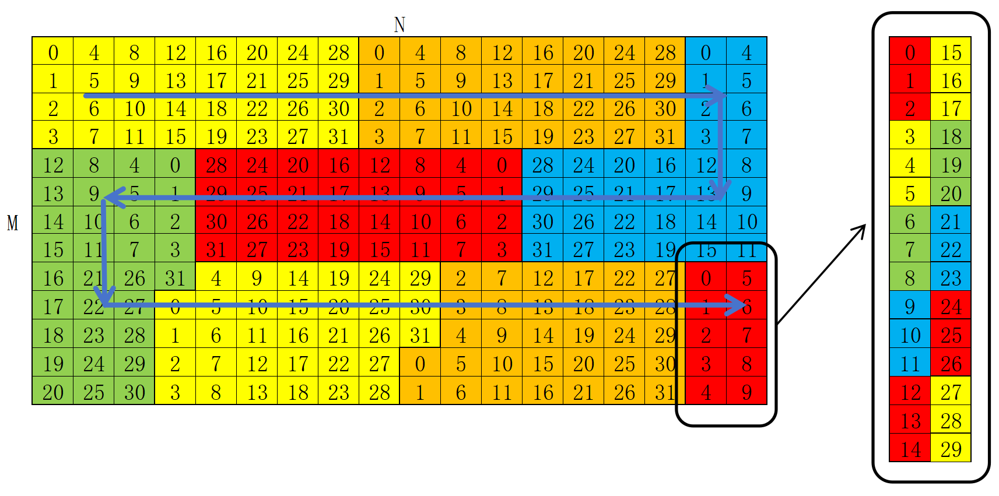

# Matmul

本文旨在说明Matmul算子的组件构成以及实现逻辑，并澄清相关组件的概念与能力。

## 实现逻辑

以下伪代码说明了当前Matmul的整体实现逻辑，并映射到对应的单独组件。
```C++
MatmulTilingEngine.GetTiling(matmulTilingData); // 获取Matmul的Tiling切分策略

// MatmulKernelImpl组织多核核间循环组件
for (int blockMIdx = 0; blockMIdx <= mCore; blockMIdx++) {
    for (int blockNIdx = 0; blockNIdx <= nCore; blockNIdx++) {

        // blockScheduler基于Tiling策略确定核间分配策略，并更新单核计算Tile块大小
        blockShape = blockScheduler.GetBlockShape(blockMIdx, blockNIdx);
        blockCoord = blockScheduler.GetBlockCoord(blockMIdx, blockNIdx);

        // blockMmad基于Tiling组织单核内的计算逻辑
        for (int tileK = 0; tileK <= k; tileK++) {
            copyDataIn();
            mmad();
        }
        copyDataOut();
    }
}
```

## 组件说明
| 组件层级 | 名称 | 功能简介 |
| ------- | ------- | ------ |
| Tiling | MatmulTilingEngine | 负责完成Tiling计算，获取模板参数 |
| Kernel | MatmulKernelImpl | 负责组织多核间基本块的循环逻辑 |
| Block | BlockMmad | 负责组织单核内的计算逻辑 |
| Tile | CopyInA1/Mmad/CopyOut | 负责单次搬运和计算逻辑 |
| Basic | AscendC::LoadData/AscendC::Mmad | 芯片使用的低阶API指令 |

### Tiling

集成了Tiling的计算策略，针对Shape选择对应的Tiling策略，并通过`GetTiling`方法获取对应的TilingData和TplValue。

- MatmulTilingData: Tiling切分结果，表明单核/L1/L0上Shape的切分大小；
- MatmulTplValue：模板选择结果，指定Kernel侧选择的模板，如Aswt/StreamK等；

#### Aswt (Adaptive Slide Window Tiling)

最大限度提高单轮Block计算的L2命中率，从而提高整体的搬运效率，更易达成CubeBound。具体排布策略如图，同一色块表示同一时刻多核计算的输出Block排布，最后一轮分不满核时，会做尾轮负载均衡：



### Kernel

Kernel对应Block在NPU多核上的执行逻辑，主要封装了支持的Block逻辑，以及不同Block在全局内存上的数据排布处理，并由TilingEngine计算的模板参数决定要使用的Kernel实现。

Kernel API位于头文件`matmul_kernel_aswt_impl.h`，声明时由输入Shape、BlockMmad、BlockScheduler组成：
```C++
template <
    class ProblemShape_,
    class BlockMmad_,
    class BlockScheduler_
>
class MatmulKernelAswtImpl;
```

### Block

Block决定了逻辑核中单核内的矩阵乘逻辑，是Matmul算子的核心实现，其主要包含了以下内容：

- 多级Buffer的异步拷贝，包括从GM->L1->L0->GM流程；
- 矩阵计算的MMAD指令；
- 核内不同流水的同步操作，以及pingpong流水控制；

Block的实现逻辑通过`BlockMmad`类来实现，其主模板定义位于`matmul_block_mmad.h`中；为了集成不同策略模板的BlockMmad，对不同的策略采用偏特化实现，已`Aswt`模板为例，定位如下所示：
```C++
template <
    class DispatchPolicy_,
    class L1TileShape_,
    class L0TileShape_,
    class AType_,
    class LayoutA_,
    class BType_,
    class LayoutB_,
    class CType_,
    class LayoutC_
>
class BlockMmad<
    DispatchPolicy_,
    L1TileShape_,
    L0TileShape_,
    AType_,
    LayoutA_,
    BType_,
    LayoutB_,
    CType_,
    LayoutC_,
    AscendC::Std::enable_if_t<AscendC::Std::is_base_of_v<MatmulMultiBlockWithAswt<>, DispatchPolicy_>>
> {};
```
- `DispatchPolicy_`: 决定当前BlockMmad的实现策略，由Tiling策略决定，针对不同shape展开针对性优化；
- `L1TileShape_`和`L0TileShape_`: 后续用于指定基本块切分逻辑的输入，当前暂未使能，切分逻辑有TilingData决定；
- `AType_`, `BType_`, `CType`: 定义全局内存上输入输出的Dtype类型；
- `LayoutA_`, `LayoutB_`, `LayoutC_`: 定义全局内存输入输出的排布类型，当前仅支持ND排布；

### Tile

Tile层的DataCopy和Mmad指令，是针对ASC的基础API的结构封装，从而不需要感知指令的复杂硬件细节，只需要明确搬运和计算的逻辑语义，即可实现相关能力。
同时该指令具备可移植性，可以被多个Block模板共同使用。当前Sample仅实现了一个模板，暂未显示拆开Tile层，目前集成到BlockMmad中。

## 约束说明

当前Sample仅实现了Matmul的基础能力，未对性能展开泛化，存在如下约束：

- 功能约束：因未实现单核切K累加，对于`K>=100000`的`FP32`场景，存在精度不足；
- 性能约束：因未实现`[全载/StreamK/负载均衡]`模板，当前仅在训练场景的shape下可拿到预期理想性能；