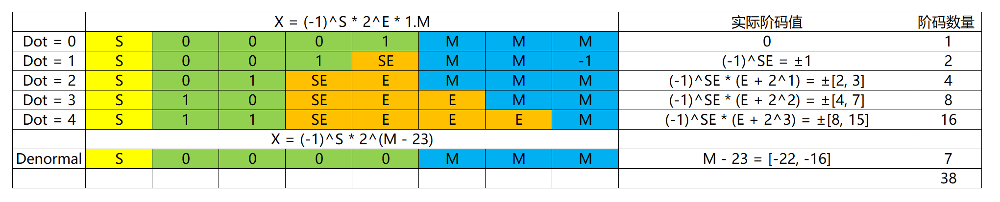
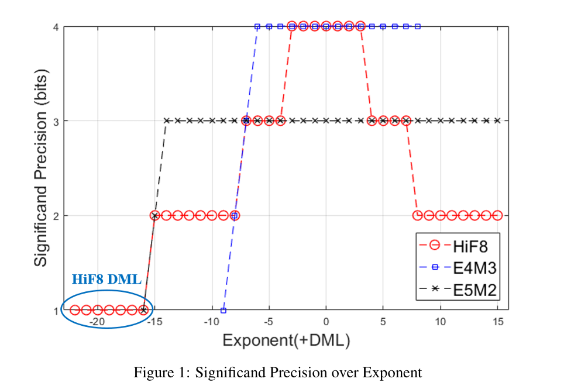

# HiFloat8介绍

## 描述

HiFloat8（以下简称HiF8）是一种适用于深度学习的创新性8位浮点数据格式。HiF8采用梯度精度设计：在常规值编码模式下，提供7个3位尾数位指数值、8个2位尾数位指数值以及16个1位尾数位指数值。对于非标准值编码，它通过额外增加7个2的幂次将动态范围从31扩展至38位二进制数（需注意FP16覆盖40位二进制数）。同时，HiF8编码了所有特殊值，但正零和负零仅由单一比特模式表示。得益于精度与动态范围的更佳平衡，HiF8可同时应用于AI训练的前向与后向传播。

## 关键概念

### HiF8点位解析

<table>
  <tr><td rowspan="5" align="center">Width Values</td><td align="center">Sign</td><td align="left">Dot: D</td><td align="left">Exponent: E</td><td align="left">Mantissa</td></tr>
  <tr><td align="center">1</td><td align="left">2: {2, 3, 4}</td><td align="left">D: ±[2, 15]</td><td align="center">5 − D = [1, 3]</td></tr>
  <tr><td align="center">1</td><td align="left">3: 1</td><td align="left">D: ±1</td><td align="left">4 − D = 3</td></tr>
  <tr><td align="center">1</td><td align="left">4: 0</td><td align="left">D: 0</td><td align="left">3 - D = 3</td></tr>
  <tr><td align="center">1</td><td align="left" colspan="2">4: DML—DenormalSign</td><td align="left">3</td></tr>
</table>

- 符号位（Sign Field）：1位，默认情况下1表示负号，0表示正号。
- 点位（Dot Field）：2~4位，用于编码Dot值。共6个场景11XX、10XX、01XX、001X、0001、0000，分别表示指数位为4、3、2、1、0、DML，此时剩余位数为尾数位。
- 指数位（Exponent Field）：0~4位，由Dot位的值决定。位数大于0时，首位是符号位。即E0 = 0，E1 = ±1， E2 = ±[2, 3], E3 = ±[4, 7], E5 = ±[8, 15]。所有场景综合可支持阶码[-15, 15]。
- 尾数位（Mantissa Field）：1~3位，由Dot位的值决定。如果不是DML场景（即Dot位非0000），公式为(-1)^S * 2^E * 1.M；如果是DML场景，公式为(-1)^S * 2^(M - 23)。

### 特殊编码
- 当S = 0， D = DML，M = 3’b000，X = 0（不区分±0）。（HIF8:b00000000）
- 当S = 1， D = DML，M = 3’b000，X = NaN。（HIF8:b10000000）
- 当D = 4，E = 4’b0111，M = 1’b1，X = ±Inf。（HIF8:bS1101111）

### 编码示意图
其中黄色部分为符号位，绿色部分为Dot，橙色部分为Exponent， 蓝色部分为Mantissa。
Normal和Denormal场景编码方式不同，Denormal场景Mantissa作为指数位。

### 锥形精度图
基于以上编码示意图，可以得到HIF8的锥形精度图如下，

锥形精度图本质是一个有效位-阶码分布图：
- 有效位包含1.M的隐藏位1，因此比Mantissa位宽多1bit
- HIF8在数值绝对值靠近1的时候，精度高；远离1时，精度逐渐降低。精度不存在跳变，都是1bit渐变。
- HIF8综合阶码范围达到[-22, 15]，和FP16的[-25, 15]接近，共38个binades（powers of 2）

## 编译运行

从算子目录构建, 参考算子目录下quantize/README.md

