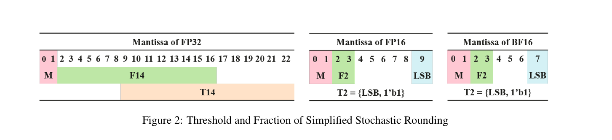

# HiFloat8介绍

## 描述

HiFloat8（以下简称HiF8）是一种适用于深度学习的创新性8位浮点数据格式。HiF8采用梯度精度设计：在常规值编码模式下，提供7个3位尾数位指数值、8个2位尾数位指数值以及16个1位尾数位指数值。对于非标准值编码，它通过额外增加7个2的幂次将动态范围从31扩展至38位二进制数（需注意FP16覆盖40位二进制数）。同时，HiF8编码了所有特殊值，但正零和负零仅由单一比特模式表示。得益于精度与动态范围的更佳平衡，HiF8可同时应用于AI训练的前向与后向传播。

## 设计实现

### HiF8点位解析

<table>
  <tr><td rowspan="5" align="center">Width Values</td><td align="center">Sign</td><td align="left">Dot: D</td><td align="left">Exponent: E</td><td align="left">Mantissa</td></tr>
  <tr><td align="center">1</td><td align="left">2: {2, 3, 4}</td><td align="left">D: ±[2, 15]</td><td align="center">5 − D = [1, 3]</td></tr>
  <tr><td align="center">1</td><td align="left">3: 1</td><td align="left">D: ±1</td><td align="left">4 − D = 3</td></tr>
  <tr><td align="center">1</td><td align="left">4: 0</td><td align="left">D: 0</td><td align="left">3 - D = 3</td></tr>
  <tr><td align="center">1</td><td align="left" colspan="2">4: DML—DenormalSign</td><td align="left">3</td></tr>
</table>

- 符号位（Sign Field）：1位，默认情况下1表示负号，0表示正号。
- 点位（Dot Field）：2~4位，用于编码Dot值。共6个场景11XX、10XX、01XX、001X、0001、0000，分别表示指数位为4、3、2、1、0、DML，此时剩余位数为尾数位。
- 指数位（Exponent Field）：0~4位，由Dot位的值决定。位数大于0时，首位是符号位。即E0 = 0，E1 = ±1， E2 = ±[2, 3], E3 = ±[4, 7], E5 = ±[8, 15]。所有场景综合可支持阶码[-15, 15]。
- 尾数位（Mantissa Field）：1~3位，由Dot位的值决定。如果不是DML场景（即Dot位非0000），公式为(-1)^S * 2^E * 1.M；如果是DML场景，公式为(-1)^S * 2^(M - 23)。

### 特殊编码
- 当S = 0， D = DML，M = 3’b000，X = 0（不区分±0）。（HIF8:b00000000）
- 当S = 1， D = DML，M = 3’b000，X = NaN。（HIF8:b10000000）
- 当D = 4，E = 4’b0111，M = 1’b1，X = ±Inf。（HIF8:bS1101111）

### 编码示意图
结合之前的简要介绍，可以得到HIF8的编码示意图如下。其中黄色部分为符号位，绿色部分为Dot，橙色部分为Exponent， 蓝色部分为Mantissa。
Normal和Denormal场景编码方式不同，Denormal场景Mantissa作为指数位。


### 锥形精度图
基于以上编码示意图，可以得到HIF8的锥形精度图如下，


锥形精度图本质是一个有效位-阶码分布图：
- 有效位包含1.M的隐藏位1，因此比Mantissa位宽多1bit
- HIF8在数值绝对值靠近1的时候，精度高；远离1时，精度逐渐降低。精度不存在跳变，都是1bit渐变。
- HIF8综合阶码范围达到[-22, 15]，和FP16的[-25, 15]接近，共38个binades（powers of 2）

### 舍入方式
在Float8混合精度训练和推理中，高精度浮点格式（如FP32）需要转换为低精度的Float8格式，然后输入到GEMM（通用矩阵乘法）运算中，这一过程涉及舍入操作。

由于Float8的精度相对低于BF16和FP16，舍入方法对神经网络训练的收敛性和准确性极为敏感。经过理论分析和大量实验，我们得出结论：HiF8将支持两种舍入方法——“向远离零舍入”（rounding half to away from zero）和“混合舍入”（hybrid rounding）。在将高精度数据转换为HiF8时，我们仅在前向传播中使用“向远离零舍入”，而在反向传播中使用“向远离零舍入”或“混合舍入”。此外，为了满足某些AI算法的要求，HiF8还提供了两种选项：溢出时饱和到边界值，以及将NaN饱和到零。

#### 1. Round模式
HIF8支持 “向远离零舍入”（TA, rounding half to away）向最接近值舍入。尽管“向偶数舍入”（TE, rounding half to even）在大多数论文和商业产品中默认使用，因为它最大化了无偏性。但是在从高精度格式转换为HiF8的过程中，TE特殊案例的发生概率极低。Float8在AI中的最大挑战是其有限的数据分辨率能力。分析结果表明，TA的数据分辨率能力略高于TE。由于TA在硬件实现上更简单且训练准确率更高，因此在从高精度格式（包括FP32、FP16和BF16）转换为HiF8时，HiF8支持TA舍入方法。

#### 2. Hybrid模式
大规模HiF8混合精度训练实验表明，全局“向远离零舍入”（TA rounding）对几乎所有神经网络都表现良好。但对于部分网络比如YoLo-V3-Tiny，损失曲线的某些部分出现了崩溃，最终准确率比FP32基线低了1.67%。经过广泛的研究和多次实验，除了全局TA舍入方法外，我们还提出了一种新的HiF8训练舍入方法：前向传播使用TA舍入，反向传播使用混合舍入（Hybrid Rounding，HR）。这使得YoLo-V3-Tiny的训练准确率接近基线值。因此，HiF8支持TA舍入和混合舍入（HR）。实际上，HR本质上是标准随机舍入的优化版本，其电路实现更为简单，并且在训练精度上略高。

随机舍入（SR）的误差为1个ulp（最小精度单位）。与TA相比，SR在批量处理数据时具有显著优势。具体来说，在SR中，需要随机生成一个均匀分布的随机数作为阈值T（T ∈ [0, 1)），并将所有被舍去的位视为小数部分，标记为F（F ∈ [0, 1)）。如果F ≥ T，则将1加到保留的位K上，否则将0加到保留的位K上。由于阈值T是均匀分布的，SR后的期望值可以表示为：
$$(K + 1)× F + K × (1 - F) = K + F$$

显然，SR能够最大化批量数据舍入过程中整体均值的不变性。然而，深度学习需要并行生成大量均匀分布的随机数，这使得SR在软硬件实现上都遇到了性能瓶颈。

为了解决这一瓶颈，我们提出了一个简化的SR硬件解决方案。理论分析和实验表明，浮点数的尾数低位服从均匀分布。因此，对于FP32源数据，我们将源格式的14位最低有效位（LSB）设为阈值T14，并将被舍去的14位最高有效位（MSB）设为小数部分F14。然而，对于FP16和BF16源数据，被舍去的位数不足以合理划分为相关性较弱的阈值和小数部分。为了解决这一难题，我们将源格式的最低有效位（LSB）与固定值1组合，形成一个特殊的2位阈值T2，并将被舍去的2位最高有效位设为小数部分F2。如下图所示，我们为FP32设计了一个14位SR（SR14），为FP16和BF16设计了一个2位SR（SR2），无需通过复杂算法生成随机数。SR14与标准SR非常相似，具有相同的1个ulp舍入误差。SR2是一种弱随机舍入，仅有两个阈值0.25和0.75，但其舍入误差较小，为0.75个ulp。通过比较F14/F2与T14/T2，简化的SR可以在硬件中实现。


在从高精度格式（包括FP32、FP16和BF16）转换为HiF8时，除了TA舍入外，还支持我们提出的混合舍入。需要注意的是，前向传播无需使用混合舍入，因为激活值和权重的分布相对于反向传播的梯度分布更为集中。同时，对于绝大多数神经网络，使用TA和HR进行训练几乎没有区别，迄今为止我们只发现了一个明确需要HR的神经网络。

## 算子实践
```c++
// 支持创建数据类型为 hifloat8_t 的 GM 和 UB
AscendC::GlobalTensor<hifloat8_t> yGm;
yGm.SetGlobalBuffer((__gm__ hifloat8_t *)y, TOTAL_LENGTH);

AscendC::LocalTensor<hifloat8_t> yLocal = outQueueY.AllocTensor<hifloat8_t>();
AscendC::LocalTensor<float> tmpLocal = tmpCalc.Get<float>();

// 直接使用 AscendC::Cast API 进行类型转换，无需额外操作
AscendC::Cast<hifloat8_t, float>(yLocal, tmpLocal, AscendC::RoundMode::CAST_ROUND, TOTAL_LENGTH);

// DataCopy时按照每个数据 1 Byte 计算搬运量，正常搬出即可
outQueueY.EnQue<hifloat8_t>(yLocal);
AscendC::LocalTensor<hifloat8_t> yOutput = outQueueY.DeQue<hifloat8_t>();
AscendC::DataCopy(yGm, yOutput, TOTAL_LENGTH);
```


# 算子样例
## Quantize算子
- 算子功能：  
  Quantize算子实现将数据量化为Hifloat8类型的功能。

- 算子规格：
  <table>
  <tr><td rowspan="1" align="center">算子类型(OpType)</td><td colspan="4" align="center">Quantize</td></tr>
  </tr>
  <tr><td rowspan="4" align="center">算子输入</td><td align="center">name</td><td align="center">shape</td><td align="center">data type</td><td align="center">format</td></tr>
  <tr><td align="center">x</td><td align="center">1 * 2048</td><td align="center">float32</td><td align="center">ND</td></tr>
  <tr><td align="center">scale</td><td align="center">1 * 2048</td><td align="center">float32</td><td align="center">ND</td></tr>
  <tr><td align="center">offset</td><td align="center">1 * 2048</td><td align="center">float32</td><td align="center">ND</td></tr>
  </tr>
  </tr>
  <tr><td rowspan="1" align="center">算子输出</td><td align="center">y</td><td align="center">1 * 2048</td><td align="center">hifloat8</td><td align="center">ND</td></tr>
  </tr>
  <tr><td rowspan="1" align="center">核函数名</td><td colspan="4" align="center">quantize_custom</td></tr>
  </table>
- 算子实现：  
  Quantize算子的数学表达式为：
  ```
  y = (x / scale + offset).to(hifloat8)
  ```

- 样例执行
  ```bash
  # 根据 ${git_clone_path}/README.md 编译Samples仓的所有执行用例
  cd build_out/1_Features/hif8 # 进入hif8的build结果目录
  python3 gen_data.py   # 生成测试输入数据
  ./quantize_hif8_demo  # 执行编译生成的可执行程序，执行样例
  python3 verify_result.py output/output_y.bin output/golden_y.bin   # 验证输出结果是否正确，确认算法逻辑正确
  ```
  如果看到以下执行结果，说明精度对比成功。
  ```bash
  test pass
  ```