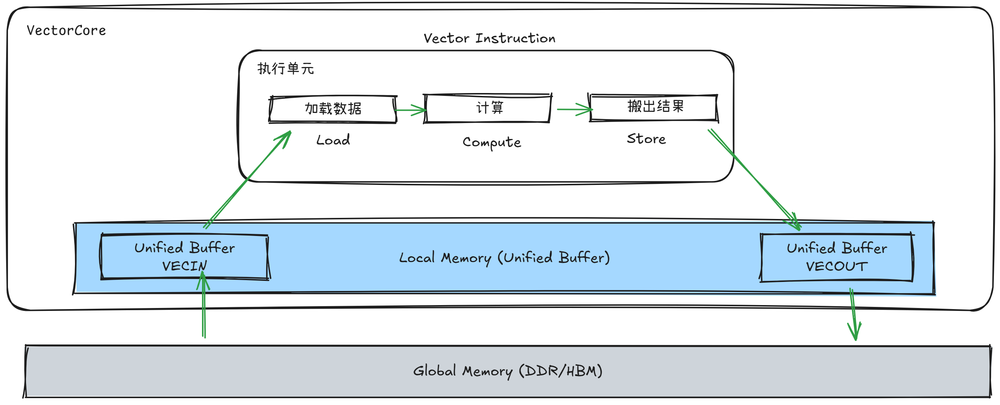
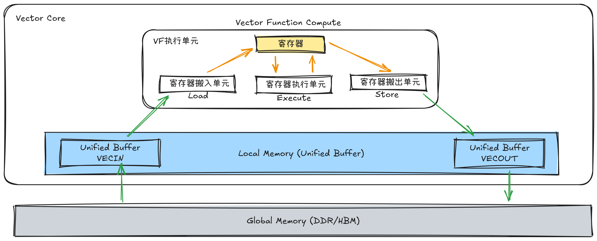
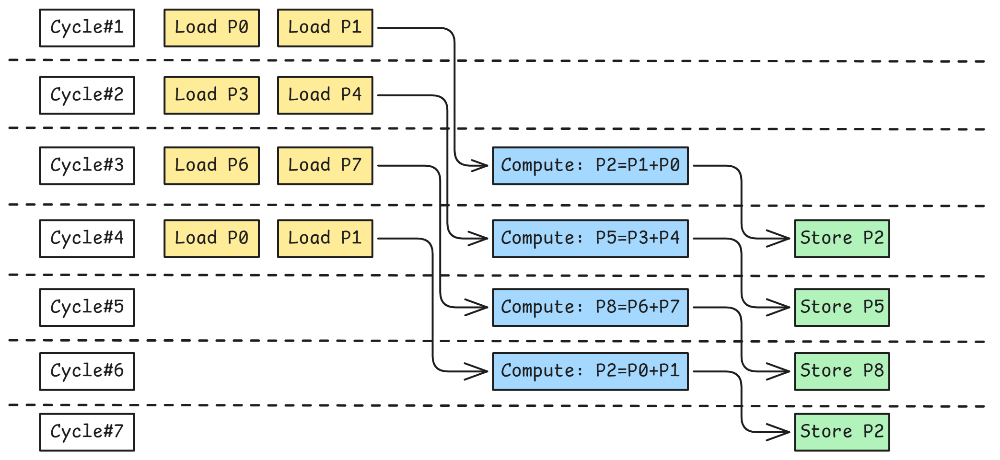

# Vector Function

## 🚀 快速开始

### 步骤1：环境检查
```bash
# 检查Ascend环境
echo $ASCEND_HOME_PATH
# 预期有路径输出

# 检查CMake版本
cmake --version | head -1
# CMake版本 >= 3.16

# 检查编译器
which bisheng
# 预期返回bisheng的绝对路径
```

### 步骤2：编译运行示例

#### 2.1 从项目根目录构建（推荐）
```bash
# 1. 配置项目（首次构建需要）
cmake -S . -B build

# 2. 编译
cmake --build build --parallel

# 3. 安装到build_out目录
cmake --install build --prefix ./build_out

# 6. 运行示例
./build_out/Samples/1_Features/vector_function/gelu_without_vf
./build_out/Samples/1_Features/vector_function/gelu_with_vf
```

**预期输出**：
```
GeLU completed successfully!
```

> 💡 **提示**：如果遇到环境配置问题，请确保：
> 1. `ASCEND_HOME_PATH`环境变量已正确设置
> 2. Bisheng编译器已安装并可用
> 3. CMake版本为3.16或更高

### 步骤3：观察性能差异

#### 3.1 使用msprof进行性能分析
msprof是Ascend工具链中的性能分析工具，可以测量Kernel的执行时间：

```bash
# 分析无VF融合版本性能
msprof --application='./gelu_without_vf'

# 分析VF优化版本性能
msprof --application='./gelu_with_vf'
```

#### 3.2 性能对比数据
运行上述命令后，您将看到类似以下的性能数据：

| 性能指标 | 传统版本 | VF优化版本 | 加速比 |
|---------|---------|-----------|--------|
| **Task Duration** | 69.2μs | 25.3μs | **2.74x** |
| **AIV Time** | 67.8μs | 24.1μs | 2.81x |
| **AIV Vec Time** | 67.4μs | 23.7μs | 2.84x |
| **AIV Vec Ratio** | 97.9% | 94.9% | - |

#### 3.3 性能结果解读
1. **绝对性能提升**：VF优化版本比传统版本快约**2.8倍**
2. **计算瓶颈分析**：
   - 两个版本的AIV Vec Ratio都超过90%，说明都是计算密集型算子
   - VF优化主要减少了数据搬运开销，而非改变瓶颈性质
3. **优化效果验证**：
   - 验证了Vector Function在消除中间UB写回方面的有效性
   - 证明了计算融合对GeLU这类多步复合运算的显著优化效果

> 📊 **性能分析小贴士**：
> 1. 确保在相同的硬件环境和负载条件下进行性能测试
> 2. 多次运行取平均值以获得更稳定的性能数据
> 3. 关注AIV Vec Ratio指标，判断算子是否为计算瓶颈
> 4. 对于Memory Bound算子，VF优化的效果可能不如Compute Bound算子显著

**恭喜！** 您已成功体验Vector Function的性能优势。接下来让我们深入了解其原理。

> 💡 **小提示**：如果遇到环境问题，请参考[🛠️ 开发指南](#️-开发指南)中的环境配置部分。

---

## 📚 什么是Vector Function？

### 核心定义
**Vector Function（向量函数）** 是Ascend NPU引入的编程概念，通过显式控制向量寄存器实现极致计算性能。

### 关键特征
1. **"标量调用、向量执行"**：
   - **标量调用**：由Main Scalar（主标量单元）发起VF调用，处理程序控制流
   - **向量执行**：VF内部的向量计算由专用VF计算单元并行执行

2. **数据驻留**：
   - 中间结果直接在向量寄存器间传递，无需写回Unified Buffer (UB)
   - 消除冗余的数据搬运，提高计算密度

3. **运行时灵活性**：
   - 可根据运行时参数动态调整处理的数据量
   - 支持硬件循环和掩码处理尾部数据

### 与普通函数的本质区别
| 特性 | 普通函数 | Vector Function |
|------|----------|-----------------|
| 执行单元 | Main Scalar逐个执行指令 | VF计算单元接管内部计算 |
| 数据流 | UB-to-UB，中间结果写回UB | 寄存器到寄存器，数据驻留在寄存器中 |
| 优化级别 | 指令级优化 | 计算融合、寄存器重用 |
| 硬件要求 | 所有Ascend平台 | Ascend 950PR/950DT |

### 硬件平台支持
- **支持VF的平台**：Ascend 950PR、Ascend 950DT
- **传统平台**：Atlas A2/A3（不支持VF特性，使用传统SPMD模型）

> 🔍 **深入了解**：想了解为什么需要VF？请继续阅读下一章节。

---

## ⚙️ 为什么需要VF？传统模型的局限性

### 传统SPMD编程模型的瓶颈
在传统模型中（对应Atlas A2/A3芯片），计算遵循**Load-Compute-Store三阶段**：



**性能问题**：
1. **冗余数据搬运**：每个计算步骤都需要完整的`加载-计算-存储`循环
2. **计算单元闲置**：计算单元频繁等待数据搬运完成
3. **UB带宽压力**：大量中间结果占用UB带宽

### GeLU计算示例分析
传统GeLU实现需要8步计算：
```
1. x² = x * x          # 结果写回UB
2. x³ = x² * x         # 结果写回UB
3. t = x * factor      # 结果写回UB
4. sum = x³ + t        # 结果写回UB
5. scaled = sum * k    # 结果写回UB
6. exp = exp(scaled)   # 结果写回UB
7. exp_plus1 = exp + 1 # 结果写回UB
8. y = x / exp_plus1   # 最终结果
```

**问题**：7次中间结果写回UB，产生大量存储-加载开销

### VF的突破性优化
Vector Function通过**计算融合**打破限制：

1. **寄存器驻留**：中间结果保留在寄存器中
2. **指令融合**：多步计算合并为单个VF指令块
3. **硬件并行**：利用乱序执行和指令双发

**效果**：将8步计算融合为单个连续执行流，消除中间数据搬运。


> 🎯 **关键洞察**：VF不是"更快地做同样的事"，而是"用不同的方式做更少的事"（减少数据搬运）。

---

## 🏗️ Vector Core架构概览

### 存储层次
```
Global Memory (HBM/DDR)
        ↓
   L2 Cache (片上缓存，多核共享)
        ↓
  Unified Buffer (UB) ← Vector Core内部
        ↓
   寄存器 (Registers)
        ↓
   计算单元 (VALU)
```

### Vector Core主要组件
| 组件 | 功能 | 编程接口 |
|------|------|----------|
| **MainScalar** | 标量计算、程序控制流、VF调用 | 标准C++代码 |
| **VF计算单元** | 向量计算执行 | `__VEC_SCOPE__`内代码 |
| **UB (Unified Buffer)** | 片上高速存储，向量指令操作空间 | `LocalTensor<T>` |
| **寄存器** | 计算数据存储 | `RegTensor<T>` |

### 寄存器系统（逻辑概念）
| 寄存器类型 | 用途 | 特点 |
|------------|------|------|
| **V寄存器** | 存储计算数据 | 核心计算存储，支持SIMD计算 |
| **A寄存器** | 硬件循环地址更新 | 自动计算循环内地址偏移 |
| **U寄存器** | 非对齐访问辅助 | 处理非32B对齐地址 |
| **P寄存器** | 掩码控制 | 处理尾部非完整向量数据 |

> ⚠️ **重要说明**：这些是逻辑寄存器概念，编译器自动管理物理寄存器的分配和释放。

### UB与Local Memory的关系
- **UB (Unified Buffer)**：硬件架构术语，指具体的物理存储单元
- **Local Memory**：编程概念，指Vector Core内部可寻址的片上存储
- **实际关系**：两者指代同一实体，UB是物理实现，Local Memory是编程接口

**编程中的体现**：
- `LocalTensor<float>`：UB上的数据张量
- `RegTensor<float>`：向量寄存器中的数据

---

## 🔄 VF编程模型详解

### 硬件循环（Hardware Loop）
**特点**：
- 硬件直接支持，消除循环判断和跳转开销
- A寄存器自动更新地址，减少显式地址计算
- 最多支持4层嵌套，超过转为软件循环

**限制**：
- 循环内部不支持条件分支（如if语句）
- 包含条件分支的循环会转为软件循环

**代码模式**：
```cpp
// 硬件循环示例
for (uint16_t i = 0; i < loopNum; ++i) {
    // 循环体内的向量计算
    // 地址自动更新：addr = base + i * stride
}
```

### 指令双发（Instruction Dual-Issue）
**机制**：硬件拥有两份相同的执行单元，可并行执行相同指令

**优化机会**：
```cpp
// 独立的加载指令可以双发
register_t va = vld(a_addr);  // 指令1
register_t vb = vld(b_addr);  // 指令2（可与指令1双发）

// 有依赖的指令无法双发
register_t vc = vadd(va, vb); // 依赖va和vb，无法与加载指令同时实现
```

**优化建议**：
1. 将独立操作安排在一起
2. 减少指令间数据依赖
3. 合理安排指令顺序

### 乱序执行（Out-of-Order Execution）
**工作机制**：
1. 硬件分析指令间寄存器依赖关系
2. 无依赖关系的指令并行调度到空闲单元
3. 长延迟指令尽早发射，后续不依赖指令可并行


如上图所示，花费了7个Cycle实现了4次VectorAdd计算，并写回到了UB。
- Cycle#1: 加载P0,P1的数据到寄存器
- Cycle#2: 假设数据加载需要2个Cycle以上，那么可以提前将第二轮计算需要的P3,P4也加载到寄存器
- Cycle#3: P0,P1数据已经加载完毕，可以执行VADD计算；同时可以把第三轮需要的P6,P7提前加载到寄存器
- Cycle#4: 类似的P3,P4加载完毕，可以执行计算；同时P2=P0+P1也计算完毕，P0,P1的数据不再需要了，可以释放复用；同时将P2寄存器的数据写回UB；
- Cycle#5: 已经没有数据需要加载，按顺序执行计算后Store数据

可以看出，由于乱序执行机制，可以让后续轮次的数据加载指令提前发射执行，实现了寄存器数据加载存储延迟与指令执行延迟之间的互相掩盖。

**程序员无需担心**：
- 数据冒险（RAW、WAR、WAW）由硬件内部的计分板(ScoreBoard)自动处理
- 执行顺序保证依赖关系正确

**优化技巧**：
```cpp
// 长延迟指令（如指数运算）尽早执行
Exp(result, input);      // 长延迟，尽早发射

// 不依赖Exp结果的计算可并行
SomeOtherCalc(tmp);      // 可与Exp并行执行
```

---

## 💻 实战示例：GeLU优化

### GeLU计算公式
```
GeLU(x) ≈ x * σ(1.702x)
近似公式：x * 0.5 * (1 + tanh(√(2/π) * (x + 0.044715x³)))
```

### 传统实现分析
```cpp
// gelu_without_vf.cpp 关键代码
__aicore__ void gelu_compute(...) {
    AscendC::PipeBarrier<PIPE_V>();          // 同步流水线
    AscendC::Mul(xCube, xLocal, xLocal, n);  // x²，结果写回UB
    AscendC::PipeBarrier<PIPE_V>();          // 等待写回完成
    AscendC::Mul(xCube, xCube, xLocal, n);   // x³，结果写回UB
    AscendC::Muls(tLocal, xLocal, factor, n);// t = x * factor
    AscendC::PipeBarrier<PIPE_V>();          // 等待写回完成
    // ... 总共8个PipeBarrier
}
```

**问题诊断**：
- 8步计算需要7次中间结果写回UB
- 每个`PipeBarrier`强制流水线排空，计算单元闲置
- 大量时间消耗在数据搬运而非计算

### VF优化实现
```cpp
// gelu_with_vf.cpp 关键代码
__aicore__ void gelu_compute(...) {
    __VEC_SCOPE__  // 标记VF执行作用域，内部代码由VF计算单元执行
    {
        // 寄存器声明：使用MicroAPI::RegTensor定义向量寄存器中的张量
        AscendC::MicroAPI::RegTensor<float> xReg, cubeReg, tReg;

        for (uint16_t i = 0; i < loopNum; ++i) {
            // 数据加载到寄存器（一次）
            // LoadDist::DIST_NORM: 连续对齐搬入模式，从UB加载数据到寄存器
            AscendC::MicroAPI::DataCopy<float, AscendC::MicroAPI::LoadDist::DIST_NORM>(
                xReg, xAddr + i * vectorLength);

            // 计算融合（中间结果驻留寄存器）
            // 所有中间结果在寄存器间传递，无需写回UB
            AscendC::MicroAPI::Mul(cubeReg, xReg, xReg);     // x² → cubeReg
            AscendC::MicroAPI::Mul(cubeReg, cubeReg, xReg);  // x³ → cubeReg（寄存器重用）
            AscendC::MicroAPI::Muls(tReg, xReg, factor);     // t = x * factor
            AscendC::MicroAPI::Add(cubeReg, cubeReg, tReg);  // x³ + t → cubeReg
            // ... 后续计算（指数、加法、除法）全部在寄存器中进行

            // 最终结果写回UB（一次）
            // StoreDist::DIST_NORM_B32: 连续对齐搬出模式，B32表示32Byte对齐
            AscendC::MicroAPI::DataCopy<float, AscendC::MicroAPI::StoreDist::DIST_NORM_B32>(
                yAddr + i * vectorLength, yReg);
        }
    }
}
```

**优化亮点**：
1. ✅ 消除中间结果UB写回（7次→0次）
2. ✅ 移除PipeBarrier（8个→0个）
3. ✅ 寄存器重用（xReg多次使用）
4. ✅ 硬件自动管理指令依赖

### 关键API解析
| API | 用途 | 说明 |
|-----|------|------|
| `__VEC_SCOPE__` | 定义VF作用域 | 内部代码由VF计算单元执行 |
| `MicroAPI::` | 微指令API | 寄存器级操作，支持数据驻留 |
| `RegTensor<T>` | 寄存器张量 | 向量寄存器中的数据容器 |
| `UpdateMask()` | 掩码更新 | 处理尾部非完整向量数据 |

---

## 📊 性能分析与优化原理

### 性能指标解读
| 指标 | 含义 | 分析用途 |
|------|------|----------|
| **Task Duration** | Kernel总执行时间 | 评估绝对性能 |
| **AIV Time** | VectorCore执行时间 | 分析核心利用率 |
| **AIV Vec Time** | 向量计算流水时间 | 判断计算瓶颈 |
| **AIV Vec Ratio** | 向量计算占比 | Compute Bound判断 |

### GeLU性能对比数据
| 版本 | Task Duration | AIV Vec Time | AIV Vec Ratio | 加速比 |
|------|---------------|--------------|---------------|--------|
| 传统实现 | 69.2μs | 67.4μs | 97.9% | 1.0x |
| VF优化 | 25.3μs | 23.7μs | 94.9% | 2.8x |

### 瓶颈分析指南
**Compute Bound（计算瓶颈）**：
- AIV Vec Ratio > 90%
- 优化方向：计算融合、指令级并行、寄存器重用

**Memory Bound（存储瓶颈）**：
- AIV MTE2/MTE3 Ratio较高
- 优化方向：数据复用、访问模式优化、预取

**GeLU案例分析**：
- 优化前后Vec Ratio都>90% → 典型Compute Bound算子
- VF优化降低绝对耗时，但未改变瓶颈性质
- 进一步优化：多核负载均衡、指令调度优化

### IPC（Instructions per Cycle）分析
**概念**：每个时钟周期执行的指令数，衡量指令级并行度

**优化目标**：
- 理论双发值：2.0（硬件有两份执行单元）
- 实际IPC接近2.0 → 优化接近极限
- 通过CA Model日志分析实际IPC

**优化策略**：
1. 减少指令间数据依赖
2. 合理安排指令顺序
3. 充分利用指令双发特性

---

## 🛠️ 开发指南

### 从零开发VF程序
**步骤指南**：
1. **分析计算模式**：识别可融合的多步计算
2. **设计寄存器使用**：规划数据流和寄存器分配
3. **实现VF代码**：使用Vector Function相关API
4. **测试验证**：对比传统实现，确保正确性
5. **性能调优**：分析性能数据，迭代优化

**模板结构**：
```cpp
__aicore__ void my_vf_kernel(...) {
    // Main Scalar计算（循环控制、地址计算等）

    __VEC_SCOPE__ {
        // VF寄存器声明
        AscendC::MicroAPI::RegTensor<float> reg1, reg2, reg3;

        for (循环) {
            // 数据加载到寄存器
            AscendC::MicroAPI::DataCopy(reg1, source);

            // 计算融合（中间结果驻留寄存器）
            AscendC::MicroAPI::Operation1(reg2, reg1);
            AscendC::MicroAPI::Operation2(reg3, reg2);
            // ... 更多计算

            // 结果写回UB
            AscendC::MicroAPI::DataCopy(dest, reg3);
        }
    }
}
```

---

## 💡 最佳实践与常见问题

### 适用场景选择
**适合VF优化的算子**：
- ✅ 激活函数（GeLU、ReLU、Sigmoid等）
- ✅ 逐元素运算（向量加、乘、混合等）
- ✅ 规范化操作（LayerNorm、BatchNorm）
- ✅ 数值计算函数（指数、对数、三角函数）

**不适合VF的场景**：
- ❌ 简单数据搬运（无计算）
- ❌ I/O密集型操作
- ❌ 随机访问模式
- ❌ 计算步骤极少的简单操作

### 优化级别建议
| 优化级别 | 目标 | 关键技术 |
|----------|------|----------|
| **基础优化** | 消除中间UB写回 | 计算融合、寄存器驻留 |
| **中级优化** | 提高指令级并行 | 指令双发、乱序执行 |
| **高级优化** | 接近理论极限 | IPC优化、负载均衡 |

### 常见问题解答
**Q1：VF有大小限制吗？**
A：有寄存器数量限制，复杂计算可能寄存器不足。编译器会告警。

**Q2：如何判断代码是否适合VF优化？**
A：1) 计算步骤多且相关；2) 数据复用率高；3) 性能分析显示Compute Bound。

**Q3：VF编程有哪些限制？**
A：1) 仅支持Ascend 950PR/950DT+；2) 硬件循环最多4层；3) 循环内不支持条件分支。

**Q4：调试VF程序有什么特殊工具？**
A：使用CA Model查看VF执行日志，分析指令流水和寄存器使用。

### 性能调优检查清单
- [ ] 计算融合是否彻底？（减少中间UB写回）
- [ ] 寄存器是否充分重用？（减少数据加载）
- [ ] 指令顺序是否优化？（提高指令级并行）
- [ ] 硬件循环是否正确使用？（避免转为软件循环）
- [ ] 掩码处理是否高效？（统一处理完整和尾部数据）
