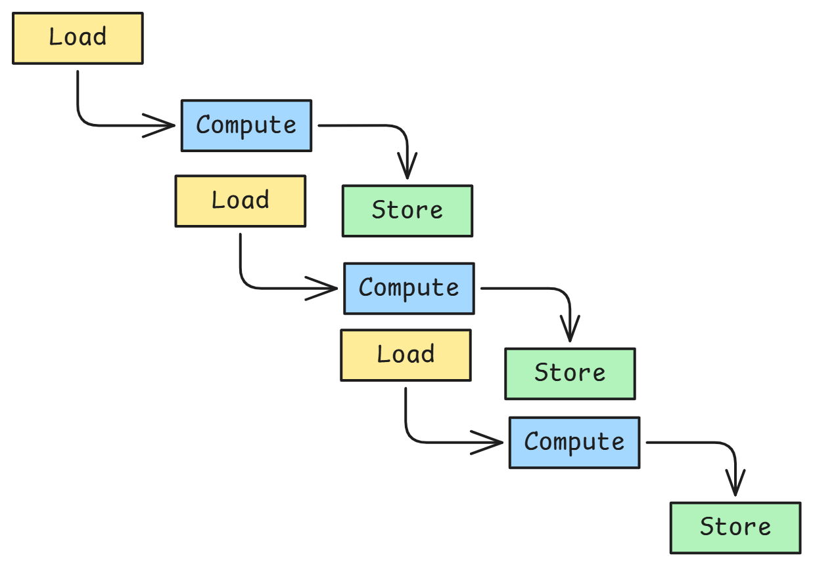
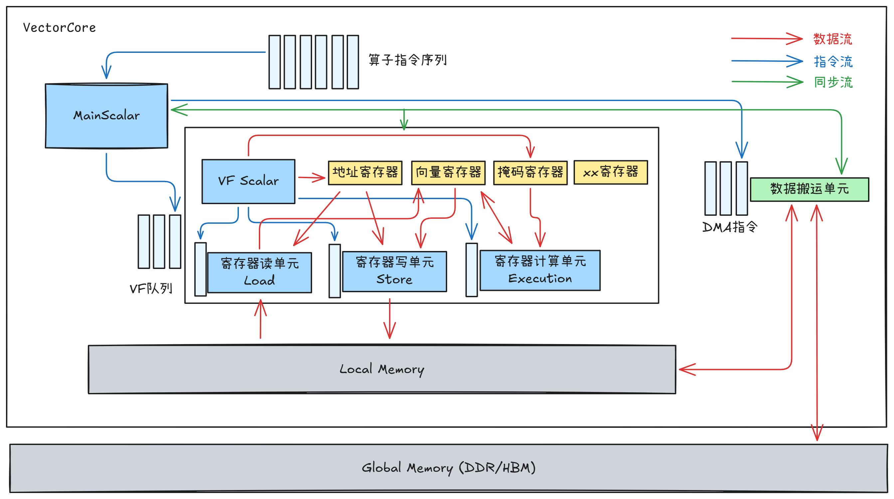

# Vector Function

向量函数(Vector Function)是 Ascend 950PR/Ascend 950DT 引入的新编程概念，旨在通过显式控制向量寄存器来实现极致计算性能。

在传统编程模型中，计算指令通常在UB（Unified Buffer）和向量寄存器之间频繁搬运数据，而VF(Vector Function)允许开发者直接在向量寄存器中进行多步骤连续计算，大幅减少计算中间步骤数据搬运开销。

本文将深入介绍Vector Function这一编程概念，详细阐述其性能优势原理、编程范式以及在实际应用中的最佳实践。

## 概述

### 什么是 Vector Function
向量函数(Vector Function)是由Main Scalar调用的由vector指令组成的连续指令块。它是一个标量调用、向量执行的编程单元，将一系列向量计算、数据搬运和地址更新等操作封装在一个独立的执行流中。在此函数内部，数据可以直接在向量寄存器间流动和计算，无需将每个中间结果写回UB，从而实现了计算过程的“寄存器驻留”，极大提升了数据复用效率和计算吞吐。

### 与传统编程模型的对比

传统的向量编程模型采用“单指令-三阶段”的流水线范式，核心特征是基于UB到UB（UB-to-UB） 的数据流。

如上图所示，每一条向量指令（如 `VectorAdd`）都是一个独立的操作单元，其执行过程遵循 **Load（加载）- Compute（计算）- Store（写回）** 三个阶段：

1.  **Load**：从源操作数指定的UB地址，将数据加载至内部的临时向量寄存器。
2.  **Compute**：在向量算术逻辑单元（VALU）中对加载的数据执行指令所定义的计算（如加法）。
3.  **Store**：将计算结果从临时向量寄存器写回目的操作数指定的UB地址。


在这种模型下，**任何计算产生的中间结果都必须写回UB**。当执行一个包含多步运算的复杂函数时（例如 `f(x) = (a*x + b)*x + c`），每一步运算都需要作为一条独立的UB-to-UB指令来执行。

这导致了频繁的、冗余的**UB与向量寄存器之间的数据搬运**，使得宝贵的计算带宽和周期被消耗在数据移动上，而非纯粹的计算。

Vector Function模型则打破了这一限制。它将一个复杂的计算函数（如GeLU）封装为一个VF。在VF内部：

1. **一次性加载**：将所需输入数据从UB加载至指定的向量寄存器。
2. **寄存器内连续计算**：所有中间计算都在向量寄存器之间直接完成，结果暂存于寄存器中。
3. **一次性写回**：最终结果从寄存器写回UB。

这种模式，将多次Load-Store缩减为一次，消除了中间数据的冗余搬运，使计算单元（VALU）能够持续工作，显著提升了计算效率和数据吞吐率。

## 编程模型

### Vector Core硬件架构抽象
理解硬件是写好Vector Function代码的前提，在深入阐述Vector Function（VF）的编程范式之前，有必要首先理解其赖以运行的硬件基础架构。


VectorCore中主要包括：存储单元、搬运单元和计算单元；其中计算单元包括MainScalar计算单元和VF计算单元；VF计算单元内又包括VF Scalar、寄存器读单元、寄存器写单元、寄存器计算单元和各类型的寄存器单元；

- 存储单元
  - Global Memory: VectorCore能访问的外部存储，即为Device上的HBM/GDDR等内存；
  - Local Memory: VectorCore内部片上高速缓存，即为Unified Buffer（UB），是向量指令直接访问的存储空间；
- 搬运单元：负责处理DMA指令（如DataCopy），用于在Global Memory和Local Memory之间搬移数据；
- 计算单元
  - MainScalar计算单元：处理VF函数外的所有Scalar计算，包括各类型的标量数据运算、程序的流程控制（如循环、分支）、以及VF的调用等；
  - VF计算单元:
    - 寄存器:
      - 向量寄存器(V寄存器)：用来存放计算指令操作的目标数据，是VF计算的核心存储单元；
      - 地址寄存器(A寄存器): 用来在硬件循环（Hardware Loop）中自动更新Local Memory上的数据搬运起始地址，实现循环内地址的自动偏移；
      - 对齐寄存器(U寄存器): 用来辅助访问Local Memory上非32B对齐地址的数据，存储基地址的偏移量；
      - 掩码寄存器(P寄存器): 用来控制计算指令操作的数据粒度，按bit位标识V寄存器中的有效数据；1表示有效，0表示无效。常用于处理尾部非完整向量数据；
    - 寄存器读单元: 处理Load指令，用来加载Local Memory的数据到V寄存器；
    - 寄存器写单元: 处理Store指令，用来从V寄存器搬运数据到Local Memroy；
    - 寄存器计算单元：处理计算指令，对V寄存器中的值进行计算，源操作数和目的操作数对象均为V寄存器；
    - VF Scalar单元：处理VF函数内的标量计算，如计算常数、循环控制变量等。

### 编程范式

#### 硬件循环
硬件循环（Hardware Loop）是一种由硬件直接支持的循环机制，通过专用的循环控制寄存器和地址寄存器（A寄存器）自动管理循环迭代和内存地址更新。与软件循环（通过跳转指令实现）相比，硬件循环消除了循环判断和跳转的开销，并能实现地址的自动增量，极大地提升了小粒度、规则循环的性能。另外在乱序执行机制的配合下，硬件有能力根据指令间的依赖关系和寄存器使用情况，自动把后续循环中的指令提前发射出去(比如提前Load数据，掩盖数据加载延迟)。

#### __VEC_SCOPE__宏
__VEC_SCOPE__宏是定义Vector Function的关键。在该宏定义的代码块内，开发者可以编写微指令级别的向量操作，直接控制向量寄存器和计算单元。

#### 寄存器使用
- 向量寄存器
  - VF中所有计算的数据载体。编程时需要手动声明和分配，通过寄存器复用减少对UB的访问。
- 地址寄存器
  - 存储UB中的地址便宜，可以根据HardwareLoop的层次和深度自动更新。
- 对齐寄存器
  - 当访问的UB地址不是32字节对齐时，需要使用U寄存器来协助完成非对齐数据的加载和存储。
- 掩码寄存器
  - 用于处理向量化计算中的“尾部”数据，即当数据总长度不是向量长度的整数倍时，屏蔽掉多余部分，防止越界和无效计算。

#### 指令双发
指令有两份硬件单元，可并行执行，充分利用指令双发是提高性能的关键。

#### 乱序执行机制
VF计算单元内部具备乱序执行（Out-of-Order Execution）能力。硬件会自动分析指令间的寄存器依赖关系，将没有数据依赖关系的指令并行调度到空闲的执行单元。在VF编程中，可以通过合理安排计算顺序，让长延迟指令（如Exp）尽早执行，后续安排不依赖其结果的其他计算，从而隐藏指令延迟。


## 实践: 使用Vector Function计算融合加速GeLU计算
GeLU（高斯误差线性单元）是Transformer架构中的核心激活函数，其计算包含多项式、指数、乘除法等多步操作，是典型的计算密集型算子。
### 代码
- [gelu_without_vf](./gelu_without_vf.cpp)
- [gelu_with_vf](./gelu_with_vf.cpp)

注意观察gelu_compute部分的差异

- 不使用Vector Function的传统实现
  ```cpp
  __aicore__ void gelu_compute(const AscendC::LocalTensor<float> &xLocal, const   AscendC::LocalTensor<float> &yLocal,
      const AscendC::LocalTensor<float> &xCube, const AscendC::LocalTensor<float> &tLocal, int64_t n)
  {
      const float NEG_SQRT_EIGHT_OVER_PI = -1.595769121 * 0.044715;
      const float TANH_APPROX_FACTOR = 1 / 0.044715;
      AscendC::PipeBarrier<PIPE_V>();
      AscendC::Mul(xCube, xLocal, xLocal, n);
      AscendC::PipeBarrier<PIPE_V>();
      AscendC::Mul(xCube, xCube, xLocal, n);
      AscendC::Muls(tLocal, xLocal, TANH_APPROX_FACTOR, n);
      AscendC::PipeBarrier<PIPE_V>();
      AscendC::Add(xCube, xCube, tLocal, n);
      AscendC::PipeBarrier<PIPE_V>();
      AscendC::Muls(xCube, xCube, NEG_SQRT_EIGHT_OVER_PI, n);
      AscendC::PipeBarrier<PIPE_V>();
      AscendC::Exp(xCube, xCube, n);
      AscendC::PipeBarrier<PIPE_V>();
      AscendC::Adds(xCube, xCube, 1.0f, n);
      AscendC::PipeBarrier<PIPE_V>();
      AscendC::Div(yLocal, xLocal, xCube, n);
      AscendC::PipeBarrier<PIPE_V>();
  }
  ```
  - 关键问题：
    - 9步计算产生8次中间结果写回UB
    - 每步后需要PipeBarrier强制流水线同步
    - 计算单元频繁等待数据搬运
  
- 使用Vector Function的优化实现
  ```cpp
  __aicore__ void gelu_compute(const AscendC::LocalTensor<float> &xLocal, const   AscendC::LocalTensor<float> &yLocal,
      const AscendC::LocalTensor<float> &xCube, const AscendC::LocalTensor<float> &tLocal, int64_t n)
  {
      const float NEG_SQRT_EIGHT_OVER_PI = -1.595769121 * 0.044715;
      const float TANH_APPROX_FACTOR = 1 / 0.044715;
      uint32_t vectorLength = AscendC::VECTOR_REG_WIDTH / sizeof(float);
      uint32_t loopNum = (n + vectorLength - 1) / vectorLength;
      __VEC_SCOPE__
      {
          __ubuf__ float *xAddr = (__ubuf__ float *)xLocal.GetPhyAddr();
          __ubuf__ float *yAddr = (__ubuf__ float *)yLocal.GetPhyAddr();
          AscendC::MicroAPI::MaskReg pMask;
          AscendC::MicroAPI::RegTensor<float> xReg, yReg, cubeReg, tReg;
          uint32_t count;
          count = static_cast<uint32_t>(n);
          for (uint16_t i = 0; i < loopNum; ++i) {
              pMask = AscendC::MicroAPI::UpdateMask<float>(count);
              AscendC::MicroAPI::DataCopy<float, AscendC::MicroAPI::LoadDist::DIST_NORM>(
                  xReg, (__ubuf__ float *)xAddr + i * vectorLength);
              AscendC::MicroAPI::Mul(cubeReg, xReg, xReg, pMask);
              AscendC::MicroAPI::Mul(cubeReg, cubeReg, xReg, pMask);
              AscendC::MicroAPI::Muls(tReg, xReg, TANH_APPROX_FACTOR, pMask);
              AscendC::MicroAPI::Add(cubeReg, cubeReg, tReg, pMask);
              AscendC::MicroAPI::Muls(cubeReg, cubeReg, NEG_SQRT_EIGHT_OVER_PI, pMask);
              AscendC::MicroAPI::Exp(cubeReg, cubeReg, pMask);
              AscendC::MicroAPI::Adds(cubeReg, cubeReg, 1.0f, pMask);
              AscendC::MicroAPI::Div(yReg, xReg, cubeReg, pMask);
              AscendC::MicroAPI::DataCopy<float, AscendC::MicroAPI::StoreDist::DIST_NORM_B32>(
                  (__ubuf__ float *)yAddr + i * vectorLength, yReg, pMask);
          }
      }
  }
  ```
  - 优化特点：
    - 中间结果驻留寄存器，无需写回UB
    - 硬件自动管理指令依赖，无需显式同步
    - 支持指令级并行和乱序执行

### 性能
在Ascend 950PR平台上处理2048个float32数据，性能对比如下：
补充表格

### 性能优化原理
1. 计算融合消除数据搬运
   传统实现中GeLU的9步计算需要8次中间结果写回UB，每次写回会产生存储延迟。VF实现将这些计算融合在一个硬件循环内，中间变量全部在寄存器中传递，彻底消除了中间数据搬运。
2. 寄存器重用最大化
   输入向量`x`加载一次后，在后续多个计算步骤中被重复使用，显著减少了对UB带宽的需求。
3. 指令级并行优化
   VF的乱序执行机制允许长延迟指令（如指数运算`Exp`）尽早发射，后续不依赖其结果的指令可并行执行。硬件循环的深度流水线特性使得数据加载、计算和存储操作能够充分重叠。
4. 同步开销最小化
   传统实现中每个`PipeBarrier`强制流水线排空，造成计算单元空闲。
5. 尾块处理优化
   通过掩码寄存器一次性处理所有数据，包括尾部非完整向量，避免了传统模式中特殊的尾部处理逻辑。

## 结论

Vector Function通过寄存器驻留计算和硬件级并行优化，为Ascend芯片提供了接近理论峰值性能的计算能力。对于GeLU这类计算密集型算子，VF实现相比传统方式可获得数倍的性能提升，主要收益来源于数据搬运的消除、寄存器重用的优化以及指令级并行的充分利用。掌握VF编程范式是发挥Ascend芯片极致计算性能的关键技术。
