# Flash Attention Lite：Ascend 950 上的 1 Cube + 2 Vector 协同优化

Flash Attention Lite（FALite）是面向 Ascend 950 的因果（causal）Flash Attention 前向教学样例。它从最容易核对的数据通路出发，用 v0～v11 展示中间量片上化、AIC/AIV 错位执行、核内双缓冲、连续预加载和 Vector 路径压缩。

文章重点讲清一组 Mix 核中的 `1 AIC + 2 AIV` 如何分工：AIC 完成两次矩阵乘，两路 AIV 各处理 64 行 Query，并通过 Fixpipe、共享 L1、CrossCore 信号和核内 Mutex 交接数据。FALite 只覆盖完整 Flash Attention 的核心计算，不是网络中的通用融合算子。

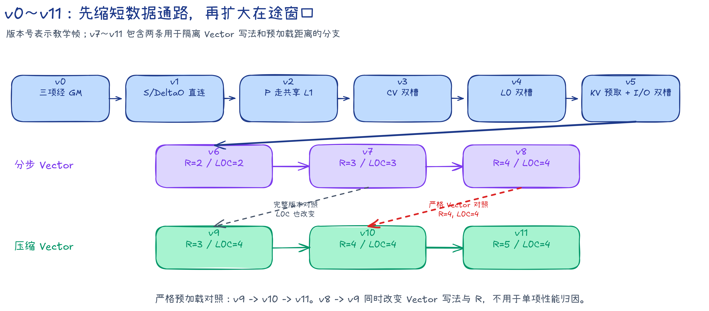

## 样例定位

### 支持的功能

- causal self-attention 前向计算；
- BF16 `Q/K/V/O`，FP32 Softmax 统计量和输出累加；
- `N=1`、`D=128`、`Br=Bc=128`；
- `S` 为 128 的整数倍，`B` 可变；
- 一组 `1 AIC + 2 AIV` 的 Mix 核协作；
- Host 侧按 Query tile 将任务分配给多个 Mix 核。

### 不支持的功能

- 运行时切换 non-causal 和 causal；
- 非方形 Q/KV 长度、causal offset、滑动窗口和 KV Cache；
- 序列尾块、可变 Head 数、HeadDim 或 tile 大小；
- Attention bias、Dropout、反向计算和其他网络融合能力。

### 对外接口

```cpp
bool FlashAttnLiteNPU(
    uint8_t* dQ,
    uint8_t* dK,
    uint8_t* dV,
    uint8_t* dOut,
    uint32_t batchSize,
    uint32_t seqLen,
    float softmaxScale,
    uint32_t requestedAicCoreNum,
    aclrtStream stream);
```

| 参数 | 含义与约束 |
| --- | --- |
| `dQ`、`dK`、`dV` | 设备侧 BF16 输入，逻辑形状均为 `(B,1,S,128)` |
| `dOut` | 设备侧 BF16 输出，逻辑形状为 `(B,1,S,128)` |
| `batchSize` | Batch 大小 `B`，必须大于 0 |
| `seqLen` | 序列长度 `S`，必须大于 0 且为 128 的整数倍 |
| `softmaxScale` | Softmax 缩放系数，必须是非 0 有限值；Demo 使用 `1/sqrt(128)` |
| `requestedAicCoreNum` | 请求使用的 Mix 组数，以 AIC 数表示；传 0 时使用设备全部 AIC |
| `stream` | 提交 Kernel 的 ACL Stream；v0/v1 因释放内部 GM workspace 会在返回前同步，v2～v11 可在提交后返回；调用方在读取输出或释放输入输出前仍应同步 |

正式版 Kernel 固定发射 causal 模板实例。模板中保留 non-causal 分支，便于阅读两种遍历方式，但公共接口没有暴露运行时开关。

### 版本总览

先用几个源码术语概括版本路线。一个 `task` 负责一个 Query tile 的完整计算；它每访问一个 Key/Value tile，就产生一个 `item`。

C1 计算源码所称的分数转置 `S^T=K_j Q_i^T`，它对应后文数学记号 $\mathbf R_{i,j}^{\top}$；V1 根据 `S` 生成尚未除以完整 Softmax 分母的 `P`；C2 再计算 `DeltaO=P_j V_j`。

GM 表示全局内存，CV 表示 Cube 核与 Vector 核之间的数据交接。四个阶段和各类槽位会在“[硬件映射](#硬件映射)”中展开。

| 版本 | 主要设计 | 解决的问题 |
| --- | --- | --- |
| [v0](src/v0/README.md) | `S/P/DeltaO` 全部经过 GM | 建立四阶段计算与同步基线 |
| [v1](src/v1/README.md) | `S/DeltaO` 由 Fixpipe 直接写入 AIV UB，`P` 仍经 GM | 去掉两类中间量的 GM 往返 |
| [v2](src/v2/README.md) | `P` 经共享 L1 交给 AIC | 移除最后一份 GM workspace |
| [v3](src/v3/README.md) | 两个 item 使用两套 CV 槽 | 让 AIC 与 AIV 错位处理相邻 item |
| [v4](src/v4/README.md) | L0A/L0B/L0C 双缓冲 | 放开 AIC 内部 Load、Cube 和 Fixpipe 的重叠 |
| [v5](src/v5/README.md) | C1 同时预取 `K/V`，Query 与输出使用 I/O 双槽 | 减少 C2 搬运等待并覆盖 task 边界 |
| [v6](src/v6/README.md) | `R=2` 连续滚动 | 让新 C1/V1 越过固定分组边界 |
| [v7](src/v7/README.md) | `R=3` 连续滚动 | 增加一代可提前发射的独立工作 |
| [v8](src/v8/README.md) | `R=4`，保留分步 Vector | 判断继续加深滚动距离是否有效 |
| [v9](src/v9/README.md) | `R=3`，压缩 Vector | 观察较短 Vector 与三代滚动的组合 |
| [v10](src/v10/README.md) | `R=4`，压缩 Vector | 分别对照 Vector 写法和 `R=3/4` |
| [v11](src/v11/README.md) | `R=5`，L0C 仍为四槽 | 判断第五代预加载是否仍有收益 |

causal 裁剪和核内 Mutex 是全部正式版本的共同能力，不作为某一版的性能增量。v9 从 `R=3` 分支引入压缩 Vector，因此 v7～v11 需要按配对关系比较，不能只按版本号理解成一条线性优化链。

### 性能摘要

统一规格为 CANN 9.2.0、Ascend 950PR、32 个 AIC、1650 MHz、`B=1,N=1,S=131072,D=128`。v0 到 v11 的 Kernel 时间从 88377.64 μs 降至 10578.22 μs；按因果下三角有效 Cube 工作量计算的模型算力利用率（MFU）从 11.52% 提升到 96.24%。

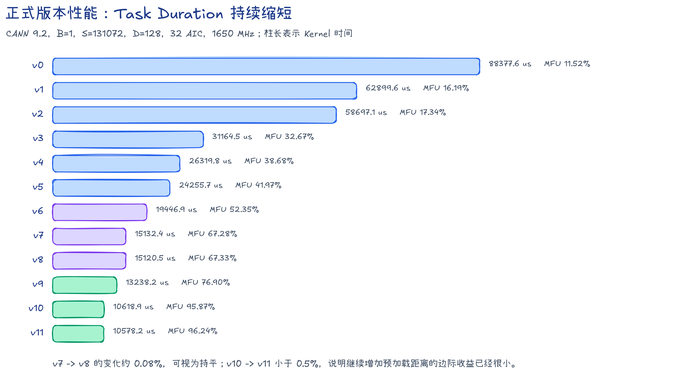

性能数据用于解释这些固定规格版本的设计结果，不代表完整 Flash Attention 的通用性能上限。详细统计口径见“[性能统计](#性能统计)”。

## 数学记号

### 下标与形状

除非特别说明，向量均为行向量，公式省略 Batch 轴和固定为 1 的 Head 轴。

| 符号 | 含义 | 形状或取值 |
| --- | --- | --- |
| $B$ | Batch 数 | 正整数 |
| $N$ | Head 数 | 本样例固定为 1 |
| $S$ | 序列长度 | 128 的正整数倍 |
| $D$ | Query、Key、Value 的通道数 | 本样例固定为 128 |
| $B_r$、$B_c$ | Query tile 与 Key/Value tile 的行数 | 本样例均固定为 128 |
| $i$ | Query tile 下标 | $0,\ldots,S/B_r-1$ |
| $j$ | Key/Value tile 下标 | $0,\ldots,S/B_c-1$ |
| $r$、$c$ | tile 内的 Query 行和 Key 列 | $0,\ldots,127$ |
| $\gamma$ | Softmax 缩放系数 | Demo 使用 $1/\sqrt{128}$ |

输入和输出为：

$$
\mathbf Q,\mathbf K,\mathbf V,\mathbf O\in\mathbb R^{S\times D}.
$$

分块后：

$$
\mathbf Q_i\in\mathbb R^{B_r\times D},\qquad
\mathbf K_j,\mathbf V_j\in\mathbb R^{B_c\times D}.
$$

### 完整 causal Attention

令 $\mathbf M\in\mathbb R^{S\times S}$ 为 causal mask：

$$
M_{p,q}=
\begin{cases}
0,&q\le p,\\
-\infty,&q>p.
\end{cases}
$$

完整计算为：

$$
\mathbf Z=\gamma\mathbf Q\mathbf K^\top+\mathbf M,
\qquad
\mathbf P_{\mathrm{full}}=\operatorname{Softmax}_{\mathrm{row}}(\mathbf Z),
\qquad
\mathbf O=\mathbf P_{\mathrm{full}}\mathbf V.
$$

$\mathbf P_{\mathrm{full}}$ 是完整归一化后的 Attention 概率。后文代码阶段中的 $\mathbf P_{i,j}$ 是单个 tile 的指数分子，二者含义不同。

## 分块与 Online Softmax

### 只发射有效 tile

FALite 把 Attention 矩阵切成 $128\times128$ 的 tile。第 $i$ 个 Query tile 只读取 $j\le i$ 的 Key/Value tile：

- $j<i$：整个 tile 都位于因果下三角，完整参与计算；
- $j=i$：对角 tile 只保留块内 $c\le r$ 的元素；
- $j>i$：整个 tile 位于未来区域，不发射 QK 和 PV 矩阵乘。

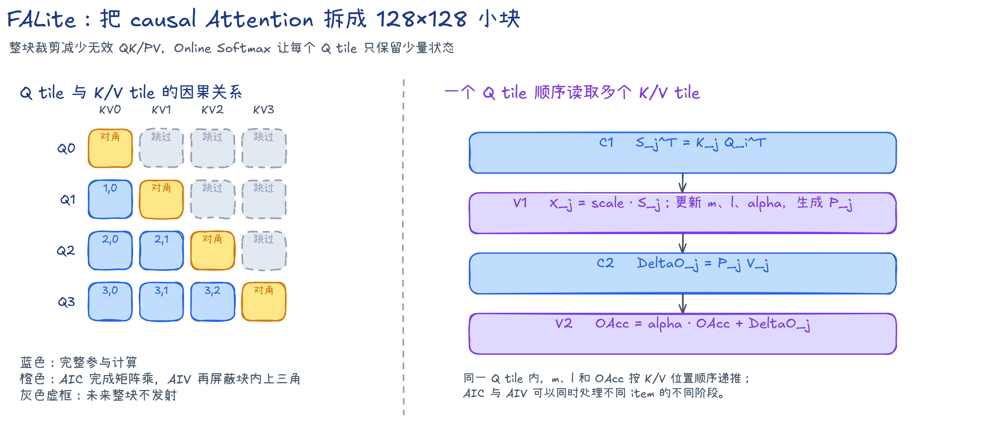

对角 tile 的 AIC 仍执行完整矩阵乘。AIV 在最大值扫描和指数求和扫描中都把块内上三角视为 $-\infty$，确保这些位置既不影响最大值，也不会进入指数和。

### 一个 Query tile 怎样顺序读取 K/V

先定义不含缩放和 mask 的原始分数：

$$
\mathbf R_{i,j}=\mathbf Q_i\mathbf K_j^\top\in\mathbb R^{B_r\times B_c}.
$$

应用缩放与块内 mask 后：

$$
\mathbf X_{i,j}=\gamma\mathbf R_{i,j}+\mathbf M_{i,j}.
$$

对固定的 $i$，从 $j=0$ 开始维护三份 FP32 状态：逐行最大值 $\mathbf m_{i,j}\in\mathbb R^{B_r}$、逐行指数和 $\boldsymbol\ell_{i,j}\in\mathbb R^{B_r}$ 和未归一化输出 $\mathbf O^{\mathrm{acc}}_{i,j}\in\mathbb R^{B_r\times D}$。

第 $j$ 个 tile 先更新最大值：

$$
\mathbf m_{i,j}=\max\left(\mathbf m_{i,j-1},\operatorname{RowMax}(\mathbf X_{i,j})\right).
$$

旧状态需要按新最大值缩放：

$$
\boldsymbol\alpha_{i,j}=\exp\left(\mathbf m_{i,j-1}-\mathbf m_{i,j}\right)\in\mathbb R^{B_r}.
$$

本 tile 的指数分子为：

$$
\mathbf P_{i,j}=\exp\left(\mathbf X_{i,j}-\mathbf m_{i,j}[:,\mathrm{None}]\right)\in\mathbb R^{B_r\times B_c}.
$$

随后更新指数和与输出累加：

$$
\boldsymbol\ell_{i,j}=\boldsymbol\alpha_{i,j}\odot\boldsymbol\ell_{i,j-1}+\operatorname{RowSum}(\mathbf P_{i,j}),
$$

$$
\mathbf O^{\mathrm{acc}}_{i,j}=\boldsymbol\alpha_{i,j}[:,\mathrm{None}]\odot\mathbf O^{\mathrm{acc}}_{i,j-1}+\mathbf P_{i,j}\mathbf V_j.
$$

初始化时令 $\mathbf m_{i,-1}=-\infty$、$\boldsymbol\ell_{i,-1}=\mathbf 0$、$\mathbf O^{\mathrm{acc}}_{i,-1}=\mathbf 0$。处理完 $j=0,\ldots,i$ 后得到：

$$
\mathbf O_i=\mathbf O^{\mathrm{acc}}_{i,i}\oslash\boldsymbol\ell_{i,i}[:,\mathrm{None}].
$$

这个递推不需要保存完整 $S\times S$ Attention 矩阵。每个 Query tile 只保留 $\mathbf m$、$\boldsymbol\ell$ 和 $\mathbf O^{\mathrm{acc}}$，但同一 Query tile 内的 Key/Value tile 必须按 $j$ 的顺序更新状态。

### 公式符号速查

| 符号 | 含义 | 形状 | 来源或定义 | 所处时刻 |
| --- | --- | --- | --- | --- |
| $\mathbf Q_i$ | 第 $i$ 个 Query tile | $\mathbb R^{128\times128}$ | 输入 $\mathbf Q$ 的连续 128 行 | 一个 task 开始时 |
| $\mathbf K_j$、$\mathbf V_j$ | 第 $j$ 个 Key/Value tile | $\mathbb R^{128\times128}$ | 输入 $\mathbf K$、$\mathbf V$ 的连续 128 行 | 一个 item 开始时 |
| $\mathbf R_{i,j}$ | 未缩放的分数 tile | $\mathbb R^{128\times128}$ | $\mathbf Q_i\mathbf K_j^\top$ | C1 后 |
| $\mathbf X_{i,j}$ | 已缩放并应用 causal mask 的分数 | $\mathbb R^{128\times128}$ | $\gamma\mathbf R_{i,j}+\mathbf M_{i,j}$ | V1 第一遍扫描 |
| $\mathbf m_{i,j}$ | 处理到第 $j$ 个 K/V tile 后的逐行最大值 | $\mathbb R^{128}$ | Online Softmax 递推 | V1 后 |
| $\boldsymbol\alpha_{i,j}$ | 旧输出和旧指数和的缩放系数 | $\mathbb R^{128}$ | $\exp(\mathbf m_{i,j-1}-\mathbf m_{i,j})$ | V1 后，V2 使用 |
| $\mathbf P_{i,j}$ | 本 tile 的指数分子 | $\mathbb R^{128\times128}$ | $\exp(\mathbf X_{i,j}-\mathbf m_{i,j})$ | V1 后，C2 使用 |
| $\boldsymbol\ell_{i,j}$ | 处理到第 $j$ 个 K/V tile 后的逐行指数和 | $\mathbb R^{128}$ | Online Softmax 递推 | V1 后 |
| $\boldsymbol\Delta\mathbf O_{i,j}$ | 本 tile 对输出分子的增量 | $\mathbb R^{128\times128}$ | $\mathbf P_{i,j}\mathbf V_j$ | C2 后 |
| $\mathbf O^{\mathrm{acc}}_{i,j}$ | 尚未除以 $\boldsymbol\ell$ 的输出累加 | $\mathbb R^{128\times128}$ | V2 递推 | V2 后 |
| $\mathbf P_{\mathrm{full}}$ | 完整归一化 Attention 概率 | $\mathbb R^{S\times S}$ | $\operatorname{Softmax}(\mathbf Z)$ | 数学定义，不落盘 |

### NPU Kernel 最终公式

读者不需要重复推导 Online Softmax。设计 Kernel 时，只需实现以下四个阶段：

```text
C1: R_ij^T = K_j Q_i^T
V1: X_ij = scale * R_ij + causal_mask
    m_new = max(m_old, row_max(X_ij))
    alpha = exp(m_old - m_new)
    P_ij = exp(X_ij - m_new[:, None])
    l_new = alpha * l_old + row_sum(P_ij)
C2: DeltaO_ij = P_ij V_j
V2: OAcc_new = alpha[:, None] * OAcc_old + DeltaO_ij
End: O_i = OAcc / l[:, None]
```

AIC 实际计算的是 $\mathbf R_{i,j}^\top=\mathbf K_j\mathbf Q_i^\top$。这样 Fixpipe 可以把 128 个 Query 行对应的列均分给两路 AIV；每路 AIV 按转置后的含义读取自己的 64 列，即可为 64 个 Query 行更新 Softmax 状态。

AIV 沿 `S^T[key,query]` 生成的物理数据也是 $\mathbf P_{i,j}^{\top}$。v2～v11 将它整理为 BF16 NZ（供 Cube 读取的分块布局）后写入共享 L1，AIC 在 C2 以转置加载恢复逻辑上的 $\mathbf P_{i,j}$；v0/v1 则把 BF16 DN（普通二维布局）的 $\mathbf P_{i,j}^{\top}$ 经 GM 交给 AIC。

## 硬件映射

### 一组 Mix 核如何分工

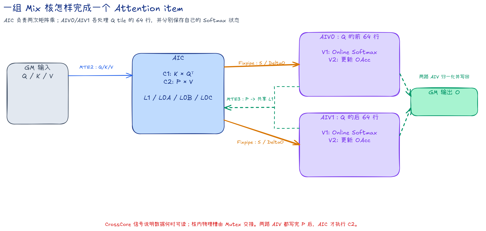

| 核心 | 负责的工作 | 保存的状态 |
| --- | --- | --- |
| AIC | C1 的 $\mathbf K_j\mathbf Q_i^\top$；C2 的 $\mathbf P_{i,j}\mathbf V_j$ | L1/GM 中的输入与中间量，L0A/L0B/L0C 中的矩阵乘工作槽 |
| AIV0 | Query tile 前 64 行的 V1/V2 | 自己的 $\mathbf m$、$\boldsymbol\ell$、$\boldsymbol\alpha$、$\mathbf O^{\mathrm{acc}}$ |
| AIV1 | Query tile 后 64 行的 V1/V2 | 与 AIV0 形状相同、内容独立的另一半状态 |

两路 AIV 不共享 Softmax 状态。它们只是在同一个 AIC 产生的矩阵 tile 上各取一半 Query 行，并分别生成自己的 `P` 分片。v2～v11 把两份 `P` 写入共享 L1，v0/v1 则经 GM 交给 AIC；AIC 必须等两路 `P` 都准备好，才能执行覆盖完整 128 行的 C2。

### 四个阶段

下表以 v2～v11 的片上直连通路为例。v0 的 `S/P/DeltaO` 都经 GM，v1 只有 `P` 经 GM；它们的四阶段计算相同，交接位置不同。

| 阶段 | 执行核心 | 主要计算 | 主要交接 |
| --- | --- | --- | --- |
| C1 | AIC | $\mathbf K_j\mathbf Q_i^\top\rightarrow\mathbf R_{i,j}^\top$ | Fixpipe 将前后 64 个 Query 行分别写入 AIV0/AIV1 UB |
| V1 | AIV0/AIV1 | 缩放、causal mask、Online Softmax、生成 BF16 `P` | 两路 AIV 经 MTE3 写入共享 L1，并分别通知 AIC |
| C2 | AIC | $\mathbf P_{i,j}\mathbf V_j\rightarrow\boldsymbol\Delta\mathbf O_{i,j}$ | Fixpipe 将结果的前后 64 行分别写入 AIV0/AIV1 UB |
| V2 | AIV0/AIV1 | 更新 $\mathbf O^{\mathrm{acc}}$；末次 item 再归一化和写回 | 消费 `DeltaO`；末次 item 将输出写回 GM |

AIV 的 `OAcc/Output` 是各自本地 UB，不由 AIC 复用。跨核槽位怎样归还取决于版本：v0～v2 使用 `DONE`，v3～v5 依靠固定阶段顺序，v6～v11 使用 ready/free 双向信号；后文会随版本分别说明。

### item、task、slot、group、epoch 和 R

这些词在各版本 README 和源码中反复出现，含义如下：

| 名称 | 含义 |
| --- | --- |
| item | 一个 Query tile 与一个已发射 Key/Value tile 的计算，即一组 C1/V1/C2/V2 |
| task | 一个 Query tile 的完整计算；它顺序处理所有允许读取的 Key/Value tile |
| slot | 一块可复用的物理片上缓冲；编号回卷时必须先确认上一位使用者已经释放 |
| group | v3～v5 中固定放在一起调度的两个 item |
| epoch | v6～v11 滚动调度的一次循环；同一 epoch 可以发射新阶段，也可以消费较早阶段 |
| $R$ | C1 与对应 V2 之间隔开的滚动代数；$R$ 越大，可提前保留的独立 C1/V1 越多 |

`R` 不是硬件自动预取次数。它由 Kernel 的发射顺序、代际槽数和跨核依赖共同定义。增加 `R` 会占用更多 L1/UB，且只有在额外工作能够覆盖等待时才可能缩短耗时。

### 数据精度

- `Q`、`K`、`V` 和最终 `O` 使用 BF16；
- 两次 Cube 矩阵乘使用 BF16 输入，并在 L0C 中进行 FP32 累加；
- C1 的分数、$\mathbf m$、$\boldsymbol\ell$、$\boldsymbol\alpha$ 和 $\mathbf O^{\mathrm{acc}}$ 使用 FP32；
- $\mathbf P_{i,j}$ 在 V1 内先以 FP32 计算，再转换为 BF16，供 C2 使用；
- C2 输出到 AIV 后恢复为 FP32，并在 V2 中与 FP32 $\mathbf O^{\mathrm{acc}}$ 累加；
- 最终除法在 FP32 中完成，写回 GM 前转换为 BF16。

### 同步分成两层

CrossCore 信号负责 AIC 与 AIV 之间的数据就绪关系。例如 AIC 写完 `S` 后通知两路 AIV，两路 AIV 都写完 `P` 后分别通知 AIC。

Mutex 负责单个 AIC 或 AIV 内部的物理槽所有权。例如 MTE1、Cube 和 Fixpipe 复用同一块 L0 时，用同一个 Mutex ID 交接该槽。Mutex 不替代 CrossCore，也不表示跨核数据已经就绪。

本文示意图中的红色虚框表示可能发生的等待，红色虚线箭头表示 CrossCore 依赖。真实等待时长以 PipeTimeline 为准；手绘色块只表达先后关系。

v6～v11 的滚动图分成两部分：上半图按 `epoch` 展示各核心的发射顺序，下半图抽出同一个 `item`，单独画清 `S/P/DeltaO` 的跨核 ready 关系。反向 free、Mutex 回卷和尾部排空会在图内注明是否省略。

## 复现方法

### 编译与运行

在 cann-samples 根目录安装数据生成和精度校验所需的 Python 依赖：

```bash
python3 -m pip install -r Samples/2_Performance/flash_attn_lite_story/requirements.txt
```

CANN Toolkit 不在默认位置时，先设置安装路径：

```bash
export ASCEND_HOME_PATH=/path/to/ascend-toolkit/latest
```

在 cann-samples 根目录构建全部正式版本：

```bash
cmake -S . -B build -DNPU_ARCH=dav-3510
cmake --build build --target falite -j
```

可执行文件和共用验证脚本位于 `build/Samples/2_Performance/flash_attn_lite_story/`。

只构建一个版本：

```bash
cmake --build build --target falite_v11 -j
```

运行并校验：

```bash
./build/Samples/2_Performance/flash_attn_lite_story/falite_v0 --size 1 384
./build/Samples/2_Performance/flash_attn_lite_story/falite_v11 --core-num 1 --size 1 768
```

| 参数 | 含义 |
| --- | --- |
| `--size B S` | 设置 Batch 和序列长度 |
| `--core-num n` | 设置 Mix 组数上限，以 AIC 数表示；不传时使用设备全部可用 AIC |
| `--dry-run` | 仍执行 Kernel、同步、结果回传和落盘，只跳过 Golden 与精度比对 |

### 精度标准

公共验证脚本以 FP32 计算 causal Golden，并以 FP32 落盘。NPU 的 BF16 输出读取后转为 FP32，直接与未量化的 FP32 Golden 逐元素比较：

```text
abs(float(npu_bf16) - golden_fp32) <= 0.004 + 0.004 * abs(golden_fp32)
```

全部元素通过才算验证成功；NaN 或 Inf 直接判为失败。默认标准只计算一份 Attention Golden。

设置 `FA_VERIFY_LOW_PRECISION_BASELINE=1` 后，脚本再用 Torch BF16 计算一份低精度基线。设 NPU 输出和 Torch BF16 基线相对 FP32 Golden 的最大绝对误差为 $E_{\mathrm{npu}}$ 和 $E_{\mathrm{bf16}}$，通过条件为：

$$
E_{\mathrm{npu}}\le2E_{\mathrm{bf16}}.
$$

该模式参考 FlashAttention 的精度测试思路，必须能够导入 Torch：

```bash
FA_VERIFY_LOW_PRECISION_BASELINE=1 ./build/Samples/2_Performance/flash_attn_lite_story/falite_v9 --size 1 32768
```

v0～v11 均通过正式回归。各版本 README 给出覆盖流水填充、排空和槽位回卷的具体用例。

### 流水统计口径

| 数据 | 规格 | 用途 | 解读边界 |
| --- | --- | --- | --- |
| 正式性能 | CANN 9.2、32 个 AIC、`B=1,S=131072` | 比较端到端 Kernel 时间和 MFU | 不含 Host Golden 时间 |
| 真机 PipeTimeline | CANN 9.2、1 组 Mix 核、`B=1,S=2048` | 观察核内 Pipe 的忙区、空隙和重叠 | 小规格时间不参与正式性能排名 |
| CANNSIM | 1 组 Mix 核的小规格输入 | 核对指令顺序和同步关系 | 仿真周期不能替代真机耗时 |

本文的真机截图均从完整 PipeTimeline `trace.json` 直接生成，没有先裁成小 trace。每张图保留 AIC 的 MTE2、MTE1、CUBE、FIXP，以及两路 AIV 的 VECTOR、MTE3；截图宽度统一为 40 μs，图注给出顶部标尺对应的时间窗口。

MTE2、MTE1、CUBE、FIXP、VECTOR、MTE3 都是核心内部的 Pipe。它们用于观察搬运和计算是否重叠，不与 AIC/AIV 处于同一层级，也不能把不同 Pipe 的忙碌时长直接相加成 Kernel 时间。

正式性能使用：

```bash
msopprof --warm-up=5 --launch-count=1 \
    --aic-metrics=BasicInfo \
    --output=<profiling-output> \
    ./build/Samples/2_Performance/flash_attn_lite_story/falite_v11 --dry-run --size 1 131072
```

流水截图使用：

```bash
msopprof --aic-metrics=PipeTimeline \
    --output=<profiling-output> \
    ./build/Samples/2_Performance/flash_attn_lite_story/falite_v11 --dry-run --core-num 1 --size 1 2048
```

## v0～v2：先把中间结果移到片上

### v0：三个中间结果都经过 GM

v0 用最直接的单槽顺序执行一个 item：

```text
C1 -> S 写入 GM -> V1 -> P 写入 GM -> C2 -> DeltaO 写入 GM -> V2
```

每个生产者都把结果写到 GM，消费者再读回。路径容易逐项核对，但 `S`、`P`、`DeltaO` 合计需要 160 KiB/task 的 workspace，并带来额外 MTE 搬运与 Host stream 同步。

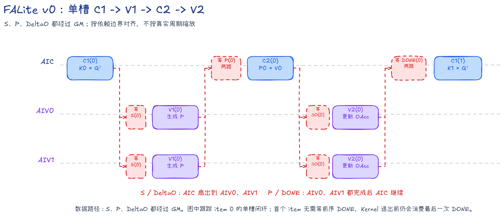

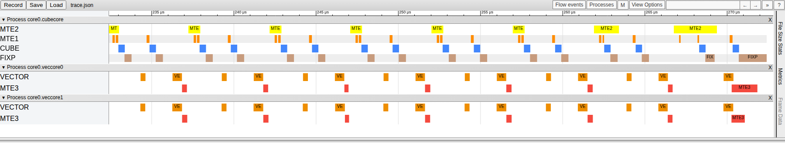

截图窗口为 `[232.419, 272.419]` μs。单槽阶段之间存在较明显的间隔，GM 中间量也使 MTE 搬运占据更多位置。

v1 保留同一计算顺序，只改变 `S` 和 `DeltaO` 的交接路径，便于把收益对应到一项明确改动。源码级流程见 [v0 README](src/v0/README.md)。

### v1：S 和 DeltaO 直接进入 AIV UB

v1 让 AIC Fixpipe 把 `S` 和 `DeltaO` 分别写入两路 AIV 的 UB：

```text
C1 -> Fixpipe 写 AIV UB -> V1 -> P 写入 GM -> C2 -> Fixpipe 写 AIV UB -> V2
```

`P` 仍按 AIV UB→GM→AIC L1 交接，所以 workspace 降到 32 KiB/task，但尚未归零。AIV MTE3 和 AIC MTE2 仍需搬运 `P`，这成为下一步可缩短的数据通路。

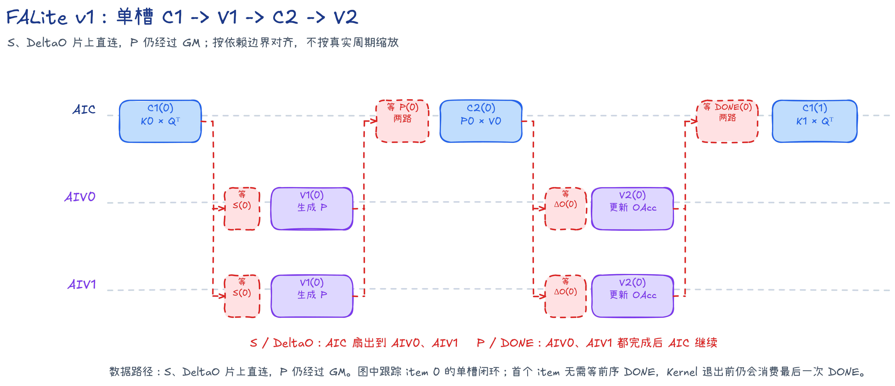


截图窗口为 `[152.785, 192.785]` μs。与 v0 相比，`S` 和 `DeltaO` 的 GM 往返被移除；`P` 的 MTE3/MTE2 交接仍然存在。

v2 继续把 `P` 放到片上，使四个阶段不再依赖 GM workspace。源码级流程见 [v1 README](src/v1/README.md)。

### v2：P 经共享 L1 交给 AIC

v2 在 AIV UB 中把 FP32 `P` 转成 BF16 NZ 布局（供 Cube 读取的分块布局），再经 MTE3 写入共享 L1。AIC 的 MTE1 从共享 L1 读取 `P` 到 L0A，随后执行 C2：

```text
C1 -> V1 -> P: AIV UB -> 共享 L1 -> AIC L0A -> C2 -> V2
```

全部中间量都留在片上，GM workspace 归零。不过只有一套 CV 槽，同一物理槽尚未被上一阶段释放时，下一 item 不能进入，AIC 和 AIV 很难同时处理相邻 item。

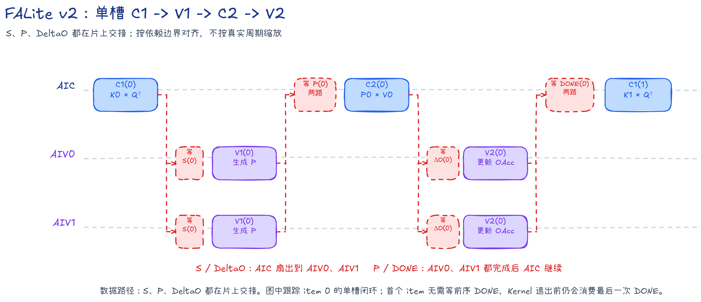


截图窗口为 `[140.107, 180.107]` μs。`P` 已不再往返 GM，但单槽依赖仍留下较多跨 Pipe 空隙。

v3 为相邻两个 item 准备两套 CV 槽，让生产者和消费者可以错位执行。源码级流程见 [v2 README](src/v2/README.md)。

## v3～v5：逐层打开流水

### v3：两个 item 错位执行

v3 把相邻两个 item 组成一组，并为 `K/V/P/S/DeltaO/alpha/PWork` 准备两套 CV 槽；`PWork` 是 AIV UB 中暂存并整理 `P` 的工作区。组内发射顺序可以简化为：

```text
AIC: C1(0) -> C1(1) -> C2(0) -> C2(1)
AIV: V1(0) -> V1(1) -> V2(0) -> V2(1)
```

AIC 的 `C1(1)` 可以与 AIV 的 `V1(0)` 重叠，后续阶段也能错位推进。两路 AIV 各有独立 CrossCore 事件，AIC 只有收到两路 `P` 就绪信号后才执行 C2。

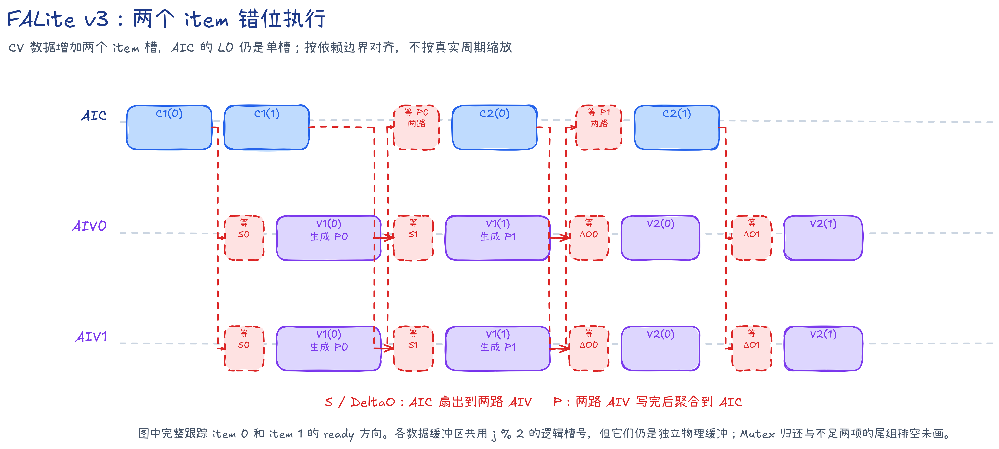

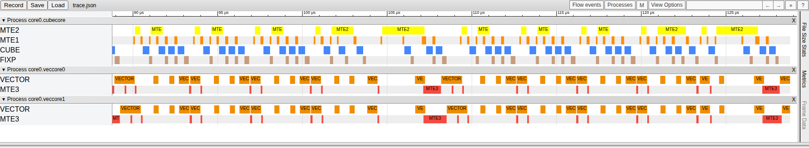

截图窗口为 `[88.796, 128.796]` μs。相同的 40 μs 视窗内出现了更多 CUBE、FIXP 与 VECTOR 重叠，说明 CV 双槽已经放开相邻 item 的并行。

v3 的 L1/UB 已有双槽，L0A/L0B/L0C 仍只有一槽。下一次矩阵乘必须等待上一阶段完整归还 L0，这引出 v4 的 AIC 核内双缓冲。源码级流程见 [v3 README](src/v3/README.md)。

### v4：L0 双缓冲

v4 将 L0A、L0B、L0C 改为双槽。MTE1/MTE2、CUBE 和 FIXP 按槽位交接所有权，使一套 L0 正在计算或写出时，另一套可以装入下一阶段的数据。

C1 分别向 MTE2 和 MTE1 发射 `K` 与 `Q` 的搬运。C2 中，`P` 的 L1→L0A 与 `V` 的 GM→L1→L0B 也使用独立就绪关系，避免一条加载路径无谓挡住另一条。

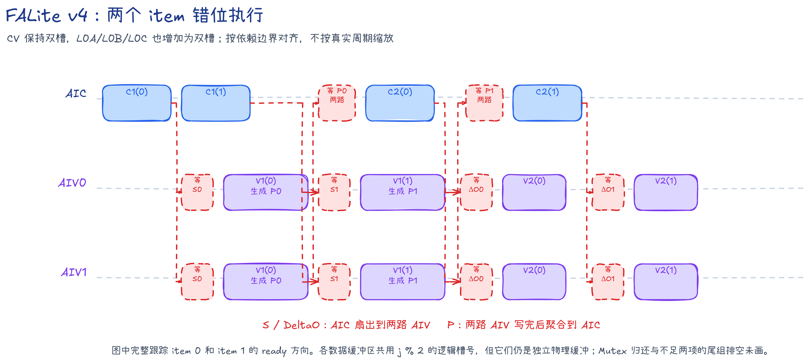

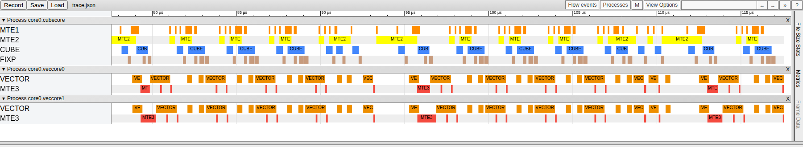

截图窗口为 `[77.589, 117.589]` μs。对照 v3，可见 AIC 的 MTE1、CUBE 和 FIXP 更紧密地交叠。

C2 仍要等 `P` 生成后才从 GM 装入 `V`，而 `V` 与 `P` 没有数据依赖。v5 将这次搬运前移到 C1。源码级流程见 [v4 README](src/v4/README.md)。

### v5：提前装入 V，并覆盖 task 边界

v5 在 C1 阶段一起把 `K` 和 `V` 搬入共享 L1。MTE1 读完 `K` 后继续保留这一 KV 槽，直到同一 item 的 C2 消费完 `V` 才归还，避免下一代数据提前覆盖。

Query L1 和 AIV 的输出区域还增加了两个 I/O 槽。一个 task 的结果经 MTE3 写回 GM 时，下一个 task 可以使用另一槽开始装入 Query 和执行计算。


截图窗口为 `[68.998, 108.998]` μs。AIC MTE2 中包含 C1 对 `K/V` 的预取，AIV 输出写回也能与后续 task 的工作交叠。

v5 的两 item 固定分组仍有一个结构性限制：组尾等待旧 C2/V2 时，下一组中没有数据依赖的 C1/V1 也不能越过本地循环边界。v6 用连续滚动调度取消这道边界。源码级流程见 [v5 README](src/v5/README.md)。

## v6～v8：连续滚动并加深 R

### 为什么固定分组仍会留下等待

v5 的 AIC 在一个 group 内发射 `C1(0), C1(1), C2(0), C2(1)`。当它等待 `P(0)` 或 `P(1)` 时，下一组的 `C1(2)` 已经不依赖这些 `P`，却仍被本地循环顺序挡在组外。AIV 等待旧 `DeltaO` 时也存在同类问题。

v6～v8 使用统一的 epoch 公式：

```text
AIC: C1(t)   后处理较早的 C2(t-R+1)
AIV: V1(t-1) 后处理较早的 V2(t-R)
```

填充阶段先发射新 C1/V1，稳态阶段同时消费较早 C2/V2，排空阶段停止产生新 item 并完成剩余阶段。这个调度增加的是独立工作覆盖等待的机会，不会减少 V1/V2 自身的指令数。

### v6：R=2，取消固定 group

v6 仍保留两代 `V/P/alpha`，但不再每两个 item 重启一次局部顺序：

```text
C1(j): epoch j
V1(j): epoch j+1
C2(j): epoch j+1
V2(j): epoch j+2
```

`S` 和 `DeltaO` 使用 ready/free 双向 CrossCore 交接，槽位可以在连续 epoch 中回卷。新的 C1/V1 可以越过 v5 的组尾等待。


截图窗口为 `[55.175, 95.175]` μs。AIC 和 AIV 的主要忙区继续变密，但两代滚动只能在等待旧 `P` 前多准备一代工作。

v7 把滚动距离增至三代，观察额外一代 C1/V1 能否覆盖分步 Vector 的等待。源码级流程见 [v6 README](src/v6/README.md)。

### v7：R=3，多提前一代工作

v7 将 `C2(j)` 延后到 epoch `j+2`，将 `V2(j)` 延后到 epoch `j+3`。`V/P/alpha` 和 L0C 结果队列都扩为三代。

AIC 等待 `P(j)` 前可以先发射到 `C1(j+2)`；AIV 在处理旧 V2 前也能多发射一代 V1。`m/l/OAcc` 的数学递推顺序没有改变。


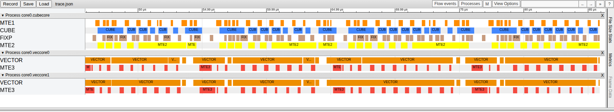

截图窗口为 `[45.915, 85.915]` μs。三代滚动让 CUBE、FIXP 和 VECTOR 形成更长的连续忙区，正式长序列耗时较 v6 下降 22.19%。

v8 将 `R/L0C` 一起增加到 `4/4`，用于判断继续加深是否仍能覆盖分步 Vector。源码级流程见 [v7 README](src/v7/README.md)。

### v8：R=4，分步 Vector 接近窗口收益上限

v8 使用四代 `V/P/alpha/L0C`，同一 item 的 C1 到 V2 相隔四个 epoch。AIV 仍使用容易逐步阅读的实现：Online Softmax 与 FP32→BF16 Cast/Pack 分开，V2 使用普通乘法和加法更新输出。

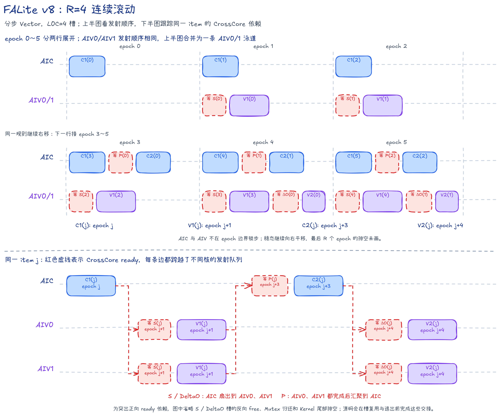

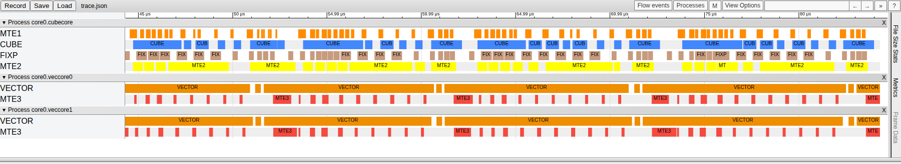

截图窗口为 `[44.312, 84.312]` μs。v7→v8 的正式长序列耗时只下降 0.08%，可视为相近水平。相邻版本同时改变 `R` 和 L0C 槽数，因此结论应落在整套配置：分步 Vector 未缩短时，继续增加一代在途工作没有带来可确认的端到端收益。

后续先压缩 V1/V2，再重新比较 `R=3/4/5`。源码级流程见 [v8 README](src/v8/README.md)。

## v9～v11：压缩 Vector 后重新比较 R

### 两条版本路线怎样对应

v7～v11 同时涉及滚动距离和 Vector 写法，可按下表配对比较：

| $R$ | 分步 Vector | 压缩 Vector | 可以回答的问题 |
| ---: | --- | --- | --- |
| 3 | v7，L0C=3 | v9，L0C=4 | 两个完整 `R=3` 版本的结果；L0C 也不同，不能做单项归因 |
| 4 | v8，L0C=4 | v10，L0C=4 | v8→v10 只改变 Vector；v9→v10 只改变 `R=3/4` |
| 5 | — | v11，L0C=4 | v10→v11 只改变 `R=4/5` |

“分步 Vector”把 Online Softmax、Cast/Pack 和输出乘加分成多个步骤。“压缩 Vector”把 Softmax 与 Cast/Pack 融合，使用多路寄存器链，并在首轮直接初始化状态、后续使用融合乘加。

### v9：R=3 的压缩 Vector

v9 把压缩 Vector 放在 `R=3` 调度下。V1 在一次 VF（Vector Function，即 AIV 上执行的一段 Vector 函数）中完成最大值、指数和、BF16 转换与 NZ 写入；V2 的首个 item 直接用 `DeltaO` 初始化 `OAcc`，后续 item 使用 `MulDstAdd` 更新。

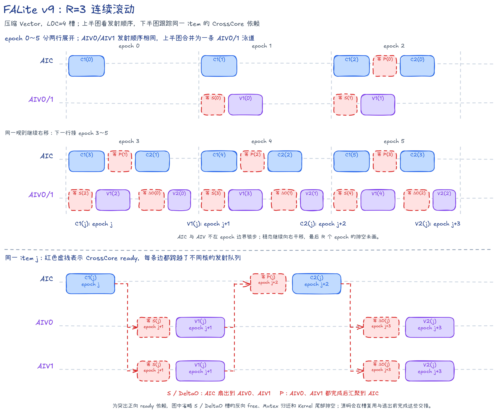

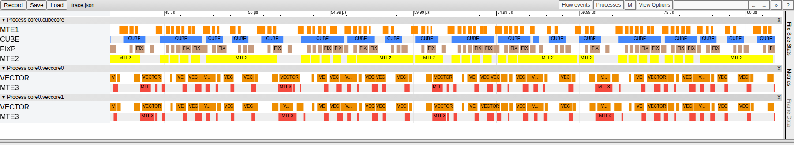

截图窗口为 `[41.778, 81.778]` μs。压缩后的 VECTOR 忙区短于分步路径，但三代滚动仍可能在第四代 C1 进入前等待较早 `P`。

v10 保持同一套压缩 Vector 和四槽 L0C，只把 `R` 增至 4。这使 v9→v10 成为滚动距离的直接对照。源码级流程见 [v9 README](src/v9/README.md)。

### v10：R=4 与压缩 Vector 配合

v10 可分别与 v8、v9 作单变量对照：

- v8→v10：`R=4,L0C=4` 不变，只压缩 Vector；
- v9→v10：压缩 Vector 与 `L0C=4` 不变，只把 `R` 从 3 增至 4。


截图窗口为 `[39.165, 79.165]` μs。与 v8 相比，VECTOR 忙区被拆成更短的工作块；与 v9 相比，第四代独立 C1/V1 进一步填补较早阶段的等待。正式长序列数据中，v8→v10 耗时下降 29.77%，v9→v10 下降 19.79%。

L0C 的四个 FP32 tile 已占满 256 KiB，不能再随 `R` 增加。v11 保持 L0C 四槽，只增加 `V/P/alpha` 的代际距离。源码级流程见 [v10 README](src/v10/README.md)。

### v11：R=5，收益进入平台区

v11 把滚动距离增至 5，L0C 仍按 4 槽回卷。AIC L1 为第五代 `V/P` 增加空间，AIV 也保留第五代 `alpha`，但 C2 的 FP32 结果继续使用四槽 L0C。


截图窗口为 `[36.456, 76.456]` μs。v10 和 v11 的 AIC/AIV 忙区都已十分紧凑；统一汇总表的中位数相差 0.38%，同轮交错对照约为 0.50%，两种口径都说明变化很小。继续增加 `R` 会消耗更多 L1/UB，而可覆盖的等待已经不多。

这组结果说明滚动距离需要与 Vector 路径长度共同选择。当 `R` 已覆盖主要等待后，继续增大 `R` 会增加片上空间占用，端到端收益则趋于平缓。源码级流程见 [v11 README](src/v11/README.md)。

## 性能统计

### 计算量和 MFU

causal Attention 的 QK 和 PV 两次矩阵乘都只统计有效下三角，合计有效 Cube 工作量为：

$$
F_{\mathrm{effective}}=2BNDS(S+1).
$$

FALite 跳过所有未来整块，但对角 tile 仍由 AIC 完整计算，实际整块工作量为：

$$
F_{\mathrm{tile}}=2BNDS(S+128).
$$

有效 MFU 使用：

$$
\mathrm{MFU}_{\mathrm{effective}}=
\frac{F_{\mathrm{effective}}}{T\times432\times10^{12}},
$$

其中 $T$ 是 Kernel Task Duration 的秒数，432 TFLOP/s 是 950PR 全部 32 个 AIC 的 BF16 Cube 峰值。统一规格下的工作量和峰值理论下限为：

| 统计口径 | 工作量/TFLOP | 峰值理论下限/μs |
| --- | ---: | ---: |
| 有效下三角 | 4.398080065536 | 10180.740892 |
| 实际整块 | 4.402341478400 | 10190.605274 |

### 统一条件

- CANN 9.2.0，Ascend 950PR，真机 mode2（每组 `1 AIC + 2 AIV`）；
- `B=1,N=1,S=131072,D=128`，32 个 AIC，1650 MHz；
- `msopprof --warm-up=5 --launch-count=1 --aic-metrics=BasicInfo`；
- 读取 `OpBasicInfo.csv` 的 `Task Duration(us)`；
- `--dry-run` 仍执行 Kernel、同步、D2H 和结果落盘，只跳过 Golden。

### 正式结果

| 版本 | 调度 | Vector 写法 | Task Duration（μs） | 有效吞吐（TFLOP/s） | 有效 Cube MFU | 高于有效下限（μs） | 整块 Cube 利用率 |
| --- | --- | --- | ---: | ---: | ---: | ---: | ---: |
| v0 | 单槽，`S/P/DeltaO` 经 GM | 分步 | 88377.640625 | 49.764624 | 11.5196% | 78196.899733 | 11.5308% |
| v1 | 单槽，只有 `P` 经 GM | 分步 | 62899.636719 | 69.922185 | 16.1857% | 52718.895827 | 16.2014% |
| v2 | 单槽，中间结果片上直连 | 分步 | 58697.125000 | 74.928373 | 17.3445% | 48516.384108 | 17.3613% |
| v3 | 双 item | 分步 | 31164.513672 | 141.124617 | 32.6677% | 20983.772780 | 32.6994% |
| v4 | 双 item，L0 双缓冲 | 分步 | 26319.761719 | 167.101819 | 38.6810% | 16139.020827 | 38.7185% |
| v5 | 双 item，增加 I/O 双缓冲 | 分步 | 24255.705078 | 181.321469 | 41.9726% | 14074.964186 | 42.0132% |
| v6 | `R=2,L0C=2` | 分步 | 19446.865234 | 226.158819 | 52.3516% | 9266.124342 | 52.4023% |
| v7 | `R=3,L0C=3` | 分步 | 15132.375000 | 290.640436 | 67.2779% | 4951.634108 | 67.3431% |
| v8 | `R=4,L0C=4` | 分步 | 15120.490234 | 290.868880 | 67.3308% | 4939.749342 | 67.3960% |
| v9 | `R=3,L0C=4` | 压缩 | 13238.221680 | 332.225896 | 76.9041% | 3057.480788 | 76.9787% |
| v10 | `R=4,L0C=4` | 压缩 | 10618.893555 | 414.174984 | 95.8738% | 438.152663 | 95.9667% |
| v11 | `R=5,L0C=4` | 压缩 | 10578.221680 | 415.767432 | 96.2425% | 397.480788 | 96.3357% |

前半段的主要变化可以按数据通路阅读：v0→v1 去掉 `S/DeltaO` 的 GM 往返，耗时下降 28.83%；v1→v2 再去掉 `P` 的 GM 往返，下降 6.68%；v2→v3 引入 CV 双槽后下降 46.91%；v3→v5 继续打开 L0 和 I/O 流水。

后半段需要按实验变量配对：v6→v7 的整套 `R/L0C=2/2→3/3` 配置下降 22.19%；v7→v8 仅变化 0.08%；v8→v10 在 `R=4,L0C=4` 下只压缩 Vector，下降 29.77%；v9→v10 只把 `R` 从 3 增至 4，下降 19.79%；v10→v11 按统一汇总表相差 0.38%，同轮交错对照约为 0.50%。

除单独注明的同轮交错对照外，这些百分比都由统一性能表计算。约 0.5% 的变化不宜单独作为稳定收益结论，更适合结合重复采样和流水证据判断。

## 后续方向

FALite 用固定规格把 `1 AIC + 2 AIV` 的数据交接和流水调度拆成了可逐版阅读的实现。开发者可以沿以下方向继续完善：

- 在公共接口中增加 causal 选择、非方形 Q/KV、offset、滑动窗口和 KV Cache；
- 支持序列尾块、更多 Head/HeadDim，并补充完整网络需要的 bias、Dropout 或融合能力；
- 研究对角 tile 的专用计算，减少块内上三角仍由 Cube 执行的无效工作；
- 在保持精度标准的前提下继续压缩 Vector、数据搬运和跨核等待；
- 为不同序列长度、核数和片上空间约束选择合适的滚动距离，而不是固定追求更大的 `R`。

这个样例仍有继续优化的空间。欢迎开发者在 [cann-samples 的 Flash Attention Lite 样例](https://gitcode.com/cann/cann-samples/tree/master/Samples/2_Performance/flash_attn_lite_story) 上继续完善这项工作，包括改进性能和精度标准，或补充更多能力以贴近完整网络中的 Flash Attention。

## 参考资料

- [FlashAttention: Fast and Memory-Efficient Exact Attention with IO-Awareness](https://arxiv.org/abs/2205.14135)
- [FlashAttention-2: Faster Attention with Better Parallelism and Work Partitioning](https://arxiv.org/abs/2307.08691)
- [FlashAttention 官方仓库与精度测试说明](https://github.com/Dao-AILab/flash-attention)
- [Ascend C 算子开发文档](https://www.hiascend.com/document/redirect/CannCommunityAscendC)
