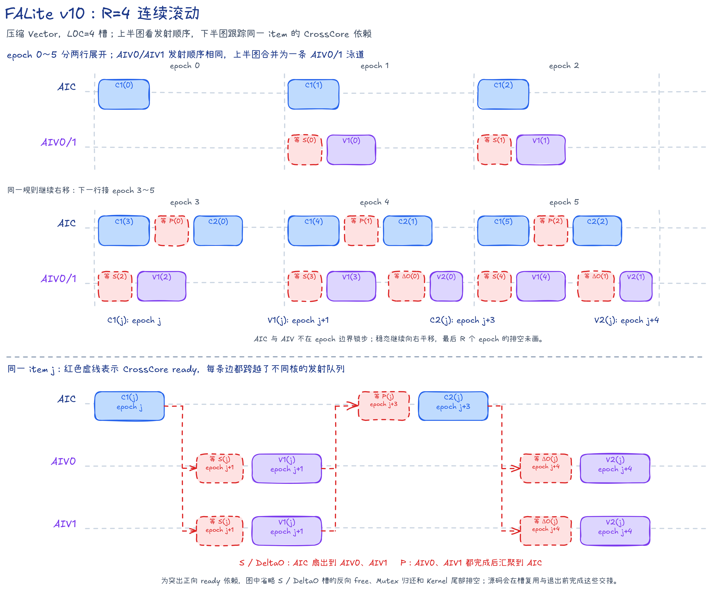
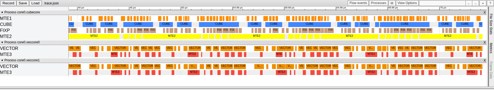

# FALite v10：四代滚动与压缩 Vector 配合

## 本版内容

FALite v10 在 v9 的压缩 Vector 路径上把滚动距离从 3 增至 4。它提供两组可直接归因的对照：与 v8 相比只改变 Vector 写法，与 v9 相比只改变 R 及其派生代际槽。

本版固定计算因果 Flash Attention 前向。

| 项目 | 实现 |
| --- | --- |
| 输入与输出 | BF16 `Q/K/V/O`，物理形状 `[B,S,128]`，逻辑形状 `[B,1,S,128]` |
| 分块 | `Br=Bc=D=128`，`B>0`、`S>0` 且 `S%128==0` |
| 内部精度 | Cube 使用 BF16 输入和 FP32 累加；Softmax 状态、`alpha` 和 `OAcc` 使用 FP32；`P` 为 BF16 |
| 并行方式 | 一个 Mix 组包含 `1 AIC + 2 AIV`；一个 `task` 处理一个 Query 分块，两路 AIV 各处理 64 行 |
| 因果模式 | Q 与 K/V 等长、同起点，固定使用包含对角线的标准下三角掩码 |
| 未覆盖能力 | 尾块、非方形 Q/KV、多 Head、多种 HeadDim、滑动窗口、KV Cache、dropout 和反向计算 |

所有中间结果均在片上交接，不使用 GM workspace。

## task、item、阶段与 epoch

一个 `task` 表示一个 Query 分块（Q tile）的完整计算。

这个 `task` 每发射一个 Key/Value 分块，就形成一个 `item=(i,j)`。其中 `i` 是 Query 分块编号，`j` 是 Key/Value 分块编号；每个 `item` 依次经过 C1、V1、C2 和 V2。

因果模式只处理 `j=0...i`。源码变量 `oDelta` 对应本文的 `DeltaO=P_jV_j`，下文统一写作 `DeltaO`。

数据布局：DN 指普通二维布局，NZ 指供 Cube 使用的分块布局；NZ 转换中的临时填充会在写入共享 L1 时跳过。

代码名词：`PWork` 是 AIV UB 中暂存并整理 `P` 的工作区；VF（Vector Function）指在 AIV 上执行的一段 Vector 函数。

| 阶段 | 核心 | 工作 |
| --- | --- | --- |
| `C1(j)` | AIC | `K_j × Q_i^T -> S_j^T`，预取 `V_j`，Fixpipe 把 S 分发到两路 AIV UB |
| `V1(j)` | AIV | 缩放、对角块因果掩码和 Online Softmax（分块 Softmax 递推），并直接生成 BF16 NZ `P_j` |
| `C2(j)` | AIC | 等两路 AIV 写好 P，计算 `P_j × V_j -> DeltaO_j`，Fixpipe 把 DeltaO 分发到两路 AIV UB |
| `V2(j)` | AIV | 首个 `item` 用 DeltaO 建立 OAcc，后续执行 `OAcc = alpha_j × OAcc + DeltaO_j` |

对应的 Online Softmax 公式为：

```text
x_j      = causal_mask(scale × Q_i × K_j^T)
m_new    = max(m, rowmax(x_j))
alpha_j  = exp(m - m_new)
P_j      = exp(x_j - m_new)
l_new    = alpha_j × l + rowsum(P_j)
OAcc_new = alpha_j × OAcc + P_j × V_j
```

`P_j` 是尚未除以完整分母的分子贡献，最终输出为 `O=OAcc/l`。首个 `item` 直接建立 `m/l/OAcc`，后续 `item` 执行普通递推。

`epoch` 表示滚动调度循环的一次推进。AIC 与 AIV 并不按 `epoch` 锁步，真正的数据消费由 CrossCore 信号约束。

## R=4 的滚动调度

`R=4` 表示同一个 `item` 的 C1 与 V2 相隔 4 个 `epoch`。对至少有 4 个有效 `item` 的 task，首个 C2 之前会发射 4 个 C1；较短 task 只发射实际存在的 C1：

```text
C1(j): epoch = j
V1(j): epoch = j + 1
C2(j): epoch = j + 3
V2(j): epoch = j + 4
```

| `epoch` | AIC 内的发射顺序 | 每路 AIV 内的发射顺序 |
| ---: | --- | --- |
| 0 | `C1(0)` | — |
| 1 | `C1(1)` | `V1(0)` |
| 2 | `C1(2)` | `V1(1)` |
| 3 | `C1(3) -> C2(0)` | `V1(2)` |
| 4 | `C1(4) -> C2(1)` | `V1(3) -> V2(0)` |
| `t` | `C1(t) -> C2(t-3)` | `V1(t-1) -> V2(t-4)` |

循环范围是 `epoch=0...kvTileCount+R-1`：

- 填充：C1、V1、C2 和 V2 依次进入流水；
- 稳态：C1/V1 与 C2/V2 处理不同的 `item`；
- 排空：最后一个 C1 后继续推进 4 个 `epoch`，完成剩余阶段。

阶段边界都按 `kvTileCount` 判断，较短的 `task` 不会等待不存在的 `item`。



上半图按 `epoch` 展示填充和稳态发射顺序；下半图抽出同一个 `item=j`，分别画出 `S`、`P`、`DeltaO` 的 CrossCore 扇出或聚合。红色虚框表示等待，跨泳道箭头表示 ready 方向；反向 free、Mutex 回卷和尾部排空按图内说明省略。色块宽度不表示真实耗时。

## 因果掩码

本版采用两层因果处理：

1. 整块裁剪：`kvTileCount=i+1`，第 `i` 个 Query 分块只读取 K/V 分块 `0...i`。
2. 对角块内掩码：当 `j==i` 时，AIV 屏蔽 `keyLocalIdx > queryLocalIdx` 的分数。

C1 输出 `S^T[Bc,Br]`。Vector 寄存器通道对应 Query 行，Key 行由循环变量给出；AIV0 处理 Query 局部行 0～63，AIV1 处理 64～127。`OnlineSoftmaxCastPackVF` 在最大值扫描和指数和/P 扫描中都使用相同的因果掩码。

## AIC 数据路径与核内流水

| 缓冲 | 槽数 | 用途 | Mutex ID |
| --- | ---: | --- | --- |
| K L1 | 2 | C1 内短生命周期双槽 | 0～1 |
| V L1 | 4 | 从 `C1(j)` 保存到 `C2(j)` | 2～5 |
| Q L1 | 2 | `task` 级双槽 | 6～7 |
| P L1 | 4 | 接收两路 AIV 合写的 P | CrossCore `P_READY` |
| L0A/L0B | 各 2 | MTE1 与 Cube 之间交接 | 8～9 |
| L0C | 4 | Cube 与 Fixpipe 之间的结果队列 | 10～13 |

L1 使用 384 KiB，L0A/L0B 各使用 64 KiB，L0C 使用 256 KiB。

```text
C1:
  Q: GM -> L1 -> L0B
  K: GM -> L1 -> L0A
  V: GM -> L1，保存到 j%4 代际槽
  K × Q^T -> L0C -> Fixpipe -> S UB

C2:
  P: AIV UB -> 共享 L1 -> L0A
  V: j%4 代际槽 -> L0B
  P × V -> L0C -> Fixpipe -> DeltaO UB
```

Q 在一个 `task` 的所有 C1 中共用，由首个 C1 取得、末个有效 C1 归还。K 使用双槽，V/P 使用四个代际槽。C1/C2 的矩阵乘由 `mmadOpIdx` 统一编号，L0A/L0B 按两槽轮转，L0C 按四槽轮转。

Fixpipe 在等待 AIV 归还目标 S/DeltaO 槽前先取得对应 L0C Mutex，避免后续矩阵乘覆盖尚未写出的结果。

## AIV 数据路径与核内流水

| 缓冲 | 槽数 | 内容 | Mutex ID |
| --- | ---: | --- | --- |
| S UB | 2 | FP32 `[128,64]` | CrossCore 双向交接 |
| DeltaO UB | 2 | FP32 `[64,128]` | CrossCore 双向交接 |
| PWork UB | 2 | 带 padding 的 BF16 NZ P | 0～1 |
| OAcc/Output UB | 2 | FP32 OAcc 与 BF16 Output 共址 | 2～3 |
| alpha UB | 4 | 四代行缩放系数 | Vector 顺序使用 |
| m/l UB | 各 1 | 64 行最大值与指数和 | Vector 顺序使用 |

单路 AIV 的 UB 使用 225.75 KiB。

`OnlineSoftmaxCastPackVF` 用两遍扫描完成 Online Softmax：第一遍用四路寄存器求最大值，第二遍用四路寄存器计算指数和，并把 FP32 指数直接转换、整理到 BF16 NZ PWork。这样可以省去指数结果写回 S UB 后再由第二个 VF 重读的过程。

首个 V1 直接建立 `m/l`，首个 V2 直接用 DeltaO 建立 OAcc。其余 V2 一次处理两个 Query 行，每行分成两个 64 元素片段，使用四组寄存器和 `MulDstAdd` 更新 OAcc。

PWork Mutex 负责 Vector→MTE3 的交接；Output Mutex 负责 Vector→MTE3 的交接。全部 `item` 完成后，`FusedDivCastInplaceVF` 在 OAcc 槽内计算 `OAcc/l` 并生成 BF16 Output，MTE3 再写回 GM。

## CrossCore 同步

真机 `mode2`（每组 `1 AIC + 2 AIV`）的逻辑 flag ID 如下。

| 数据 | flag ID | 方向 | 交接 |
| --- | ---: | --- | --- |
| S | 0～1 | AIC Fixpipe -> AIV Vector | AIV 初始发 free；AIC 写完发 ready；两路 AIV 读完归还 free |
| P | 2～5 | AIV MTE3 -> AIC MTE1 | 两路 AIV 各写一半，AIC 等齐后执行 C2 |
| DeltaO | 6～7 | AIC Fixpipe -> AIV Vector | AIV 初始发 free；AIC 写完发 ready；V2 读完归还 free |

S/DeltaO 使用两槽 ready/free 双向交接，并在 Kernel 结束时由 AIC 消费最后的 free。P 不使用 free flag：`C2(j)` 在 `epoch j+3` 读取 P，`V2(j)` 在 `epoch j+4` 读取 alpha，`V1(j+4)` 到 `epoch j+5` 才覆盖同一代际槽。

`SIM_COMPATIBLE` 构建以 mode4 分别同步两路 AIV，但数据生产、消费和槽位回卷顺序不变。

## 调度伪代码

```python
R = 4
aiv_set_initial_s_and_odelta_free_flags()

for task in tasks_of_this_mix_group:
    q_tile = task % query_tile_count
    kv_tile_count = q_tile + 1
    AIC.load_q(task, io_slot)
    AIV.lock_output_slot(io_slot)

    for epoch in range(kv_tile_count + R):
        if epoch < kv_tile_count:
            AIC.c1(epoch)

        if epoch >= 1 and epoch - 1 < kv_tile_count:
            j = epoch - 1
            AIV.wait_s_ready(j % 2)
            AIV.softmax_cast_pack(j, diagonal_mask=(j == q_tile))
            AIV.copy_p_half_to_l1(j % R)
            AIV.set_p_ready(j % R)

        if epoch >= R - 1 and epoch - R + 1 < kv_tile_count:
            j = epoch - R + 1
            AIC.wait_two_p_ready(j % R)
            AIC.c2(j)

        if epoch >= R and epoch - R < kv_tile_count:
            j = epoch - R
            AIV.wait_odelta_ready(j % 2)
            AIV.update_output(first_item=(j == 0))

    AIV.normalize_cast_and_store(io_slot)
    io_slot ^= 1

AIC.drain_final_s_and_odelta_free_flags()
```

## 从 v9 到 v10

| 项目 | v9 | v10 |
| --- | ---: | ---: |
| `R` | 3 | 4 |
| V/P/alpha 代际槽 | 3 | 4 |
| L0C | 4 槽 | 4 槽 |
| L1 占用 | 320 KiB | 384 KiB |
| 单路 AIV UB | 225.50 KiB | 225.75 KiB |
| AIC/AIV 计算 | 压缩 Vector | 压缩 Vector |

除 `CV_PIPELINE_SLOT_NUM: 3→4` 外，两版的 Host、AIC、AIV、L0C、causal 和同步源码相同。V/P/alpha 槽数、地址和 flag 范围都是 R 的派生结果，因此 v9→v10 可以直接比较三代与四代滚动。

## 两组直接对照

- v8→v10：两版都使用 `R=4,L0C=4`，Host、AIC、缓冲和同步相同，只替换 AIV Vector 路径。
- v9→v10：两版都使用压缩 Vector 和四槽 L0C，只把 R 从 3 增至 4。

这两组对照把“缩短单个 V1/V2”和“增加可重叠 `item` 数”分开。v8→v9 同时改变这两项，不用于单项归因。

## 流水证据



截图直接取自完整 PipeTimeline trace 的 `[39.165, 79.165]` μs。它既可与 v8 比较压缩前后的 VECTOR 忙区，也可与 v9 比较三代和四代滚动带来的等待变化；三张图使用一致的时间宽度和 Pipe 集合。

## 局限与下一方向

R=4 已允许四代 C1/V1 在途，压缩 Vector 又减少了每个 V1/V2 的工作。L0C 的四个 FP32 tile 已占满 256 KiB，不能随 R 继续增加。[v11](../v11/README.md) 保持四槽 L0C，通过 Mutex 回卷这四个槽，只把 V/P/alpha 的代际距离增至 5，判断额外一代预加载是否仍有收益。

## 精度与性能

性能条件为 CANN 9.2.0、Ascend 950PR、mode2、32 个 AIC、1650 MHz 和 `B=1,N=1,S=131072,D=128`。

模型算力利用率（MFU）按因果有效 Cube 工作量计算。

| 对照 | 版本 | 配置 | Task Duration（μs） | 因果有效 Cube MFU |
| --- | --- | --- | ---: | ---: |
| Vector 写法 | v8 | `R=4,L0C=4`，分步 Vector | 15120.490234 | 67.3308% |
| Vector 写法 | v10 | `R=4,L0C=4`，压缩 Vector | 10618.893555 | 95.8738% |
| 滚动距离 | v9 | `R=3,L0C=4`，压缩 Vector | 13238.221680 | 76.9041% |
| 滚动距离 | v10 | `R=4,L0C=4`，压缩 Vector | 10618.893555 | 95.8738% |

v8→v10 耗时下降 29.77%，表示压缩 Vector 的收益；v9→v10 耗时下降 19.79%，表示压缩 Vector 下把 R 从 3 增至 4 的收益。

默认将 NPU 的 BF16 输出转为 FP32，直接与 FP32 causal Golden 逐元素比较：

```text
abs(float(npu_bf16) - golden_fp32) <= 0.004 + 0.004 * abs(golden_fp32)
```

v10 已通过 `--size 1 131072` 回归。构建和验证命令如下：

```bash
cmake -S . -B build -DNPU_ARCH=dav-3510
cmake --build build --target falite_v10 -j
./build/Samples/2_Performance/flash_attn_lite_story/falite_v10 --core-num 1 --size 1 640
```

`S=640` 包含 5 个 Query tile，可覆盖 R=4 的完整填充、排空和首次代际槽回卷。
