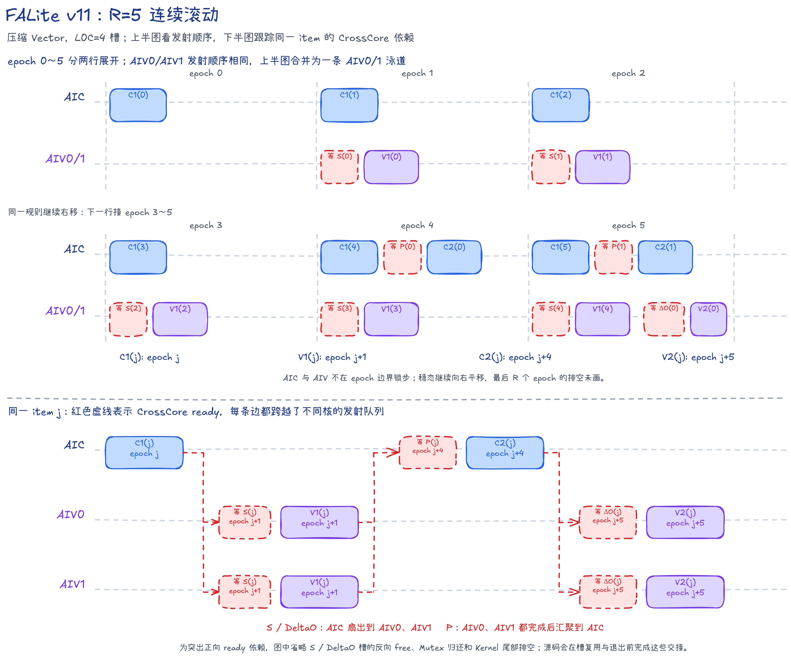

# FALite v11：把压缩 Vector 的滚动距离增至五代

## 本版内容

FALite v11 沿用 v10 的压缩 Vector，把滚动距离从四代增至五代。V、P 和 alpha 使用五个代际槽，L0C 使用四个结果槽并按矩阵乘发射序号回卷。

本版固定计算因果 Flash Attention 前向。

| 项目 | 实现 |
| --- | --- |
| 输入与输出 | BF16 `Q/K/V/O`，物理形状 `[B,S,128]`，逻辑形状 `[B,1,S,128]` |
| 分块 | `Br=Bc=D=128`，`B>0`、`S>0` 且 `S%128==0` |
| 内部精度 | Cube 使用 BF16 输入和 FP32 累加；Softmax 状态、`alpha` 和 `OAcc` 使用 FP32；`P` 为 BF16 |
| 并行方式 | 一个 Mix 组包含 `1 AIC + 2 AIV`；一个 `task` 处理一个 Query 分块，两路 AIV 各处理 64 行 |
| 因果模式 | Q 与 K/V 等长、同起点，固定使用包含对角线的标准下三角掩码 |
| 未覆盖能力 | 尾块、非方形 Q/KV、多 Head、多种 HeadDim、滑动窗口、KV Cache、dropout 和反向计算 |

本版不使用 GM workspace，所有中间结果都在片上交接。

## task、item、阶段与 epoch

一个 `task` 表示一个 Query 分块（Q tile）的完整计算。

这个 `task` 每发射一个 Key/Value 分块，就形成一个 `item=(i,j)`。其中 `i` 是 Query 分块编号，`j` 是 Key/Value 分块编号；每个 `item` 依次经过 C1、V1、C2 和 V2。

因果模式只处理 `j=0...i`。源码变量 `oDelta` 对应本文的 `DeltaO=P_jV_j`，下文统一写作 `DeltaO`。

数据布局：DN 指普通二维布局，NZ 指供 Cube 使用的分块布局；NZ 转换中的临时填充会在写入共享 L1 时跳过。

代码名词：`PWork` 是 AIV UB 中暂存并整理 `P` 的工作区；VF（Vector Function）指在 AIV 上执行的一段 Vector 函数。

| 阶段 | 核心 | 工作 |
| --- | --- | --- |
| `C1(j)` | AIC | `K_j × Q_i^T -> S_j^T`，预取 `V_j`，Fixpipe 把 S 分发到两路 AIV UB |
| `V1(j)` | AIV | 缩放、对角块因果掩码和 Online Softmax（分块 Softmax 递推），并直接生成 BF16 NZ `P_j` |
| `C2(j)` | AIC | 等两路 AIV 写好 P，计算 `P_j × V_j -> DeltaO_j`，Fixpipe 把 DeltaO 分发到两路 AIV UB |
| `V2(j)` | AIV | 首个 `item` 用 DeltaO 建立 OAcc，后续执行 `OAcc = alpha_j × OAcc + DeltaO_j` |

对应的 Online Softmax 公式为：

```text
x_j      = causal_mask(scale × Q_i × K_j^T)
m_new    = max(m, rowmax(x_j))
alpha_j  = exp(m - m_new)
P_j      = exp(x_j - m_new)
l_new    = alpha_j × l + rowsum(P_j)
OAcc_new = alpha_j × OAcc + P_j × V_j
```

`P_j` 是尚未除以完整分母的分子贡献，最终输出为 `O=OAcc/l`。首个 `item` 直接建立 `m/l/OAcc`，后续 `item` 执行普通递推。

`epoch` 表示滚动调度循环的一次推进，只描述每颗核心的发射顺序。AIC 与 AIV 的完成时刻由各自 Pipe 和 CrossCore 依赖决定。

## R=5 的滚动调度

`R=5` 表示同一 `item` 的 C1 与 V2 相隔 5 个 `epoch`。对至少有 5 个有效 `item` 的 task，首个 C2 发射前会有 5 个 C1 进入流水；较短 task 只发射实际存在的 C1：

```text
C1(j): epoch = j
V1(j): epoch = j + 1
C2(j): epoch = j + 4
V2(j): epoch = j + 5
```

| `epoch` | AIC 内的发射顺序 | 每路 AIV 内的发射顺序 |
| ---: | --- | --- |
| 0 | `C1(0)` | — |
| 1 | `C1(1)` | `V1(0)` |
| 2 | `C1(2)` | `V1(1)` |
| 3 | `C1(3)` | `V1(2)` |
| 4 | `C1(4) -> C2(0)` | `V1(3)` |
| 5 | `C1(5) -> C2(1)` | `V1(4) -> V2(0)` |
| `t` | `C1(t) -> C2(t-4)` | `V1(t-1) -> V2(t-5)` |

循环执行 `kvTileCount+5` 个 `epoch`：

- 填充：前五个 `epoch` 让 C1、V1、C2 和 V2 依次进入流水；
- 稳态：四个阶段处理五代范围内的不同 `item`；
- 排空：最后一个 C1 后再推进五个 `epoch`，完成剩余阶段。

所有阶段都带 `item` 范围判断，`item` 数不足 5 的 `task` 也按同一循环安全执行。



上半图按 `epoch` 展示填充和稳态发射顺序；下半图抽出同一个 `item=j`，分别画出 `S`、`P`、`DeltaO` 的 CrossCore 扇出或聚合。红色虚框表示等待，跨泳道箭头表示 ready 方向；反向 free、Mutex 回卷和尾部排空按图内说明省略。色块宽度不表示真实耗时。

## 因果掩码

因果约束分两层实现：

1. 整块裁剪：`kvTileCount=i+1`，第 `i` 个 Query 分块只发射 K/V 分块 `0...i`。
2. 对角块内掩码：当 `j==i` 时，AIV 屏蔽 `keyLocalIdx > queryLocalIdx` 的分数。

C1 输出 `S^T[Bc,Br]`。Vector 寄存器通道对应 Query 行，循环变量对应 Key 行；AIV0 处理 Query 局部行 0～63，AIV1 处理 64～127。最大值扫描与指数和/P 扫描都应用相同的因果掩码。

## AIC 数据路径与片上空间

| 缓冲 | 槽数 | 单槽大小 | 合计 | Mutex ID |
| --- | ---: | ---: | ---: | --- |
| K L1 | 2 | 32 KiB | 64 KiB | 0～1 |
| V L1 | 5 | 32 KiB | 160 KiB | 2～6 |
| Q L1 | 2 | 32 KiB | 64 KiB | 7～8 |
| P L1 | 5 | 32 KiB | 160 KiB | CrossCore `P_READY` |
| L0A/L0B | 各 2 | 32 KiB | 各 64 KiB | 9～10 |
| L0C | 4 | 64 KiB | 256 KiB | 11～14 |

片上空间使用量如下：

| 存储区 | 已使用 | 容量 |
| --- | ---: | ---: |
| L1 | 448 KiB | 512 KiB |
| L0A | 64 KiB | 64 KiB |
| L0B | 64 KiB | 64 KiB |
| L0C | 256 KiB | 256 KiB |

```text
C1:
  Q: GM -> L1 -> L0B
  K: GM -> L1 -> L0A
  V: GM -> L1，保存到 j%5 代际槽
  K × Q^T -> L0C -> Fixpipe -> S UB

C2:
  P: AIV UB -> 共享 L1 -> L0A
  V: j%5 代际槽 -> L0B
  P × V -> L0C -> Fixpipe -> DeltaO UB
```

Q 在一个 `task` 的所有 C1 中共用，由首个 C1 取得、末个有效 C1 归还。K 使用双槽，V/P 使用五个代际槽。

L0C 不跟随 R 增至五槽。单个 FP32 L0C tile 占 64 KiB，五槽需要 320 KiB，超过 256 KiB 容量。源码用 `mmadOpIdx%4` 回卷 L0C，Mutex 保证 Fixpipe 读完旧结果后 Cube 才能覆盖同一物理槽。

## AIV 数据路径与片上空间

| 缓冲 | 槽数 | 内容 | Mutex ID |
| --- | ---: | --- | --- |
| S UB | 2 | FP32 `[128,64]` | CrossCore 双向交接 |
| DeltaO UB | 2 | FP32 `[64,128]` | CrossCore 双向交接 |
| PWork UB | 2 | 带 padding 的 BF16 NZ P | 0～1 |
| OAcc/Output UB | 2 | FP32 OAcc 与 BF16 Output 共址 | 2～3 |
| alpha UB | 5 | 五代行缩放系数 | Vector 顺序使用 |
| m/l UB | 各 1 | 64 行最大值与指数和 | Vector 顺序使用 |

单路 AIV 的 UB 使用 226 KiB，容量为 248 KiB。

`OnlineSoftmaxCastPackVF` 在两遍扫描中完成最大值、指数和、P 的 BF16 转换和 NZ 写入。它按四个 Key 位置展开，用四路寄存器累加后归并。首个 V1 直接建立 `m/l`，首个 V2 直接以 DeltaO 建立 OAcc；其余 V2 使用四组寄存器和 `MulDstAdd` 更新两个 Query 行。

PWork Mutex 完成 Vector→MTE3 的交接，Output Mutex 完成 Vector→MTE3 的交接。最后的 `FusedDivCastInplaceVF` 计算 `OAcc/l`，原地生成 BF16 Output，再由 MTE3 写回 GM。

## CrossCore 与首次回卷

真机 `mode2`（每组 `1 AIC + 2 AIV`）的逻辑 flag ID 如下。

| 数据 | flag ID | 方向 | 交接 |
| --- | ---: | --- | --- |
| S | 0～1 | AIC Fixpipe -> AIV Vector | AIV 初始发 free；AIC 写完发 ready；两路 AIV 读完归还 free |
| P | 2～6 | AIV MTE3 -> AIC MTE1 | 两路 AIV 各写一半，AIC 等齐后执行 C2 |
| DeltaO | 7～8 | AIC Fixpipe -> AIV Vector | AIV 初始发 free；AIC 写完发 ready；V2 读完归还 free |

S/DeltaO 使用两槽 ready/free 双向交接，并在 Kernel 结束时由 AIC 消费最后的 free。`SIM_COMPATIBLE` 构建改用 `mode4`，分别同步两路 AIV，不改变数据依赖。

五代槽第一次回卷时，不同数据在不同 `epoch` 归还：

```text
epoch 4: C2(0) 读取 V(0) 和 P(0)
epoch 5: C1(5) 可以复用 V 槽 0；V2(0) 读取 alpha(0)
epoch 6: V1(5) 可以复用 P/alpha 槽 0
```

这条顺序保证 P/alpha 安全回卷，因此 P 不需要单独的 free flag。

## 调度伪代码

```python
R = 5
aiv_set_initial_s_and_odelta_free_flags()

for task in tasks_of_this_mix_group:
    q_tile = task % query_tile_count
    kv_tile_count = q_tile + 1
    AIC.load_q(task, io_slot)
    AIV.lock_output_slot(io_slot)

    for epoch in range(kv_tile_count + R):
        if epoch < kv_tile_count:
            AIC.c1(epoch)

        if epoch >= 1 and epoch - 1 < kv_tile_count:
            j = epoch - 1
            AIV.wait_s_ready(j % 2)
            AIV.softmax_cast_pack(j, diagonal_mask=(j == q_tile))
            AIV.copy_p_half_to_l1(j % R)
            AIV.set_p_ready(j % R)

        if epoch >= R - 1 and epoch - R + 1 < kv_tile_count:
            j = epoch - R + 1
            AIC.wait_two_p_ready(j % R)
            AIC.c2(j)

        if epoch >= R and epoch - R < kv_tile_count:
            j = epoch - R
            AIV.wait_odelta_ready(j % 2)
            AIV.update_output(first_item=(j == 0))

    AIV.normalize_cast_and_store(io_slot)
    io_slot ^= 1

AIC.drain_final_s_and_odelta_free_flags()
```

## 从 v10 到 v11

| 项目 | v10 | v11 |
| --- | ---: | ---: |
| `R` | 4 | 5 |
| 首个 C2/V2 | epoch 3/4 | epoch 4/5 |
| V/P/alpha 代际槽 | 4 | 5 |
| L0C | 4 槽 | 4 槽 |
| L1 占用 | 384 KiB | 448 KiB |
| 单路 AIV UB | 225.75 KiB | 226 KiB |

两版除 `CV_PIPELINE_SLOT_NUM: 4→5` 外源码相同。Host 地址、Mutex ID、CrossCore flag 范围和 V/P/alpha 槽数都由 R 推导；L0C 深度、压缩 Vector、causal 和数值路径保持不变。因此 v10→v11 可以直接比较四代与五代滚动。

## 流水证据


截图直接取自完整 PipeTimeline trace 的 `[36.456, 76.456]` μs。与 v10 对照可观察第五代 C1/V1 对等待空隙的影响；两张图使用相同的 40 μs 窗口宽度和泳道集合。

## 局限与可扩展方向

五代滚动额外占用 64 KiB L1，长序列耗时变化约为 0.5%，继续增加代际深度的收益已经很小。L0C 也已用满 256 KiB。更合适的扩展方向包括尾块、非方形 Q/KV、运行时掩码和更多 Head/HeadDim，也可以研究如何减少对角 tile 上半区的无效矩阵计算。

## 精度与性能

性能条件为 CANN 9.2.0、Ascend 950PR、mode2、32 个 AIC、1650 MHz 和 `B=1,N=1,S=131072,D=128`。

模型算力利用率（MFU）按因果有效 Cube 工作量计算。

| 版本 | 配置 | Task Duration（μs） | 因果有效 Cube MFU |
| --- | --- | ---: | ---: |
| v10 | `R=4,L0C=4`，压缩 Vector | 10618.893555 | 95.8738% |
| v11 | `R=5,L0C=4`，压缩 Vector | 10578.221680 | 96.2425% |

按统一汇总表的中位数，v11 相对 v10 耗时下降 0.38%；同轮交错采样中，v10 为 10631.619141 μs、v11 为 10578.221680 μs，差异约为 0.50%。两种口径都表明变化很小，且只对应表中的固定规格。

默认将 NPU 的 BF16 输出转为 FP32，直接与 FP32 causal Golden 逐元素比较：

```text
abs(float(npu_bf16) - golden_fp32) <= 0.004 + 0.004 * abs(golden_fp32)
```

v11 已通过 `--size 1 131072` 回归。构建和验证命令如下：

```bash
cmake -S . -B build -DNPU_ARCH=dav-3510
cmake --build build --target falite_v11 -j
./build/Samples/2_Performance/flash_attn_lite_story/falite_v11 --core-num 1 --size 1 768
```

`S=768` 包含 6 个 Query tile，可覆盖 R=5 的填充、排空和首次代际槽回卷。
