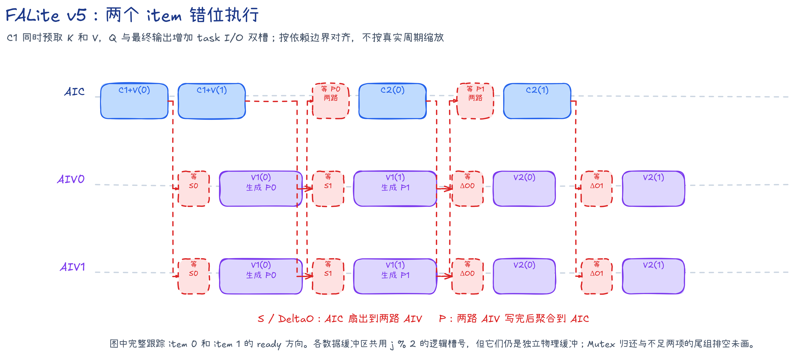

# FALite v5：提前装入 V，并为 task 输入输出增加双槽

v5 在 v4 的双 item 分组和 L0 双槽基础上继续整理数据搬运。C1 将同一 K/V tile 的 K 和 V 一起从 GM（全局内存）预取到 L1，C2 直接读取已经在片上的 V；Q 和最终输出则按 task 使用两套 I/O 槽，使相邻 task 的输入、计算和输出写回可以错位执行。

本文将 AIC（Cube）与 AIV（Vector）之间的数据交接简称为 CV 通路。

## 接口与固定规格

公共 Host 接口为：

```cpp
FlashAttnLiteNPU(Q, K, V, O, B, S, scale, coreNum, stream)
```

本版规格如下：

- `Q`、`K`、`V`、`O` 为 BF16，逻辑形状为 `(B, 1, S, 128)`。
- `Br=Bc=D=128`，要求 `B>0`、`S>0` 且 `S%128==0`。
- `--core-num` 表示 Mix 组数；每组包含 1 个 AIC 和 2 个 AIV。
- Kernel 固定计算同起点、等长度的方阵因果（causal）self-attention。
- Cube 输入为 BF16，并以 FP32 累加；分数、Online Softmax（分块 Softmax 递推）状态、`DeltaO` 和 `OAcc` 使用 FP32；`P` 与最终输出使用 BF16。
- 不支持尾块、不同的 Q/KV 长度、causal offset、滑动窗口、多头、变长序列、dropout 和反向计算。

固定 tile 配置下，AIC L1 使用 256 KiB；单路 AIV UB 使用 225.25 KiB。

## 先认识 task、item、group、item slot、I/O slot 和四个阶段

一个 **task** 完成一个 128 行 Q tile 的全部计算，Q tile 编号记为 `i`。该 task 每访问一个编号为 `j` 的 128 行 K/V tile，就产生一个 **item**，记为 `(i,j)`。同一 task 内最多两个连续 item 组成一个 **group**。

数据布局：DN 指普通二维布局，NZ 指供 Cube 使用的分块布局；NZ 转换中的临时填充会在写入共享 L1 时跳过。

代码名词：`PWork` 是 AIV UB 中暂存并整理 `P` 的工作区；VF（Vector Function）指在 AIV 上执行的一段 Vector 函数。

本版有两类槽位编号：

- **item slot**：`s=j%2`，为 K、V、P、S、DeltaO、alpha 和 PWork 选择各自的物理槽；这些数据共享编号，但不共用同一块内存。
- **I/O slot**：`io=0/1`，在相邻 task 间轮换，保存 Q L1 与 OAcc/最终输出 UB。

两种 slot 属于不同循环层级，不能混为同一编号。

| 阶段 | 执行核心 | 计算内容 |
| --- | --- | --- |
| `C1[j]` | AIC | 预取 `K_j/V_j`，计算 `K_j × Q_i^T -> S_j^T` |
| `V1[j]` | AIV0、AIV1 | Online Softmax，更新 `m/l/alpha`，生成 BF16 NZ `P_j` |
| `C2[j]` | AIC | 从 L1 读取 `P_j/V_j`，计算 `P_j × V_j -> DeltaO_j` |
| `V2[j]` | AIV0、AIV1 | `OAcc = alpha_j × OAcc + DeltaO_j` |

两路 AIV 各处理 64 个 Query 行，并各自维护本地 task 状态。

## 从 v4 到 v5

- V 的 `GM -> L1` 从 C2 前移到 C1，与 K 一起预取。
- K/V 共用一个 L1 slot；其 MTE1 所有权从 C1 读取 K 一直保持到 C2 读取 V。
- 删除 `P_READY_MTE2`，因为 C2 不再从 GM 搬运 V。
- Q L1 从一个 task 槽改为两个 I/O 槽。
- OAcc/最终输出从一个 task 槽改为两个 I/O 槽，BF16 输出在 FP32 OAcc 槽内原地生成。
- 双 item 分组、L0 双槽、P 的片上路径、Online Softmax 和 causal 语义不变。

## 数据路径

```text
C1[s]: K/V 一起进入 L1[s]
       K/Q -> L0[s] -> Cube -> S^T[s] -> AIV UB[s]

V1[s]: S^T[s] -> softmax -> PWork[s] -> 共享 P L1[s]

C2[s]: P L1[s]，已预取的 V L1[s]
       -> L0[s] -> Cube -> DeltaO[s] -> AIV UB[s]

V2[s]: DeltaO[s] -> 更新 OAcc[io]
Final: OAcc[io] / l -> 同槽 BF16 O -> GM
```

P 与 S/DeltaO 继续走片上 CV 通路，不经过 GM。

## AIC：K/V 跨阶段持有和 Q I/O 双槽

### C1 预取 K 和 V

```text
Q: L1[io] -> L0B[s]
K: GM -> KV L1[s]
V: GM -> KV L1[s]
K: KV L1[s] -> L0A[s]
Mmad(K, Q^T) -> L0C[s] -> Fixpipe -> AIV S UB[s]
```

C1 的 MTE2 取得 K/V L1 物理槽后，连续写入 K 和 V，再把槽交给 MTE1。MTE1 读取 K 后继续持有这份槽，不在 C1 末尾归还。

### C2 消费已预取的 V

```text
P: AIV -> 共享 P L1[s] -> L0A[s]
V: KV L1[s] -> L0B[s]
Mmad(P, V) -> L0C[s] -> Fixpipe -> AIV DeltaO UB[s]
```

C2 读取 V 后才归还 KV Mutex。这个跨 C1→C2 的生命周期不可提前缩短：如果 C1 读完 K 就释放，下一组 C1 可能覆盖仍要由本组 C2 使用的 V。

### AIC Mutex

| Mutex ID | 资源 | 所有权交接 |
| ---: | --- | --- |
| 0 / 1 | KV L1 slot 0 / 1 | C1 MTE2 写 K/V；C1 MTE1 读 K 并持有；C2 MTE1 读 V 后归还 |
| 2 / 3 | Q L1 I/O slot 0 / 1 | MTE2 写入，MTE1 在一个 task 的全部有效 C1 中读取 |
| 4 / 5 | L0A/L0B slot 0 / 1 | MTE1 写入，M 流水读取 |
| 6 / 7 | L0C slot 0 / 1 | M 流水写入，Fixpipe 读取 |

Q I/O slot 由每个 Mix 组在相邻 task 间交替使用。首个有效 C1 取得 Q 槽的 MTE1 所有权，`j+1==kvTileCount` 时归还；这里使用 causal 裁剪后的真实循环次数。

## AIV：PWork 双槽和输出 I/O 双槽

以下描述一路 AIV：

```text
V1[s]: 等待 S_READY[s]
       -> S UB[s] -> Online Softmax
       -> BF16 NZ PWork[s] -> MTE3 -> 共享 P L1[s]

V2[s]: 等待 O_READY[s]
       -> alpha[s] × OAcc[io] + DeltaO[s]

Final: OAcc[io] / l -> 在同一物理槽内生成 BF16 O
       -> MTE3 -> O GM
```

| Mutex ID | 资源 | 所有权交接 |
| ---: | --- | --- |
| 0 / 1 | PWork item slot 0 / 1 | Vector 写入 P，MTE3 写入共享 L1 |
| 2 / 3 | OAcc/Output I/O slot 0 / 1 | Vector 累加并原地生成 BF16 O，MTE3 写回 GM |

S、DeltaO 和 alpha 各有两套物理槽，并使用相同的 item slot 编号；`m/l/OAcc` 保存 task 的行状态，每个 task 只需一份。AIV0 与 AIV1 是独立核心，各自拥有同号的本地 Mutex。

task 结束时，最终 VF 把 `OAcc/l` 转为 BF16，并写到同一 FP32 槽的可复用区域。Vector 释放 Output Mutex 后，MTE3 才读取该槽。下一 task 切换到另一个 I/O slot，因此它的 Vector 工作可以与上一 task 的输出 MTE3 写回交叠。

代码先初始化下一 task 的 `m/l`，再等待对应 Output slot，避免无关初始化被上一 task 的输出写回阻塞。

## 因果掩码的两层处理

1. Q tile 编号为 `i` 的 task 只生成 `j=0...i` 的 item。右侧完整 K/V tile 连 K/V 预取都不会发射。
2. 对角 tile `j==i` 内，AIV 在求最大值和求指数和/P 的两次扫描中都屏蔽 `keyLocal > queryLocal`。

AIC 与 AIV 使用相同的 `kvTileCount=i+1` 和尾组长度，确保各类 item slot 和 CrossCore flag 都按真实 item 数回卷。

该整块裁剪适用于同起点方阵和 `Br=Bc`。不同 Q/KV 长度、不同起点或尾块需要重新定义可见 KV 范围。

## CV 调度与 CrossCore 同步

满组仍按两个 item 错位执行：

```text
AIC: C1[0] -> C1[1] -> C2[0] -> C2[1]
AIV: V1[0] -> V1[1] -> V2[0] -> V2[1]
```

| flag | ID | Set 所在流水 | Wait 所在流水 | 含义 |
| --- | ---: | --- | --- | --- |
| `S_READY[s]` | 0 / 1 | AIC `PIPE_FIX` | AIV `PIPE_V` | S slot 已写好 |
| `P_READY[s]` | 2 / 3 | AIV `PIPE_MTE3` | AIC `PIPE_MTE1` | 两路 AIV 已写好 P slot |
| `O_READY[s]` | 4 / 5 | AIC `PIPE_FIX` | AIV `PIPE_V` | DeltaO slot 已写好 |

v4 的 `P_READY_MTE2` 已删除。V 在 C1 预取后由 KV Mutex 保存到对应 C2，不再需要由 P 完成信号启动 V 的 MTE2。

固定组内顺序和双槽保护 item 级 CV 数据回卷；Q 与 Output 的本地 Mutex 另行保护 task 级 I/O 回卷。

## 调度伪代码

```python
# AIC
io_slot = 0
for task in assigned_tasks:
    i = task.q_tile_index
    copy_q_to_l1(i, io_slot)
    kv_tile_count = i + 1

    for group_begin in range(0, kv_tile_count, 2):
        group_count = min(2, kv_tile_count - group_begin)

        for local in range(group_count):
            j = group_begin + local
            kv_slot = j % 2
            c1_prefetch_kv_and_compute_s(j, kv_slot, io_slot)
            set_aic_to_aiv(S_READY[kv_slot])

        for local in range(group_count):
            j = group_begin + local
            kv_slot = j % 2
            wait_aiv_to_aic(P_READY[kv_slot])
            c2_read_prefetched_v(j, kv_slot)
            set_aic_to_aiv(O_READY[kv_slot])

    io_slot ^= 1
```

```python
# AIV0 和 AIV1
io_slot = 0
for task in assigned_tasks:
    i = task.q_tile_index
    init_m_l()
    lock_and_init_oacc(io_slot)
    kv_tile_count = i + 1

    for group_begin in range(0, kv_tile_count, 2):
        group_count = min(2, kv_tile_count - group_begin)

        for local in range(group_count):
            j = group_begin + local
            kv_slot = j % 2
            wait_aic_to_aiv(S_READY[kv_slot])
            v1_and_write_p(j, kv_slot, diagonal_mask=(j == i))
            set_aiv_to_aic(P_READY[kv_slot])

        for local in range(group_count):
            j = group_begin + local
            kv_slot = j % 2
            wait_aic_to_aiv(O_READY[kv_slot])
            v2(kv_slot, io_slot)

    normalize_cast_inplace_and_store_o(io_slot)
    io_slot ^= 1
```

## 流水示意与实测截图



图中分开表示 item 使用的 KV 槽和 task 使用的 I/O 槽；`V` 在 C1 预取后保留在 L1，直到同一 item 的 C2 消费完毕。


截图直接取自完整 PipeTimeline trace 的 `[68.998, 108.998]` μs。AIC MTE2 中同时包含 C1 对 `K`、`V` 的预取，C2 直接消费已经留在 L1 的 `V`；AIV MTE3 的输出写回也可与后续 task 的计算交叠。

## 本版边界与 v6 的方向

v5 仍以最多两个连续 item 为固定 group：

```text
AIC: C1(0) -> C1(1) -> C2(0) -> C2(1) | C1(2) -> C1(3) -> ...
AIV: V1(0) -> V1(1) -> V2(0) -> V2(1) | V1(2) -> V1(3) -> ...
```

竖线是每颗核心本地循环的组边界。AIC 等待本组 P、AIV 等待本组 DeltaO 时，下一组中没有数据依赖的 C1/V1 仍不能越过这个边界发射。

v6 保留两代片上数据，取消固定 group 边界，改为 `R=2` 的连续滚动调度，使新一轮 C1/V1 可以更早进入流水。

## 构建与精度验证

```bash
cmake -S . -B build -DNPU_ARCH=dav-3510
cmake --build build --target falite_v5 -j
./build/Samples/2_Performance/flash_attn_lite_story/falite_v5 --core-num 1 --size 1 640
```

`S=640` 含 5 个 Q/KV tile，能够覆盖满组、单 item 尾组、causal 对角 tile，以及相邻 task 在两个 I/O slot 间的切换。

公共验证脚本以 FP32 计算 causal Golden。NPU 的 BF16 输出转为 FP32 后，直接与 FP32 Golden 逐元素检查：

```text
abs(float(npu_bf16) - golden_fp32) <= 0.004 + 0.004 * abs(golden_fp32)
```

全部元素必须通过，NaN 或 Inf 直接判失败。设置 `FA_VERIFY_LOW_PRECISION_BASELINE=1` 可使用项目统一的低精度基线倍率标准；该模式要求主机能够导入 Torch。

## 性能记录

性能口径为 CANN 9.2.0、Ascend 950PR、真机 `mode2`（每组 `1 AIC + 2 AIV`）、32 个 AIC、`B=1,N=1,S=131072,D=128`、causal。每轮 warm-up 5 次并采集 1 次 Kernel；v5 独立采集 3 轮，表中取 `Task Duration(us)` 中位数。

表中的模型算力利用率（MFU）按因果有效 Cube 工作量计算。

```bash
msopprof --warm-up=5 --launch-count=1 --aic-metrics=BasicInfo --output=<profiling-output> ./build/Samples/2_Performance/flash_attn_lite_story/falite_v5 --dry-run --size 1 131072
```

| 版本 | Task Duration（μs） | 因果有效 Cube MFU | 相对上一版 |
| --- | ---: | ---: | --- |
| v4 | `26319.761719 us` | `38.6810%` | 基线 |
| v5 | `24255.705078 us` | `41.9726%` | 耗时下降 `7.8422%`，加速 `1.0851x` |

分子只统计 causal 有效范围内 `QK^T` 和 `PV` 的 BF16 Cube FLOPs，分母采用 950PR 上 32 个 AIC 的 BF16 Cube 峰值 432 TFLOP/s。

`--dry-run` 仍执行 Kernel、同步和输出回读，只跳过 Golden 与精度比对。
