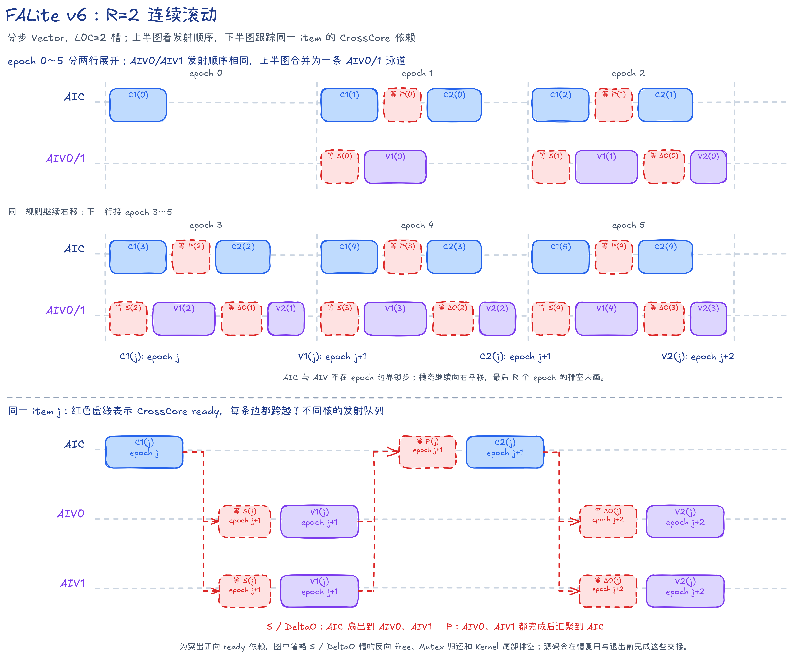
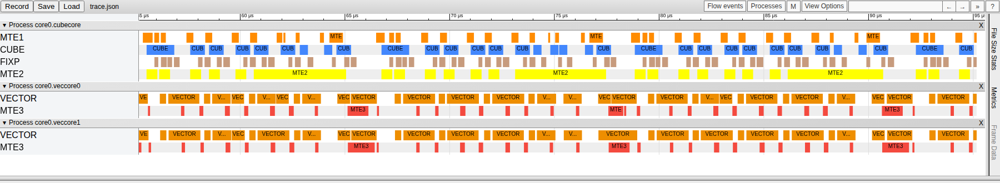

# FALite v6：取消双 item 分组，连续发射后续工作

## 本版内容

FALite v6 是固定规格的因果 Flash Attention 前向样例。它把 v5 的“双 `item` 一组”改为连续滚动：AIC 和 AIV 每推进一次调度循环，先发射较新的计算阶段，再处理已经具备输入的较早阶段。这样，新一组的工作不必等上一组全部结束。

本版的输入、输出和计算边界如下。

| 项目 | 实现 |
| --- | --- |
| 输入与输出 | BF16 `Q/K/V/O`，形状 `[B,N,S,128]` |
| 分块 | `Br=Bc=D=128`，要求 `B>0`、`N>0`、`S>0`；`S` 无需按 128 对齐 |
| 数值精度 | 两次 Cube 矩阵乘使用 BF16 输入和 FP32 累加；Softmax 状态与输出累加使用 FP32；`P` 转为 BF16 后送入第二次矩阵乘 |
| 并行方式 | 一个 Mix 组包含 `1 AIC + 2 AIV`；一个 `task` 处理一个 128 行 Query 分块，两路 AIV 各处理 64 行 |
| 因果模式 | 固定计算包含对角线的标准下三角注意力，Q 与 K/V 的长度、分块和起点相同 |
| 未覆盖能力 | 非方形 Q/KV、Q/K/V 的 Head 数不一致（GQA/MQA）、同一批次中每条序列长度不同的 varlen 输入、多种 HeadDim、滑动窗口、KV Cache、dropout 和反向计算 |

v6 不使用 GM workspace。`S`、`P` 和 `DeltaO` 都在片上完成 AIC 与 AIV 之间的交接。

Host 按 `ceil(S/128)` 建立 task。尾块的 `Q/K/V` 只读取有效行并在 L1 补 0；Softmax 不统计补齐的 Key 行，两路 AIV 只写回有效 Query 行。所有轮换槽仍保存完整物理 tile，因此 `R=2` 的 epoch 和槽位归还规则不变。

## task、item、阶段与 epoch

一个 `task` 表示某个 `(b,n)` 下一个 Query 分块（Q tile）的完整计算。

不同 `(b,n)` 之间没有数据依赖。Host 将 `B×N` 展平为独立序列维，再按 Q tile 分配 task。

这个 `task` 每发射一个 Key/Value 分块，就形成一个 `item=(i,j)`。其中 `i` 是 Query 分块编号，`j` 是 Key/Value 分块编号；每个 `item` 依次经过 C1、V1、C2 和 V2。

因果模式下，第 `i` 个 `task` 只处理 `j=0...i`，因此实际 `item` 数为 `kvTileCount=i+1`。

源码变量 `oDelta` 对应本文的 `DeltaO=P_jV_j`，下文统一写作 `DeltaO`。

数据布局：DN 指普通二维布局，NZ 指供 Cube 使用的分块布局；NZ 转换中的临时填充会在写入共享 L1 时跳过。

代码名词：`PWork` 是 AIV UB 中暂存并整理 `P` 的工作区；VF（Vector Function）指在 AIV 上执行的一段 Vector 函数。

每个 `item` 依次经过四个阶段。

| 阶段 | 执行核心 | 计算与数据交接 |
| --- | --- | --- |
| `C1(j)` | AIC | 预取 `K_j/V_j`，计算 `K_j × Q_i^T -> S_j^T`，由 Fixpipe 把结果直接写入两路 AIV 的 UB |
| `V1(j)` | AIV0/AIV1 | 对各自的 64 行做缩放、因果掩码和 Online Softmax（分块 Softmax 递推），生成 BF16 NZ 布局的 `P_j` |
| `C2(j)` | AIC | 等两路 AIV 把 `P_j` 写入共享 L1，计算 `P_j × V_j -> DeltaO_j`，由 Fixpipe 把结果写入两路 AIV 的 UB |
| `V2(j)` | AIV0/AIV1 | 更新 `OAcc = alpha_j × OAcc + DeltaO_j` |

对每个 Query 行，V1/V2 按下面的 Online Softmax 关系更新状态：

```text
x_j      = causal_mask(scale × Q_i × K_j^T)
m_new    = max(m, rowmax(x_j))
alpha_j  = exp(m - m_new)
P_j      = exp(x_j - m_new)
l_new    = alpha_j × l + rowsum(P_j)
OAcc_new = alpha_j × OAcc + P_j × V_j
```

`P_j` 是尚未除以完整分母的分子贡献；全部 `item` 完成后才计算 `O=OAcc/l`。

`epoch` 表示滚动调度循环的一次推进，只描述各核心的发射顺序，不表示 AIC 与 AIV 按相同时长锁步执行。

## R=2：首个 C2 前发射两个 C1

`R` 表示同一个 `item` 的 `C1` 与 `V2` 相隔多少个 `epoch`。对有效 `item` 数不少于 `R` 的 task，它也等于首个 `C2` 发射前已经发射的 `C1` 数量；较短 task 只发射实际存在的 C1。v6 取 `R=2`。

四个阶段的发射时刻统一写成：

```text
C1(j): epoch = j
V1(j): epoch = j + 1
C2(j): epoch = j + R - 1
V2(j): epoch = j + R
```

代入 `R=2`：

| `epoch` | AIC 内的发射顺序 | 每路 AIV 内的发射顺序 |
| ---: | --- | --- |
| 0 | `C1(0)` | — |
| 1 | `C1(1) -> C2(0)` | `V1(0)` |
| 2 | `C1(2) -> C2(1)` | `V1(1) -> V2(0)` |
| 3 | `C1(3) -> C2(2)` | `V1(2) -> V2(1)` |
| `t` | `C1(t) -> C2(t-1)` | `V1(t-1) -> V2(t-2)` |

流水分为三个部分：

- 填充：`epoch 0` 只有 `C1(0)`；`epoch 1` 开始出现 `V1` 和 `C2`。
- 稳态：只要新旧 `item` 都在有效范围内，AIC 发射一次新 `C1` 和一次旧 `C2`，AIV 发射一次新 `V1` 和一次旧 `V2`。
- 排空：最后一个 `C1` 发射后，循环继续推进 `R` 个 `epoch`，把尚未完成的 `V1/C2/V2` 依次发完。

较短的 `task` 也按实际 `kvTileCount` 判断阶段是否存在，不会为不存在的 K/V 分块发射计算或等待信号。



上半图按 `epoch` 展示填充和稳态发射顺序；下半图抽出同一个 `item=j`，分别画出 `S`、`P`、`DeltaO` 的 CrossCore 扇出或聚合。红色虚框表示等待，跨泳道箭头表示 ready 方向；反向 free、Mutex 回卷和尾部排空按图内说明省略。色块宽度不表示真实耗时。

## 因果掩码的两层处理

v6 从整块和块内两个层次处理因果掩码。

1. `GetKvTileCount<true>` 返回 `i+1`，因此第 `i` 个 Query 分块只读取 `K/V` 分块 `0...i`。位于右上方的整块不会进入 C1～V2。
2. 当 `j==i` 时，AIC 仍计算完整的对角分数块，AIV 再屏蔽块内 `keyLocalIdx > queryLocalIdx` 的元素。

`C1` 的结果布局是 `S^T[Bc,Br]`。AIV 的 Vector 寄存器通道对应 Query 行，循环变量对应 Key 行；AIV0 的 Query 局部编号为 0～63，AIV1 为 64～127。对角块的掩码同时用于求行最大值和计算指数和的两遍扫描，保证两遍只看到相同的有效元素。

## AIC 数据路径与核内流水

### 片上缓冲

| 缓冲 | 槽数 | 单槽内容 | Mutex ID |
| --- | ---: | --- | --- |
| K L1 | 2 | BF16 `[128,128]` | 0～1 |
| V L1 | 2 | BF16 `[128,128]`，从 C1 保存到对应 C2 | 2～3 |
| Q L1 | 2 | BF16 `[128,128]`，按 `task` 交替使用 | 4～5 |
| P L1 | 2 | 两路 AIV 合写的 BF16 `[128,128]` | 由 CrossCore `P_READY` 保护 |
| L0A/L0B | 各 2 | 两次矩阵乘共用的输入槽 | 6～7 |
| L0C | 2 | FP32 `[128,128]` 结果槽 | 8～9 |

L1 合计使用 256 KiB，L0A/L0B 各使用 64 KiB，L0C 使用 128 KiB。

### C1：分数计算

```text
Q: GM -> L1 -> L0B
K: GM -> L1 -> L0A
V: GM -> L1，保留到 C2
Cube: K × Q^T -> L0C
Fixpipe: L0C -> AIV0/AIV1 的 S UB
```

Q 在一个 `task` 内保持不变。首个有效 C1 取得 Q L1 槽的 MTE1 所有权，最后一个有效 C1 按 `j+1==kvTileCount` 归还，随后另一 `task` 才能复用该槽。

K 只服务本次 C1，因此使用短生命周期双槽。V 要跨越 C1～C2，按 `j%R` 保存在代际槽中。

### C2：输出增量计算

```text
P: AIV UB -> 共享 L1 -> L0A
V: 保存的 L1 槽 -> L0B
Cube: P × V -> L0C
Fixpipe: L0C -> AIV0/AIV1 的 DeltaO UB
```

`C2(j)` 先等待 `P_READY[j%R]`，再读取完整的 P 和 V。V 的 MTE1 读取完成后归还对应代际槽，后续 `C1(j+R)` 才能覆盖它。

C1 和 C2 共用 L0A/L0B/L0C。源码用全局 `mmadOpIdx` 按矩阵乘发射总序号轮转，而不是按 `item` 编号轮转。L0A/L0B 由 MTE1 与 Cube 交接，L0C 由 Cube 与 Fixpipe 交接。

Fixpipe 在等待 AIV 归还目标 UB 槽前先取得对应 L0C Mutex，防止后发射的矩阵乘覆盖尚未写出的结果。

## AIV 数据路径与核内流水

AIV0 和 AIV1 执行相同代码，各处理 64 个 Query 行，二者不交换 `m/l/alpha/OAcc`。

| 缓冲 | 槽数 | 内容与生命周期 | Mutex ID |
| --- | ---: | --- | --- |
| S UB | 2 | FP32 `[128,64]`，由 C1 的 Fixpipe 写入 | CrossCore 双向交接 |
| DeltaO UB | 2 | FP32 `[64,128]`，由 C2 的 Fixpipe 写入 | CrossCore 双向交接 |
| PWork UB | 2 | 带 NZ 分组 padding 的 BF16 `P^T` | 0～1 |
| OAcc/Output UB | 2 | FP32 累加与 BF16 输出复用同一物理槽 | 2～3 |
| alpha UB | 2 | 每个 `item` 的 64 个行缩放系数 | Vector 按顺序使用 |
| m/l UB | 各 1 | 每行最大值与指数和 | Vector 按 `item` 顺序递推 |

单路 AIV 的 UB 占用为 225.25 KiB。

V1 先调用 `OnlineColwiseSoftmaxVF`，在 FP32 中更新 `m/l/alpha`，并把指数结果写回 S UB；随后 `FusedDNToNZCastVF` 把这些结果转换为 BF16 NZ 布局的 PWork。PWork Mutex 把槽位从 Vector 交给 MTE3，MTE3 再把本 AIV 的一半 P 写入共享 L1。

第一轮代码把 `alpha` 写成 1，并把 `OAcc` 预先置零；这与数学上首轮缩放系数为 0 的结果等价。后续 V2 调用 `OnlineUpdateVF`，执行 `OAcc = alpha × OAcc + DeltaO`。

全部 `item` 完成后，`FusedDivCastInplaceVF` 计算 `OAcc/l`，并在 OAcc 槽的前半段原地生成 BF16 输出。Output Mutex 随后把该槽交给 MTE3 写回 GM；下一 `task` 使用另一个 I/O 槽，因此可以与上一 `task` 的输出写回交叠。

## CrossCore 交接

表中列出真机 `mode2`（每组 `1 AIC + 2 AIV`）使用的逻辑 flag ID。`SIM_COMPATIBLE` 构建改用 `mode4`，分别同步两路 AIV，并给 AIV1 使用独立的 ID 偏移，但不改变数据依赖。

| 数据 | flag ID | 生产者与消费者 | 交接过程 |
| --- | ---: | --- | --- |
| S | 0～1 | AIC Fixpipe -> AIV Vector | AIV 先发 free；AIC 等 free 后写 S 并发 ready；两路 AIV 读完后归还 free |
| P | 2～3 | AIV MTE3 -> AIC MTE1 | 两路 AIV 各写 64 行并发 ready；AIC 等齐后执行 C2 |
| DeltaO | 4～5 | AIC Fixpipe -> AIV Vector | AIV 先发 free；AIC 等 free 后写 DeltaO 并发 ready；V2 读完后归还 free |

S 和 DeltaO 的同一 flag ID 在“可写”和“可读”两个方向交替传递槽位所有权。AIV 在进入 `task` 循环前为两个槽发出初始 free；AIC 在所有 `task` 结束后消费最后一轮 free，完成交接排空。

P 没有单独的 free flag。`C2(j)` 在 `epoch j+R-1` 读取 `P(j)`，`V2(j)` 在 `epoch j+R` 消费 `alpha(j)`，复用同一代际槽的 `V1(j+R)` 到 `epoch j+R+1` 才发射，因此不会提前覆盖 P 或 alpha。

## 调度伪代码

```python
R = 2

# AIV 在 task 循环前把 S/DeltaO 双槽标记为可写。
aiv_set_initial_free_flags()

for task in tasks_of_this_mix_group:
    q_tile = task % query_tile_count
    kv_tile_count = q_tile + 1

    AIC.load_q_to_l1(task, io_slot)
    AIV.lock_output_slot_and_init_states(io_slot)

    for epoch in range(kv_tile_count + R):
        # 三颗核心各自执行循环；下列代码按数据依赖并列展示。
        if epoch < kv_tile_count:
            j = epoch
            AIC.c1(j)

        if epoch >= 1 and epoch - 1 < kv_tile_count:
            j = epoch - 1
            AIV.wait_s_ready(j % 2)
            AIV.v1(j, diagonal_mask=(j == q_tile))
            AIV.copy_p_half_to_shared_l1(j % R)
            AIV.set_p_ready(j % R)

        if epoch >= R - 1 and epoch - R + 1 < kv_tile_count:
            j = epoch - R + 1
            AIC.wait_two_p_ready(j % R)
            AIC.c2(j)

        if epoch >= R and epoch - R < kv_tile_count:
            j = epoch - R
            AIV.wait_odelta_ready(j % 2)
            AIV.v2(j)

    AIV.normalize_cast_and_store_output(io_slot)
    io_slot ^= 1

AIC.drain_final_s_and_odelta_free_flags()
```

## 从 v5 到 v6

| 项目 | v5 | v6 |
| --- | --- | --- |
| CV 调度 | 两个 `item` 为一组，组内依次发射两次 C1/V1，再发射两次 C2/V2 | 不设组边界，按 `epoch` 连续滚动 |
| K/V L1 | K/V 共用槽位和生命周期 | K 使用短生命周期双槽，V 使用跨 C1～C2 的代际槽 |
| S/DeltaO | 单向 ready | ready/free 双向槽位交接 |
| L0 轮转 | 跟随组内 slot | 按全部 C1/C2 的 `mmadOpIdx` 轮转 |
| 预加载距离 | 组内最多提前两个 C1 | `R=2`，新 C1/V1 可以越过原来的组边界 |

v6 同时改变了调度、K/V 生命周期和 S/DeltaO 所有权协议。它的收益应理解为两代连续滚动整套设计的结果。

## 流水证据



截图直接取自完整 PipeTimeline trace 的 `[55.175, 95.175]` μs。新 C1/V1 已能越过原来的双 item 分组边界，但 AIC 等待 `P`、AIV 等待 `DeltaO` 时仍有空隙。真实时间线中的色块长度代表硬件耗时，示意图只解释 `item` 和阶段之间的对应关系。

## 流水问题与下一步

`R=2` 允许新的 C1/V1 越过固定组边界，但 AIC 等待 `P(j)` 前只能先准备到 `C1(j+1)`。分步 Vector 计算较长，这一份额外工作还盖不住等待。[v7](../v7/README.md) 把首个 C2 前可准备的 item 数增至 3，检查第三份 C1/V1 能否填入这些空隙。

## 精度与性能

统一性能条件为 CANN 9.2.0、Ascend 950PR、mode2、32 个 AIC、1650 MHz、`B=1,N=1,S=131072,D=128`，读取 `msopprof` 的 Kernel Task Duration。模型算力利用率（MFU）按因果有效 Cube 工作量计算。

| 版本 | 调度 | Task Duration（μs） | 因果有效 Cube MFU |
| --- | --- | ---: | ---: |
| v5 | 固定双 `item` 分组 | 24255.705078 | 41.9726% |
| v6 | `R=2,L0C=2` 连续滚动 | 19446.865234 | 52.3516% |

v6 相对 v5 耗时下降 19.83%，反映连续滚动及配套所有权协议的整体收益。

默认精度检查以 FP32 计算 causal Golden。NPU 的 BF16 输出转为 FP32 后，直接与 FP32 Golden 比较：

```text
abs(float(npu_bf16) - golden_fp32) <= 0.004 + 0.004 * abs(golden_fp32)
```

所有元素都必须通过，NaN 或 Inf 直接判失败。v6 已通过 `--size 1 1 131072` 和非整块 `--size 1 1 705` 回归。

在 cann-samples 根目录构建并运行：

```bash
cmake -S . -B build -DNPU_ARCH=dav-3510
cmake --build build --target falite_v6 -j
./build/Samples/2_Performance/flash_attn_lite_story/falite_v6 --core-num 1 --size 1 1 385
```

`S=385` 包含 4 个 Query tile，最后一个 tile 只有 1 行，可覆盖流水填充、稳态、排空、代际槽回卷和序列尾块。
