# MXFP4量化矩阵乘算子性能优化指南

## 概述

本文档详细介绍MXFP4量化矩阵乘算子的实现原理、性能建模方法和优化实践。通过系统性的优化策略，帮助开发者快速掌握算子性能调优的核心技术，提升算子在昇腾平台上的执行效率。

## 算子实现原理

### 算子功能说明

- **算子功能**：完成MXFP4类型的矩阵乘计算。MX量化等价于GroupSize=32、Scale类型为float8_e8m0的FP4 PerGroup量化，通过4位浮点数量化大幅减少内存访问量，提升计算密度。

- **计算公式**：
$$
c_{_{i, j}} = \sum^{K/G-1}_{g=0}\left(scaleA_{g, i} \cdot scaleB_{g, j} \cdot \sum^{G-1}_{k'=0} (a_{i, gG+k'} \cdot b_{gG + k', j}) \right)
$$

- **参数说明**：

| **变量名** | **描述** | **Dtype** | **Layout** | **Shape** |
|-|-|-|-|-|
| a | 输入左矩阵 | `float4_e2m1` 或者 `float4_e1m2` | ND | (m, k) |
| b | 输入右矩阵 | `float4_e2m1` 或者 `float4_e1m2` | ND | (n, k) |
| scaleA | 左矩阵量化参数 | `float8_e8m0` | ND | (m, ceil(k/64), 2) |
| scaleB | 右矩阵量化参数 | `float8_e8m0` | ND | (n, ceil(k/64), 2) |
| c | 输出矩阵 | `float32` 或者 `float16` 或者 `bfloat16` | ND | (m, n) |

### 算子实现说明

相较于传统非量化的Matmul算子，MXFP4场景新增了输入变量`scaleA`、`scaleB`，并需要将其搬运到L1缓冲区中，再搬运到新增独立缓冲区`L0A_MX`和`L0B_MX`中。

通过约束`L0A`、`L0B`、`L0A_MX`、`L0B_MX`中Tensor的地址映射关系，芯片的`MMAD`指令支持自动计算MXFP4的矩阵乘，并最终将`Float32`的结果写到`L0C`中。通过设置`Fixpipe`指令的量化模式，输出预期的数据类型结果。**因此算子实现仅依赖CUBE核，不涉及MIX场景**。

MXFP4执行时完整的数据搬运流程如下图所示：

  

关于每个输入在各个缓冲区上的Shape关系和排布要求，可以参考下面的详细介绍。

**关键参数说明**：
- `m, k, n`：矩阵输入大小
- `mL1, kL1, nL1`：L1缓冲区的切分大小
- `baseM, baseK, baseN`：L0缓冲区的切分大小
- `m0, k0, n0`：当前缓冲区最小分型大小

#### Tensor a 的搬运说明

| **缓冲区变化** | **Shape排布变化** | **Layout变化** | **所属流水** | **所用指令** |
|-|-|-|-|-|
| GM -> L1 | (m, k) -> (ceil(kL1/k0), ceil(mL1/m0), m0, k0) | ND -> Nz | MTE2 | DataCopy with ND2NZ |
| L1 -> L0A | (ceil(kL1/k0), ceil(mL1/m0), m0, k0) -> (ceil(baseK/k0), ceil(baseM/m0), m0, k0) | Nz -> Nz | MTE1 | LoadData with Load2D |

  

    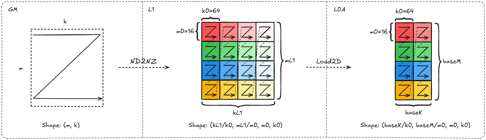
  

#### Tensor b 的搬运说明

| **缓冲区变化** | **Shape排布变化** | **Layout变化** | **所属流水** | **所用指令** |
|-|-|-|-|-|
| GM -> L1 | (n, k) -> (ceil(kL1/k0), ceil(nL1/n0), n0, k0) | ND -> Nz | MTE2 | DataCopy with ND2NZ |
| L1 -> L0B | (ceil(kL1/k0), ceil(nL1/n0), n0, k0) -> (ceil(baseK/k0), ceil(baseN/n0), n0, k0) | Nz -> Zn | MTE1 | LoadData with Load2D |

> 这里L1和L0B上的Shape排布其实一样，但L0B默认按照(k, n)方向查看数据，因此Layout会变更成`Zn`

  

    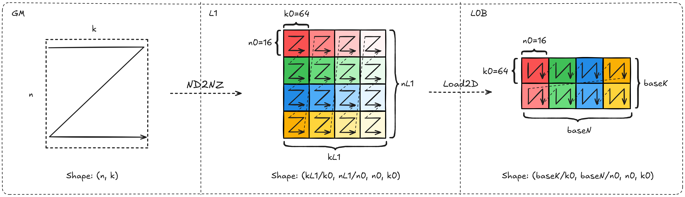
  

#### Tensor scaleA 的搬运说明

> 因为MX量化GroupSize=32的pergroup量化，因此K方向的大小是输入矩阵的1/32。

| **缓冲区变化** | **Shape排布变化** | **Layout变化** | **所属流水** | **所用指令** |
|-|-|-|-|-|
| GM -> L1 | (m, ceil(ceil(k/32)/2), 2) -> (ceil(mL1/m0), ceil(ceil(kL1/32)/k0), m0, k0) | ND -> Zz | MTE2 | DataCopy with ND2NZ |
| L1 -> L0A_MX | (ceil(mL1/m0), ceil(ceil(kL1/32)/k0), m0, k0) -> (ceil(baseM/m0), ceil(ceil(baseK/32)/k0), m0, k0) | Zz -> Zz | MTE1 | LoadData with Load2D_MX |

  

    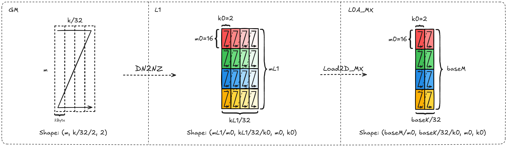
  

#### Tensor scaleB 的搬运说明

> 因为MX量化GroupSize=32的pergroup量化，因此K方向的大小是输入矩阵的1/32。

| **缓冲区变化** | **Shape排布变化** | **Layout变化** | **所属流水** | **所用指令** |
|-|-|-|-|-|
| GM -> L1 | (n, ceil(ceil(k/32)/2), 2) -> (ceil(nL1/n0), ceil(ceil(kL1/32)/k0), n0, k0) | ND -> Zz | MTE2 | DataCopy with ND2NZ |
| L1 -> L0B_MX | (ceil(nL1/n0), ceil(ceil(kL1/32)/k0), n0, k0) -> (ceil(baseN/n0), ceil(ceil(baseK/32)/k0), n0, k0) | Zz -> Zz | MTE1 | LoadData with Load2D_MX |

  

    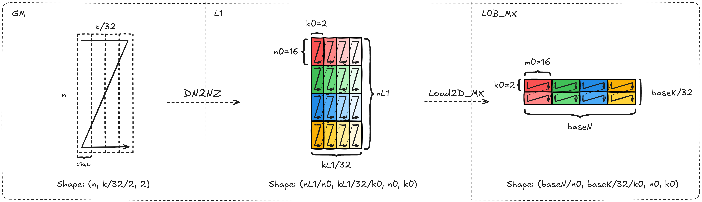
  

### 算子实现约束

1. **K维度对齐约束**：由于scale在L0_MX缓冲区上的最小分形为`(16, 2)`，因此对应输入矩阵在K方向的最小单位是64，要求**baseK是64的整数倍**。

2. **K维度补零处理**：基于约束1，当K轴非64对齐时，存在两类场景：
   - 当输入矩阵的K维度在内轴，即输入排布为`(m, k)`、`(n, k)`时，`ND2NZ`指令能够自动完成K方向补零，因此不需要特殊处理；
   - 当输入矩阵的K维度在外轴，即输入排布为`(k, m)`或者`(k, n)`时，`ND2NZ`指令无法完成K方向补零，**因此需要手动处理在K方向上的补零动作**。

      推荐的补零方法：使用`SET2D`对缓冲区L1上目标地址清零 + `ND2NZ`跳写目标地址。

3. **数据类型处理**：由于`ND2NZ`指令不支持`B4`的数据类型，因此需要将输入按照`B8`的数据类型进行搬运，相应的指令对应的`stride`和`shape`的配置均需要除以2。

4. **内轴对齐约束**：基于约束3，要求输入矩阵内轴是偶数，否则无法用2个`B4`拼成一个`B8`类型。

5. **指令约束**：`MMAD`指令关闭`gemv`能力。

## 算子性能建模

### 性能瓶颈分析

MXFP4矩阵乘算子的性能瓶颈主要分为以下几类：

1. **Cube Bound**：计算单元利用率不足，MMAD指令无法连续执行
2. **MTE2 Bound**：GM到L1的数据搬运成为瓶颈
3. **MTE1 Bound**：L1到L0的数据搬运成为瓶颈
4. **FIXPIPE Bound**：L0C到GM的数据搬出成为瓶颈

### 性能建模公式

理论计算时间 = max(计算时间, MTE2搬运时间, MTE1搬运时间, FIXPIPE搬出时间)

其中：
- 计算时间 = (M × N × K) / (计算单元数量 × 计算单元频率)
- MTE2搬运时间 = (数据量) / (MTE2带宽)
- MTE1搬运时间 = (数据量) / (MTE1带宽)
- FIXPIPE搬出时间 = (输出数据量) / (FIXPIPE带宽)

### 优化目标

通过识别当前的Bound类型，应用相应的优化策略，使得各流水阶段的时间尽可能接近，从而最大化整体算子性能。

## 算子优化实践

本章节介绍了MXFP4中会应用到的优化措施，针对不同的Bound类型场景分别提供了**搬运效率优化**、**计算效率优化**方法，以及针对因流水阻塞导致Bound类型不明确的场景提供了**指令并行度优化**实践。

### 搬运效率优化

#### ASWT（自适应滑动窗口模板）

- **原理介绍**

  ASWT(Adaptive Slide Window Template)是一种通过提升多核单次访问的L2命中率，来提升对应的`MTE2`搬运效率，从而实现首轮搬运即可做到`MMAD`指令不断流，实现算子在Cube Bound场景下计算单元利用率达到95%+。

  核心的逻辑就是让每一轮多核计算的输出排布尽量**方正**，具体的方式是通过在M轴上设定一个固定的窗口，并能够根据M轴方向的尾块大小灵活调整，再沿着N方向进行"Z"型滑动，从而最大程度的提高L2命中率。

  详细的原理描述以及代码对比实现，可以参考Features中[ASWT专题介绍]()。

- **效果对比**

  下图对比了传统的列优先分配和ASWT的理论效果。

  

    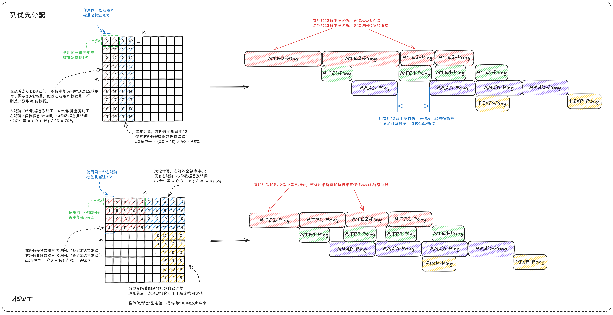
  

- **适用场景**
  - 大规模矩阵乘法场景
  - 多核并行计算场景
  - Cube Bound为主要瓶颈的场景

#### L1 Bank冲突优化

- **原理介绍**

  目前L1缓冲区以256KB粒度分为两个Bank，当同时对一个Bank进行读写操作时，就会触发Bank冲突，导致`MTE1`的带宽效率降低，进而会打断`MMAD`的指令连续性。

  因此在开启L1 Double Buffer时，需要将两份缓存的数据放到不同的Bank中，从而避免触发读写冲突导致的Bank冲突。

  详细的原理描述以及代码对比实现，可以参考Features中[L1 Bank冲突优化专题介绍]()。

- **效果对比**

  

    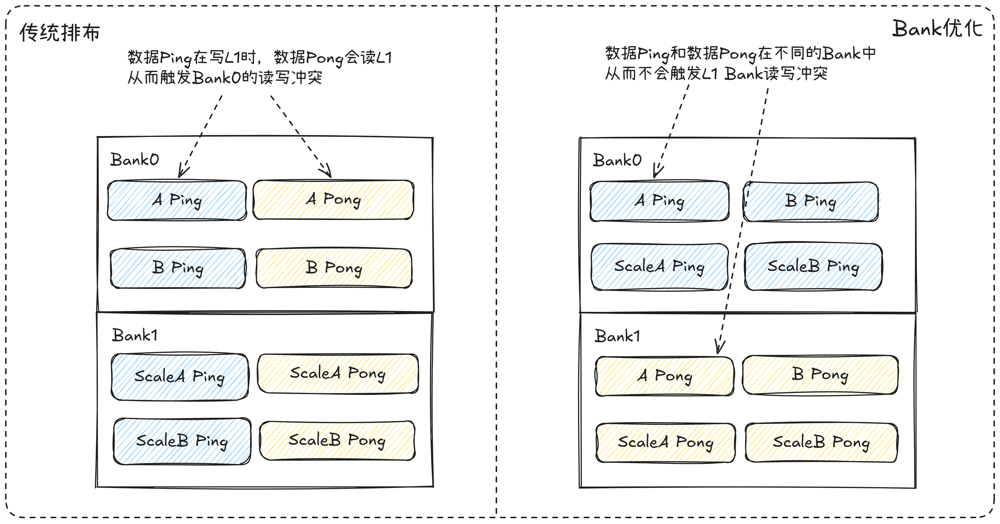
  

- **适用场景**
  - 开启了L1 Double Buffer的场景
  - MTE1带宽利用率不足的场景
  - 存在Bank冲突导致`MMAD`断流的场景

#### Scale缓存优化

- **原理介绍**

  由于Scale部分的数据量仅有输入矩阵的1/32，当输入矩阵较小时，所需要的Scale数据量也会急剧减小，从而无法支撑带宽发挥，导致搬运Scale部分的带宽利用率显著降低。

  为此可以利用L1的剩余空间，提前载入后续所需的Scale并在L1上缓存，从而减少Scale的搬运次数，缓解因单次所需Scale数据量过小而带宽速率降低的问题。

  详细的原理描述以及代码对比实现，可以参考Features中[Scale缓存专题介绍]()。

- **效果对比**

  

    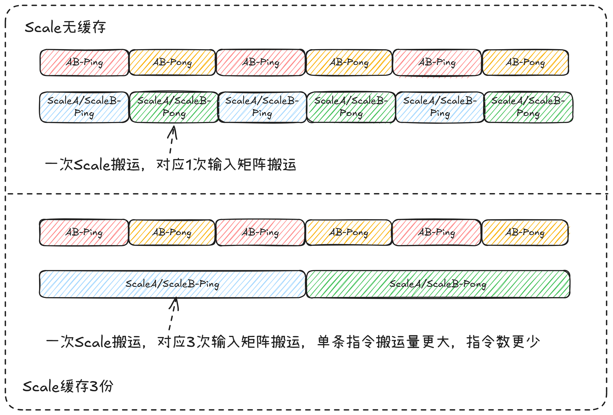
  

- **适用场景**
  - 输入矩阵较小，Scale数据量不足的场景
  - MTE2带宽利用率受Scale搬运限制的场景
  - L1缓冲区有充足剩余空间的场景

#### 全载优化

- **原理介绍**

  在MTE2 Bound的场景中，可以通过减少`MTE2`部分的整体搬运量，从而有效提高算子性能。为此，对于那些输入可以完整的在L1中缓存的场景，可以使用全载模板，在不同的轮询中让输入始终驻留在L1中，从而减少整体的搬运耗时。

  详细的原理描述以及代码对比实现，可以参考Features中[全载优化专题介绍]()。

- **效果对比**

  

    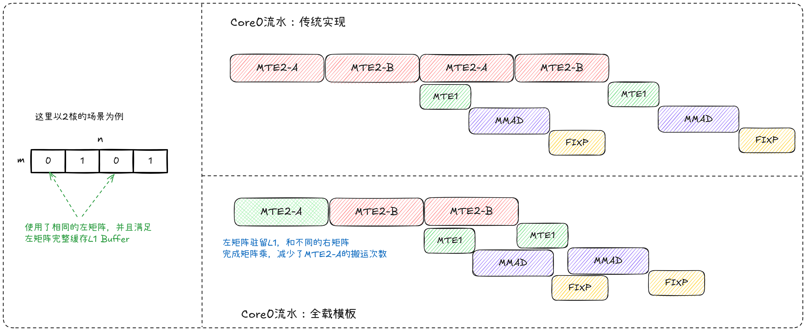
  

- **适用场景**
  - MTE2 Bound为主要瓶颈的场景
  - 输入矩阵较小，可以完全载入L1的场景
  - Decode等小批量计算场景

### 计算效率优化

#### 尾轮负载均衡

- **原理介绍**

  当前Matmul算子普遍使用基本块的策略进行多核分配。但在应对不同规格的输入下，划分出的基本块并不能均匀的分配到所有核上，从而导致分核不均，尤其是最后一轮的计算会存在算力浪费，导致整体的算力利用率无法发挥到极致。

  为此我们可以将最后一轮的不足分配的基本块进行二次切分，使其能够尽量均匀的分配到多核中，发挥完整算力。

  详细的原理描述以及代码对比实现，可以参考Features中[尾轮负载均衡专题介绍]()。

- **效果对比**

  

    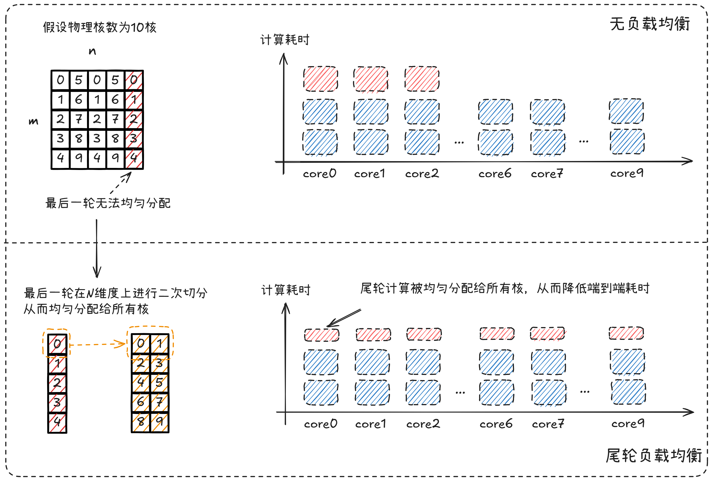
  

- **适用场景**
  - 多核并行计算场景
  - 输入形状不规则，无法均匀分配的场景
  - 最后一轮计算存在算力浪费的场景

### 指令并行度优化

#### Double Buffer（双缓冲）

- **原理介绍**

  Double Buffer使用两个缓冲区交替工作：一个缓冲区用于当前计算，另一个并行准备下一轮数据。通过计算与数据加载/准备的重叠，隐藏内存访问延迟，减少流水线停顿，提高算子吞吐量。

  详细的原理描述以及代码对比实现，可以参考Features中[N Buffer专题介绍]()。

- **效果对比**

  下图展示了使能Double Buffer后流水图的预期变化，从而有效提升不同流水间的并行度。如果缓冲区空间足够，可以进一步延伸出`4-Buffer`等其他分配方案，从而适配不同场景。

  

    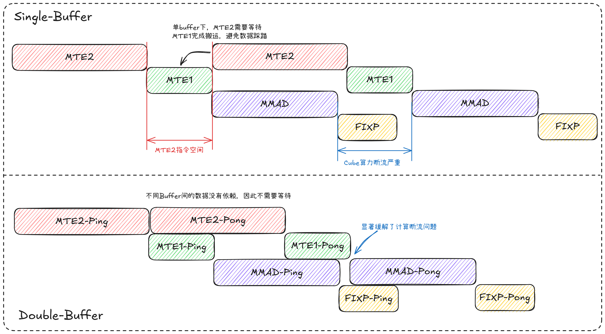
  

- **适用场景**
  - 存在流水停顿的场景
  - 内存访问延迟成为瓶颈的场景
  - L1或L0缓冲区空间充足的场景

#### UnitFlag（单元标志）

- **原理介绍**

  UnitFlag为`MMAD`计算指令和`FIXPIPE`数据搬运指令提供基于内存访问的细粒度同步（512B粒度）。未开启时，FIXPIPE需等MMAD指令完全执行完才开始搬出；开启后，MMAD每计算完512B数据，FIXPIPE立即搬出该数据块，**实现在无法开启L0C Double-Buffer的情况下提高计算与搬出流水的并行度**。

  详细的原理描述以及代码对比实现，可以参考Features中[Unitflag专题介绍]()。

- **效果对比**

  由性能建模可知，为了充分发挥计算访存比，需要尽可能的用满`L0C`缓冲区，导致存在无法在`L0C`缓冲区上开启Double Buffer的场景，此时就可以使能UnitFlag能力来提高指令并行度。

  

    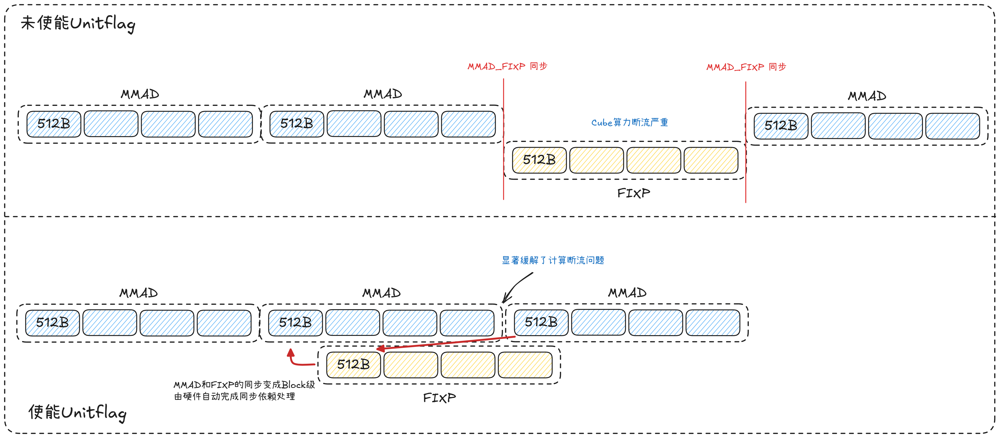
  

- **适用场景**
  - 无法开启L0C Double Buffer的场景
  - MMAD和FIXPIPE流水串行执行的场景
  - 需要提高计算与搬出并行度的场景

## 算子模板归纳

### ASWT模板

- **模板特点**：
  - 作为基础模板用于处理非特化模板的所有场景
  - 适用于大规模矩阵乘法场景
  - 支持灵活的形状配置

- **涉及优化手段**：
  - ASWT（自适应滑动窗口）
  - L1 Bank冲突优化
  - Scale缓存
  - 尾轮负载均衡
  - Double Buffer
  - UnitFlag

- **模板实现**：`quant_matmul_mxfp4_aswt.cpp`

### FullLoad模板

- **模板特点**：
  - 全载模板，主要应用于Decode等MTE2 Bound场景
  - 适用的Shape特征为m/n较小，满足左右矩阵全载L1缓冲区
  - 减少MTE2搬运次数

- **涉及优化手段**：
  - 全载优化
  - L1 Bank冲突优化
  - Scale缓存
  - Double Buffer
  - UnitFlag

- **模板实现**：待补充

## 优化策略选择指南

### 根据Bound类型选择优化策略

| **Bound类型** | **推荐优化策略** | **优先级** |
|-------------|-----------------|-----------|
| Cube Bound | ASWT + 尾轮负载均衡 | 高 |
| MTE2 Bound | 全载优化 + Scale缓存 | 高 |
| MTE1 Bound | L1 Bank冲突优化 | 中 |
| FIXPIPE Bound | UnitFlag | 中 |
| 流水停顿 | Double Buffer | 高 |

### 根据输入特征选择模板

| **输入特征** | **推荐模板** | **原因** |
|-------------|-------------|---------|
| 大规模矩阵 | ASWT模板 | 提高L2命中率，提升计算单元利用率 |
| 小规模矩阵 | FullLoad模板 | 减少MTE2搬运，降低搬运开销 |
| 不规则形状 | ASWT模板 + 尾轮负载均衡 | 均衡多核负载，避免算力浪费 |

## 性能调优实践步骤

1. **性能分析**：使用Profiling工具结合性能建模分析当前算子的Bound类型
2. **瓶颈识别**：确定主要的性能瓶颈所在
3. **策略选择**：根据Bound类型选择合适的优化策略
4. **模板选择**：根据输入特征选择合适的算子模板
5. **参数调优**：调整tiling参数，优化缓冲区使用
6. **效果验证**：对比优化前后的性能数据
7. **迭代优化**：根据结果进一步调整优化策略

## 总结

MXFP4量化矩阵乘算子的性能优化是一个系统性的工程，需要根据具体的场景和瓶颈选择合适的优化策略。通过合理应用ASWT、Double Buffer、UnitFlag等优化技术，可以显著提升算子在昇腾平台上的执行效率。