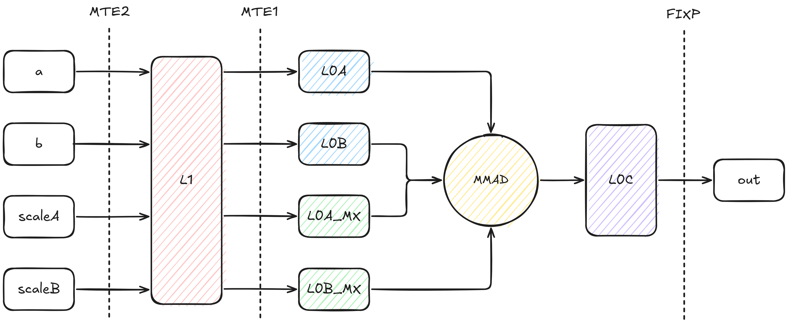
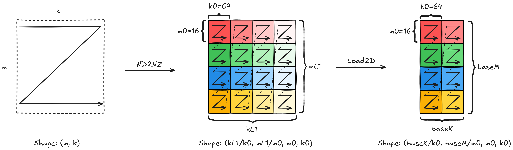
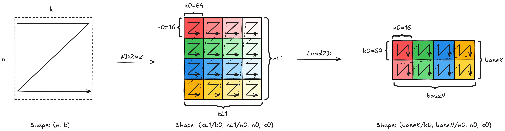
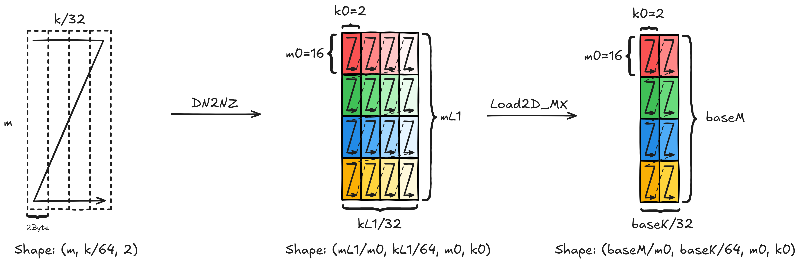
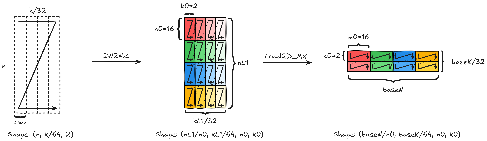

# Performance Matmul MXFP4

## 算子实现原理

### 算子功能说明

- 算子功能：完成MXFP4类型的矩阵乘计算；其中MX量化等价于`GroupSize=32`的，Scale类型为`float8_e8m0`的FP4 Pergroup量化。

- 计算公式：
$$
c_{i, j} = \sum^{K/G-1}_{g=0}\left(scaleA_{g, i} \cdot scaleB_{g, j} \cdot \sum^{G-1}_{k'=0} (a_{i, gG+k'} \cdot b_{gG + k', j}) \right)
$$

- 参数说明：

| **变量名** | **描述** | **Dtype** | **Layout** | **Shape** |
|-|-|-|-|-|
| a | 输入左矩阵 | `float4_e2m1` 或者 `float4_e1m2` | ND | (m, k) |
| b | 输入右矩阵 | `float4_e2m1` 或者 `float4_e1m2` | ND | (n, k) |
| scaleA | 左矩阵量化参数 | `float8_e8m0` | ND | (m, ceil(k, 64), 2) |
| scaleB | 右矩阵量化参数 | `float8_e8m0` | ND | (n, ceil(k, 64), 2) |
| c | 输出矩阵 | `float32` 或者 `float16` 或者 `bfloat16` | ND | (m, n) |

### 算子实现说明

相较传统非量化的Matmul算子，MXFP4场景新增了输入变量`scaleA`、`scaleB`。并需要将其搬运到L1中，再搬运到新增独立Buffer `L0A_MX`和`L0B_MX`中。

通过约束`L0A`，`L0B`，`L0A_MX`，`L0B_MX`中Tensor的地址映射关系，芯片的`MMAD`指令支持自动计算MXFP4的矩阵乘。并最终将`Float32`的结果写到`L0C`中，通过设置`Fixpipe`指令的量化模式，输出预期的数据类型结果。**因此算子实现仅依赖CUBE核，不涉及MIX场景**。

MXFP4执行时完整的数据搬运流程如下图所示：

关于每个输入在各个Buffer上的Shape关系和排布要求，可以参考下面的详细介绍。

关键参数说明：

- m, k, n：矩阵输入大小
- mL1, kL1, nL1: L1 Buffer的切分大小
- baseM, baseK, baseN: L0 Buffer的切分大小
- m0, k0, n0: 最小分型大小

#### Tensor a 的搬运说明

| **Buffer变化** | **Shape排布变化** | **Layout变化** | **所属流水** | **所用指令** |
|-|-|-|-|-|
| GM -> L1 | (m, k) -> (ceil(kL1/k0), ceil(mL1/m0), m0, k0) | ND -> Nz | MTE2 | DataCopy with ND2NZ |
| L1 -> L0A | (ceil(kL1/k0), ceil(mL1/m0), m0, k0) -> (ceil(baseK/k0), ceil(baseM/m0), m0, k0) | Nz -> Nz | MTE1 | LoadData with Load2D |

#### Tensor b 的搬运说明

| **Buffer变化** | **Shape排布变化** | **Layout变化** | **所属流水** | **所用指令** |
|-|-|-|-|-|
| GM -> L1 | (n, k) -> (ceil(kL1/k0), ceil(nL1/n0), n0, k0) | ND -> Nz | MTE2 | DataCopy with ND2NZ |
| L1 -> L0B | (ceil(kL1/k0), ceil(nL1/n0), n0, k0) -> (ceil(baseK/k0), ceil(baseN/n0), n0, k0) | Nz -> Zn | MTE1 | LoadData with Load2D |

> 这里L1和L0B上的Shape排布其实一样，但L0B默认按照(k, n)方向查看数据，因此Layout会变更成`Zn`

#### Tensor scaleA 的搬运说明

| **Buffer变化** | **Shape排布变化** | **Layout变化** | **所属流水** | **所用指令** |
|-|-|-|-|-|
| GM -> L1 | (m, ceil(k/64), 2) -> (ceil(mL1/m0), ceil(kL1/64), m0, 2) | ND -> Zz | MTE2 | DataCopy with DN2NZ |
| L1 -> L0A_MX | (ceil(mL1/m0), ceil(kL1/64), m0, 2) -> (ceil(baseM/m0), ceil(baseK/64), m0, 2) | Zz -> Zz | MTE1 | LoadData with Load2D_MX |

#### Tensor scaleB 的搬运说明

| **Buffer变化** | **Shape排布变化** | **Layout变化** | **所属流水** | **所用指令** |
|-|-|-|-|-|
| GM -> L1 | (n, ceil(k/64), 2) -> (ceil(nL1/n0), ceil(kL1/64), n0, 2) | ND -> Zz | MTE2 | DataCopy with DN2NZ |
| L1 -> L0B_MX | (ceil(nL1/n0), ceil(kL1/64), n0, 2) -> (ceil(baseN/n0), ceil(baseK/64), n0, 2) | Zz -> Zz | MTE1 | LoadData with Load2D_MX |

### 算子实现约束

1. 由于scale在L0_MX Buffer上的最小分形为`(16, 2)`，因此对应输入矩阵在K方向的最小单位是64，因此要求**baseK是64的整数倍**。
2. 基于约束1，当K轴非64对齐时，存在两类场景：
    - 当输入矩阵的K维度在内轴，即输入排布为`(m, k)`，`(n, k)`时，`ND2NZ`指令能够自动完成K方向补0，因此不需要特殊处理；
    - 当输入矩阵的K维度在外轴，即输入排布为`(k, m)`或者`(k, n)`时，`ND2NZ`指令无法完成K方向补0，**因此需要手动处理在K方向上的补0动作**。推荐的补0方法有：使用`SET2D`对L1目标地址清零 + `ND2NZ`跳写目标地址；
3. 由于`ND2NZ`指令不支持`B4`的数据类型，因此需要将输入按照`B8`的数据类型进行搬运，相应的指令对于的`stride`和`shape`的配置均需要除以2。
4. 基于约束4，要求输入矩阵内轴是偶数，否则无法用2个`B4`拼成一个`B8`类型。
5. `MMAD`指令关闭`gemv`能力

## 算子性能建模

## 算子优化实践

### 搬运效率优化

### 计算效率优化

### 指令并行度优化

## 算子模板归纳
